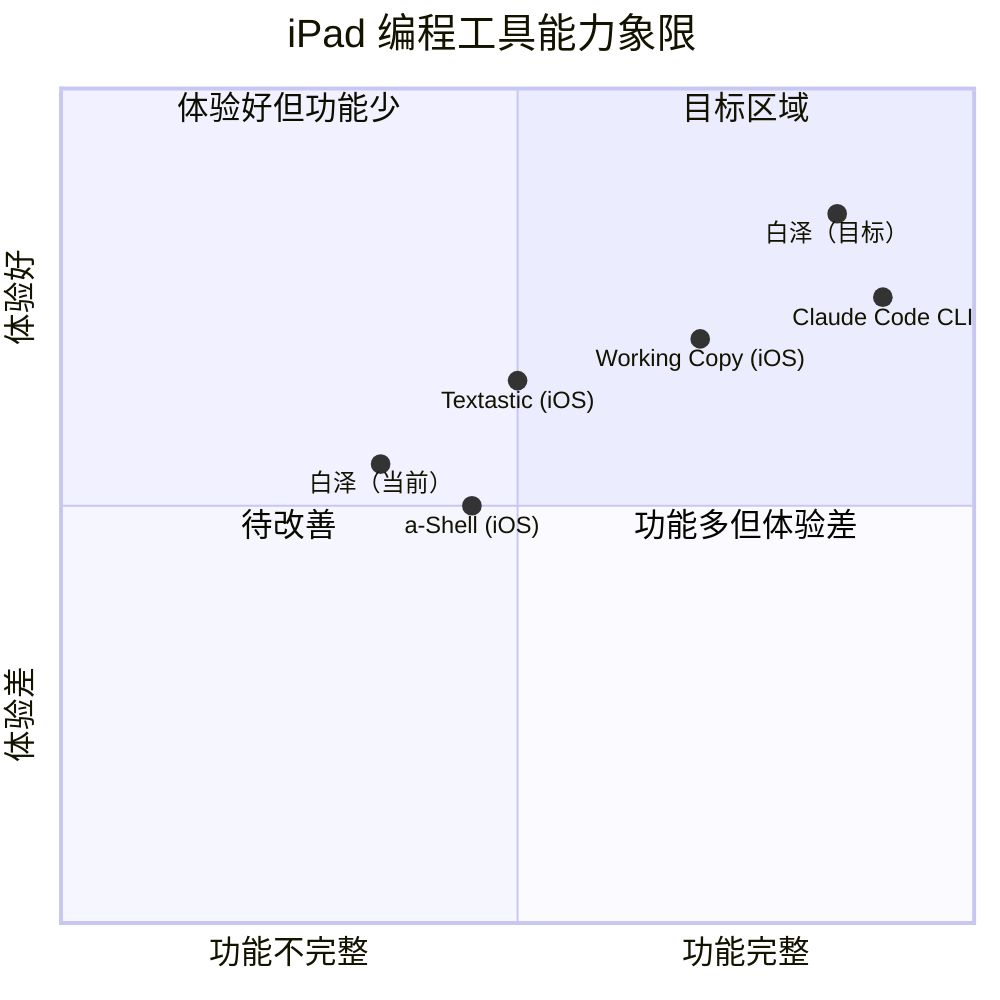

# 白泽功能补全 PRD（完整版）

## 1. 项目信息

| 字段 | 值 |
|------|------|
| Language | 中文 |
| Platform | iPad Pro 2021 M1 / iOS 16.6.1 / TrollStore 免签安装 |
| Tech Stack | Swift + SwiftUI + libgit2 C API + nodejs-mobile + CPython 3.13 嵌入 |
| Project Name | baize_feature_completion |
| 原始需求复述 | 白泽本地编程智能体的 16 项功能补全，涵盖 Git 高级操作（pull/fetch/merge/rebase/stash/reset/tag/clone/branch 管理/远程分支）、终端历史持久化、长内容渲染性能修复、Dashboard 用量统计与项目记录真实化、新建项目流程、项目切换联动、会话全文搜索、对话导出 |

---

## 2. 产品目标

本次功能补全的核心目标是**让白泽在 Git 工作流和项目管理能力上达到 Claude Code CLI 的日常可用水平**，具体对标：

| # | 产品目标 | 对标 Claude Code 能力 | 衡量标准 |
|---|---------|---------------------|---------|
| G1 | **Git 工作流闭环** — 补全 pull/fetch/merge/rebase/stash/reset/tag/clone，使 iPad 上的 Git 操作不依赖外部终端 | Claude Code 通过 `git` CLI 可执行全量 Git 操作；白泽通过 libgit2 达到同等覆盖度 | Git 常用命令覆盖率从 50%（11/22）提升至 95%（21/22），仅 rebase --interactive 不支持（libgit2 限制） |
| G2 | **多项目管理** — 从单项目写死路径升级为多项目注册/切换/新建，文件浏览器/编辑器/终端/Git/BAIZE.md 全联动 | Claude Code 基于当前工作目录自动识别项目；白泽需要显式项目注册但切换后全状态联动 | 用户可在 ≥2 个项目间无缝切换，所有子系统（文件树/编辑器/终端 cwd/Git 仓库/会话列表/BAIZE.md）同步切换 |
| G3 | **数据可见性与持久化** — Dashboard 用量统计真实化并持久化，终端命令历史持久化，会话支持全文搜索和导出 | Claude Code 不显式统计用量但用户可通过 API dashboard 查看；白泽在 App 内提供可见的用量面板 | App 重启后用量统计/命令历史/项目列表不丢失；会话搜索可匹配消息正文；对话可导出为 Markdown/纯文本 |

---

## 3. 用户故事

### Git 工作流（对应需求 #1-#9）

**US-1**: 作为 iPad 开发者，我想在白泽中执行 `git pull` 拉取远程更新，这样我就能在多设备间同步代码而不需要切换到外部 SSH 终端。

**US-2**: 作为独立开发者，我想在白泽中 `git merge` 功能分支到 main，这样我就能在 iPad 上完成完整的分支开发-合并流程。

**US-3**: 作为需要管理多个并行功能的开发者，我想用 `git stash` 暂存当前工作区改动，这样我可以快速切换到其他任务再回来恢复。

**US-4**: 作为需要回退错误提交的开发者，我想执行 `git reset --hard` 回到指定 commit，这样我能快速从错误状态恢复。

**US-5**: 作为需要版本标记的开发者，我想创建和查看 Git tag，这样我能标记发布版本。

**US-6**: 作为 iPad 开发者，我想在白泽中 `git clone` 一个 GitHub 仓库，这样我能直接在 iPad 上拉取并开始编辑远程项目。

**US-7**: 作为分支管理者，我想删除和重命名本地分支，这样我能保持分支列表整洁。

**US-8**: 作为协作开发者，我想查看和检出远程分支，这样我能 review 队友的代码。

### 终端与性能（对应需求 #10-#11）

**US-9**: 作为重度终端用户，我想 App 重启后仍能看到之前的命令历史，这样我不用重新记忆和输入长命令。

**US-10**: 作为处理长 AI 回复的用户，我想 10000+ 字的助手消息能流畅滚动，不会卡顿掉帧。

### Dashboard 与项目管理（对应需求 #12-#16）

**US-11**: 作为关注 API 费用的用户，我想在 Dashboard 看到今日真实的 Token 用量和费用估算，这样我能控制开支。

**US-12**: 作为多项目开发者，我想在 Dashboard 看到我最近打开的真实项目列表，点击即可切换，这样我能快速回到之前的工作。

**US-13**: 作为开始新项目的开发者，我想通过新建项目向导选择"空项目/模板项目/Git clone"三种方式创建项目，这样我能快速初始化工作环境。

**US-14**: 作为多项目开发者，我想在任意位置一键切换当前项目，切换后文件树/编辑器/终端/Git/会话全部联动更新，这样我不需要手动改路径。

**US-15**: 作为需要回顾历史对话的用户，我想通过关键词搜索所有会话的消息内容（不只是标题），这样我能快速找到之前讨论过的技术方案。

**US-16**: 作为需要分享对话的开发者，我想将对话导出为 Markdown 文件，这样我能在其他工具中查看或分享给队友。

---

## 4. 需求池（P0/P1/P2）

### P0 — 必做（影响"像 Claude Code 一样能用"）

| # | 需求 | 理由 |
|---|------|------|
| 1 | Git pull / fetch | RuntimeExecutor 拦截文案声称支持 "pull" 但 GitService 无此方法 — 文案与实现不符是 P0 Bug |
| 2 | Git merge | 无 merge 则分支开发流程断裂 — feature 分支无法合回 main |
| 7 | Git clone | iPad 上从 GitHub 拉项目是刚需 — 无 clone 则 #13 新建项目流程的"从 Git clone 创建"路径断裂 |
| 11 | Bug 6 长内容渲染 O(n²) 修复 | 10000 字 Text 卡顿直接影响核心聊天体验 |
| 14 | 项目切换联动 | 根目录写死 BaizePath.projectRoot — 多项目完全不可用 |
| 15 | 会话搜索 / 全文搜索 | 对话量增大后无法检索是日常体验断裂 |

### P1 — 应做（影响日常体验）

| # | 需求 | 理由 |
|---|------|------|
| 3 | Git rebase | 高级 Git 工作流需要，但 merge 可替代大部分场景 |
| 4 | Git stash | 多任务切换需要，但可通过 commit 临时替代 |
| 5 | Git reset --hard/soft/mixed | 回退错误状态需要，但当前可通过 unstage + 手动编辑替代部分场景 |
| 6 | Git tag | 版本管理需要，但非日常高频操作 |
| 8 | Git delete/rename branch | 分支管理需要，但当前 create+checkout 可工作 |
| 9 | 远程分支管理 | 协作场景需要，但单人开发可暂缓 |
| 10 | 终端命令历史持久化 | 体验优化，不影响核心功能 |
| 12 | Dashboard 今日用量 | 数据可见性，但不影响功能可用性 |
| 13 | Dashboard 最近项目 | 与 #14 项目切换联动，但 Dashboard 本身可先显示当前项目 |
| 16 | 导出对话 | 数据可移植性，但不影响日常使用 |

### P2 — 可延后

| # | 需求 | 理由 |
|---|------|------|
| — | Git rebase --interactive | libgit2 无原生支持，需自定义 commit 列表 UI，复杂度高 |
| — | Git cherry-pick | 低频操作，可延后 |
| — | Git submodule | iPad 场景极少使用 |

---

## 5. 需求详细说明

### ━━━━ P0 需求 ━━━━

---

### #1 Git pull / fetch

**功能描述**

在 GitService（actor）中新增 `fetch()` 和 `pull()` 方法，使用 libgit2 的 `git_remote_fetch` + `git_merge` API 链。`fetch` 仅下载远程更新不修改工作区；`pull` = fetch + merge 远程分支到当前分支。同时修复 RuntimeExecutor 第 156 行拦截文案中 "pull" 的虚假承诺。

**验收标准**

1. `fetch()` 执行后，远程跟踪分支（refs/remotes/origin/*）更新到最新，工作区不变，返回 fetch 结果摘要（更新的分支数）
2. `pull()` 执行后，当前分支合并远程对应分支的更新，工作区文件更新
3. 无远程仓库时返回友好错误 "尚未配置远程仓库"
4. 无 Git Token 时返回 `GitError.credentialsMissing`
5. 网络超时（15s）时返回 `GitError.networkError`
6. fast-forward merge 场景：远程领先本地，pull 后本地 HEAD 前进，无冲突
7. 非 fast-forward 场景：远程和本地都有新提交，pull 后执行 merge，若冲突返回冲突文件列表
8. GitSubTabView 的"改动"子 Tab 顶部新增 "↓ Pull" 按钮，与现有 "↑ Push" 并排
9. RuntimeExecutor git 拦截文案更新为实际支持的命令列表（移除虚假 "pull" 或改为 "请使用 Git Tab 操作"）

**技术约束**

- libgit2 `git_remote_fetch` 需要 `git_remote_callbacks` 设置 credentials 回调（复用现有 `credentialsCallback`）
- fetch 后需通过 `git_buf` 获取 refspec delta 信息（libgit2 v1.3.1 的 `git_remote_stats` 获取 received_bytes）
- merge 使用 `git_merge` + `git_merge_options` + `git_checkout_options`（GIT_CHECKOUT_SAFE）
- **所有 libgit2 对象必须 defer 配对 free**：`git_remote_free` / `git_annotated_commit_free` / `git_index_free` / `git_reference_free`
- 必须在 GitService actor 内部执行（libgit2 非线程安全）
- iOS 限制：无 `pclose` / `WIFEXITED`，所有操作走 libgit2 C API 不走 shell

**优先级**: P0

---

### #2 Git merge

**功能描述**

在 GitService 中新增 `merge(branch:)` 方法，将指定分支合并到当前分支。使用 libgit2 的 `git_merge` + `git_reference_lookup` + `git_annotated_commit_from_ref` API 链。冲突时返回冲突文件列表，不自动解决。

**验收标准**

1. 合并成功（fast-forward 或三方合并）：工作区更新，HEAD 前进，返回成功
2. 合并冲突：工作区保留冲突标记（`<<<<<<<` / `=======` / `>>>>>>>`），返回 `GitError.operationFailed` 包含冲突文件路径列表
3. 合并前检查工作区是否干净 — 有未提交改动时返回 `GitError.dirtyWorkingTree`
4. 合并目标分支不存在时返回 `GitError.branchNotFound`
5. GitSubTabView 新增 "合并" 入口（可在分支子 Tab 的分支行上新增 "合并到当前" 按钮，或改动子 Tab 新增合并按钮）
6. 合并成功后自动刷新 status + log + branches

**技术约束**

- `git_annotated_commit_from_ref` 获取合并目标的 annotated commit
- `git_merge(repo, annotated_commits, count, &merge_opts, &checkout_opts)` 执行合并
- 冲突检测：合并后检查 `git_repository_state` 是否为 `GIT_REPOSITORY_STATE_MERGE`，`git_index_has_conflicts` 检查冲突
- 冲突文件枚举：`git_index_conflict_iterator_new` + `git_index_conflict_next`
- **defer free**: `git_annotated_commit_free` / `git_index_free` / `git_index_conflict_iterator_free`

**优先级**: P0

---

### #7 Git clone

**功能描述**

在 GitService 中新增 `clone(remoteURL:toPath:)` 方法，使用 libgit2 的 `git_clone` API 将远程仓库克隆到指定本地路径。克隆完成后自动注册为白泽项目（与 #13 新建项目流程联动）。

**验收标准**

1. 输入合法 GitHub URL（https://github.com/user/repo.git）+ 有效 Token → 克隆成功，本地目录包含 .git 和仓库文件
2. 克隆过程中显示进度（`git_remote_progress_cb` 回调，UI 显示百分比）
3. 目标目录已存在且非空 → 返回错误 "目标目录已存在且非空"
4. 无效 URL 或网络不通 → 返回 `GitError.networkError`
5. 无 Token → 返回 `GitError.credentialsMissing`
6. 克隆成功后自动在白泽项目注册表中注册（调用 #14 的 ProjectRegistry）
7. Dashboard "新建项目" → "从 Git clone 创建" 入口调用此方法（与 #13 联动）
8. 终端中输入 `git clone <url>` 时，RuntimeExecutor 拦截并提示 "请在 Dashboard → 新建项目 → 从 Git clone 创建 中操作"（而非当前的通用 git 拦截文案）

**技术约束**

- `git_clone(&repo, url, path, &clone_opts)` — clone_options 包含 `git_remote_callbacks`（credentials）+ `git_fetch_options` + `git_checkout_options`
- `git_remote_progress_cb` 回调需要通过 `Unmanaged` 传递 payload（与现有 credentialsCallback 模式一致）
- clone 完成后需 `git_repository_free(repo)` 释放
- **注意**：clone 是耗时操作（可能 30s+），UI 必须显示进度且支持取消（P1 可延后取消功能）
- 克隆到 BaizePath.projectRoot 下的子目录（如 `/var/mobile/Documents/Baize/cloned-repo/`）

**优先级**: P0

---

### #11 Bug 6 长内容渲染 O(n²) 修复

**功能描述**

当前 `StreamingTextBuffer` 已修复流式输出拼接的 O(n²) 问题（改用 [String] buffer + 80ms flush），但 `ChatMessageList.swift` 中 `LazyVStack` 内的 `MessageBubble` 渲染单条 10000+ 字 `Text` 仍会卡顿。根因是 SwiftUI `Text` 对超长字符串的布局计算是 O(n²)（每帧全量测量）。需要将超长消息分段渲染或使用 `Text` + `.lineLimit` + "展开全文" 机制。

**验收标准**

1. 单条 10000 字 assistant 消息：初始渲染 < 500ms（当前 > 3s 卡顿）
2. 滚动经过长消息时无明显掉帧（60fps 目标，最低 30fps）
3. 长消息默认折叠显示前 N 行（如 50 行）+ "展开全文" 按钮，展开后完整显示
4. 流式输出中的长消息（streamingText）不受折叠影响（实时显示最新内容）
5. 已完成的超长消息（从历史会话加载）应用折叠
6. 折叠/展开动画流畅（withAnimation，不卡顿）
7. 不破坏现有 MessageBubble 的 Markdown 代码块渲染

**技术约束**

- **不可新增 Message enum case**（铁律 #10）— 折叠状态是 UI 层状态，不存入 Message
- 折叠状态用 `@State private var isExpanded: Set<String>`（按 message.id）或 `@State private var expandedMessageIds: Set<String>` 管理
- 分段渲染方案：将超长文本按段落（`\n\n`）分割，`LazyVStack` 内每个段落一个 `Text`，SwiftUI 只布局可见段落
- 阈值：超过 2000 字或 50 行的消息触发折叠
- **不可破坏** `toOpenAIMergedFormat` / `toAnthropicMessages`（铁律 #11）

**优先级**: P0

---

### #14 项目切换联动

**功能描述**

当前 `BaizePath.projectRoot` 是静态常量 `/var/mobile/Documents/Baize/`，`AppState.currentProjectPath` 虽是 `@Published` 但从未被修改。需要实现完整的多项目注册/切换/联动机制：

1. **ProjectRegistry** — 持久化项目列表（项目名/路径/技术栈/最后打开时间/图标），存储到 `BaizePath.internalData/projects.json`
2. **switchProject(to:)** — 切换当前项目，触发全子系统联动
3. 联动范围：
   - `AppState.currentProjectPath` 更新
   - `FileExplorerView` 文件树根目录更新
   - `EditorState` 打开的文件 Tab 清空（或保留可恢复）
   - `TerminalViewModel.currentWorkingDir` 更新到新项目根
   - `GitService` 重新初始化（新 repositoryPath）
   - `GitViewModel` 状态清空并重新加载
   - `ConversationStore` 会话列表按 projectPath 过滤
   - `ProjectContext` 重新加载 BAIZE.md
   - `RuntimeExecutor` 的 `ios_setMiniRoot` 更新到新项目路径
4. 首次启动自动注册默认项目（BaizePath.projectRoot）

**验收标准**

1. Dashboard "最近项目" 卡片点击 → 切换到该项目，所有子系统同步更新
2. 切换项目后文件浏览器显示新项目的文件树
3. 切换项目后终端 cwd 更新到新项目根目录
4. 切换项目后 Git Tab 显示新项目的仓库状态
5. 切换项目后会话列表只显示该项目的对话
6. 切换项目后 BAIZE.md 项目配置重新加载
7. App 重启后项目列表不丢失（持久化到 projects.json）
8. 当前活跃项目在 Dashboard 中高亮标记
9. 切换项目时如果有未保存的编辑器改动，提示用户保存
10. ProjectRegistry 的增删改查操作线程安全（actor 或 @MainActor + serial queue）

**技术约束**

- **ProjectRegistry 数据模型**：
  ```swift
  struct ProjectEntry: Codable, Identifiable {
      let id: UUID
      var name: String
      var path: String       // 绝对路径
      var stack: String      // 技术栈描述
      var icon: String       // SF Symbol name
      var lastOpened: Date
  }
  ```
- **不可删除** `BaizePath.projectRoot` 常量（其他代码依赖），但运行时项目路径以 `AppState.currentProjectPath` 为准
- `GitService` 是 actor，切换项目需要重新创建 GitService 实例（新 repositoryPath）
- `RuntimeExecutor.ios_setMiniRoot` 是进程级操作，切换项目时需重新调用
- `ConversationSession` 已有 `projectPath` 字段 — 会话列表过滤利用此字段
- **不动 Node.js 代码**（铁律 #7）— Node.js 端口不变，但工作目录通过 HTTP 请求参数传递

**优先级**: P0

---

### #15 会话搜索 / 全文搜索

**功能描述**

当前 `SessionListView` 只列出会话标题（首条用户消息前 30 字），无搜索功能。需要新增全文搜索：在会话列表顶部新增搜索框，输入关键词后匹配所有会话的所有消息内容（user/assistant/toolResult），返回匹配的会话列表 + 高亮匹配片段。

**验收标准**

1. 会话列表顶部新增搜索框（`TextField` + 放大镜图标）
2. 输入关键词后实时过滤（debounce 300ms），匹配所有会话的 `messages` 数组中每条消息的 `content`
3. 搜索结果列表显示：会话标题 + 匹配消息片段（前后各 30 字，关键词高亮）+ 匹配消息数
4. 点击搜索结果 → 加载该会话并滚动到匹配消息位置
5. 搜索范围：当前项目的会话（按 projectPath 过滤）
6. 搜索性能：100 个会话 × 平均 50 条消息 = 5000 条消息，搜索响应 < 500ms
7. 搜索不区分大小写
8. 支持中文搜索
9. 空搜索框时恢复完整会话列表
10. 搜索在 `ConversationStore` actor 内执行（避免阻塞 UI），结果通过 `@Published` 回传

**技术约束**

- `ConversationStore` 是 actor — 搜索方法 `func search(query: String, projectPath: String) async -> [SearchResult]` 在 actor 内执行
- 搜索结果数据模型：
  ```swift
  struct SessionSearchResult: Identifiable {
      let id: UUID               // session.id
      let sessionId: UUID
      let sessionTitle: String
      let matchedSnippet: String  // 匹配片段（前后 30 字）
      let matchCount: Int
      let matchedMessageId: String // 用于跳转定位
  }
  ```
- **不可新增 Message enum case**（铁律 #10）
- 搜索遍历 `session.messages` 的 `.content` 属性（已有 computed property）
- 搜索在后台 Task 执行，结果通过 `@MainActor` 回传

**优先级**: P0

---

### ━━━━ P1 需求 ━━━━

---

### #3 Git rebase

**功能描述**

在 GitService 中新增 `rebase(branch:)` 方法，将当前分支 rebase 到指定分支的最新 commit 上。使用 libgit2 的 `git_rebase_init` + `git_rebase_next` + `git_rebase_commit` API 链。

**验收标准**

1. rebase 成功：当前分支的 commit 在目标分支最新 commit 之上重放，无冲突
2. rebase 冲突：暂停 rebase，返回冲突文件列表，提供 "abort rebase" 选项
3. rebase 完成后 HEAD 指向重放后的最新 commit
4. 支持 `git rebase --abort`（`git_rebase_abort`）
5. GitSubTabView 分支子 Tab 新增 "变基" 入口
6. rebase 前检查工作区是否干净

**技术约束**

- `git_rebase_init(repo, &rebase, branch, upstream, &opts)` 初始化 rebase
- `git_rebase_next` + `git_rebase_commit` 循环重放每个 commit
- 冲突时 `git_rebase_commit` 返回 `GIT_EAPPLIED` 或 `GIT_EMERGECONFLICT`
- `git_rebase_abort` 取消 rebase 恢复原始状态
- **defer free**: `git_rebase_free`
- **不支持 `rebase --interactive`**（libgit2 无原生支持，需自定义 UI，归入 P2）

**优先级**: P1

---

### #4 Git stash

**功能描述**

在 GitService 中新增三个方法：`stashList()` / `stashPush(message:)` / `stashPop()`。使用 libgit2 的 `git_stash_save` / `git_stash_foreach` / `git_stash_pop` API。

**验收标准**

1. `stashPush(message:)` — 保存当前工作区 + 暂存区改动到 stash 栈，工作区恢复到 HEAD 状态
2. `stashList()` — 返回 stash 列表（索引 + 消息 + 时间）
3. `stashPop()` — 恢复最近一个 stash 并从栈中删除，工作区恢复改动
4. stashPop 冲突时保留 stash 不删除，返回冲突信息
5. 空工作区 stashPush 返回错误 "没有可暂存的改动"
6. GitSubTabView 新增 "贮藏" 子 Tab（GitSubTab 新增 .stash case），或改动子 Tab 新增 stash 操作按钮组
7. stash 列表显示消息 + 相对时间，支持 pop/drop 操作

**技术约束**

- `git_stash_save` 需要 `git_signature` + `git_stash_flags`（GIT_STASH_DEFAULT）
- `git_stash_foreach` 回调遍历 stash 栈
- `git_stash_pop(repo, index, &opts)` 恢复并删除
- `git_stash_drop(repo, index)` 仅删除不恢复
- **defer free**: `git_signature_free`
- stash 操作修改 .git/refs/stash 和 stash reflog

**优先级**: P1

---

### #5 Git reset --hard / --soft / --mixed

**功能描述**

当前 GitService 只有 `reset_default`（用于 unstage，即 `git reset --mixed` 的 pathspec 版本）。需要新增完整的 `reset(to:mode:)` 方法，支持三种模式回退到指定 commit。

**验收标准**

1. `reset(to: oid, mode: .hard)` — HEAD + 暂存区 + 工作区全部回退到指定 commit，未提交改动**丢失**（需二次确认）
2. `reset(to: oid, mode: .soft)` — 仅 HEAD 回退，暂存区和工作区保留改动
3. `reset(to: oid, mode: .mixed)` — HEAD + 暂存区回退，工作区保留改动（默认模式）
4. reset 目标 commit 不存在时返回错误
5. --hard 模式在 UI 层需二次确认（"此操作不可撤销，确定要丢弃所有改动？"）
6. GitSubTabView 历史子 Tab 的 commit 行新增 "重置到此提交" 操作（长按或滑动菜单）
7. reset 后自动刷新 status + log

**技术约束**

- `git_reset(repo, target, reset_type, &checkout_opts)` — reset_type 为 `GIT_RESET_SOFT` / `GIT_RESET_MIXED` / `GIT_RESET_HARD`
- `GIT_RESET_HARD` 需要 `git_checkout_options`（GIT_CHECKOUT_FORCE）
- **注意**：`git_reset` 的第二个参数是 `git_object*`（target commit），需通过 `git_commit_lookup` 获取
- **defer free**: `git_commit_free` / `git_object_free`
- 当前 `unstage` 使用的 `git_reset_default` 是 pathspec 版本，与 `git_reset` 是不同的 API — 不替换现有 unstage 逻辑

**优先级**: P1

---

### #6 Git tag

**功能描述**

在 GitService 中新增 `createTag(name:message:)` / `listTags()` / `deleteTag(name:)` 三个方法。使用 libgit2 的 `git_tag_create` / `git_tag_list` / `git_tag_delete` API。支持轻量标签（lightweight）和附注标签（annotated）。

**验收标准**

1. `createTag(name:message:)` — 在当前 HEAD 创建附注标签（有 message）或轻量标签（无 message）
2. `listTags()` — 返回标签列表（名称 + OID + 时间 + 消息）
3. `deleteTag(name:)` — 删除指定标签
4. 标签名已存在时返回错误 "标签已存在"
5. GitSubTabView 历史子 Tab 新增标签显示（commit 行旁显示 tag 徽章）
6. 历史子 Tab 新增 "标签" 入口或子 Tab，列出所有标签
7. 支持在指定 commit 上创建标签（不只是 HEAD）

**技术约束**

- `git_tag_create(&oid, repo, name, target, tagger, message, force)` — 附注标签
- `git_tag_create_lightweight(&oid, repo, name, target, force)` — 轻量标签
- `git_tag_list(&tags, repo)` — 返回 `git_strarray`（标签名列表）
- `git_tag_lookup` → `git_tag_name` / `git_tag_target` / `git_tag_tagger` 获取详情
- `git_tag_delete(repo, name)` — 删除
- **defer free**: `git_tag_free` / `git_signature_free` / `git_strarray` 释放
- `git_tag_list` 返回的 `git_strarray` 需要手动 `git_strarray_free`

**优先级**: P1

---

### #8 Git delete / rename branch

**功能描述**

在 GitService 中新增 `deleteBranch(name:)` / `renameBranch(oldName:newName:)` 方法。使用 libgit2 的 `git_branch_delete` / `git_branch_move` API。

**验收标准**

1. `deleteBranch(name:)` — 删除本地分支（不能删除当前分支）
2. 删除当前分支 → 返回错误 "不能删除当前所在分支"
3. 删除不存在分支 → 返回 `GitError.branchNotFound`
4. `renameBranch(oldName:newName:)` — 重命名分支
5. 新名称已存在 → 返回错误 "分支名已存在"
6. GitBranchView 分支行新增滑动操作（swipeActions）或长按菜单：删除 / 重命名
7. 删除分支需二次确认
8. 重命名分支弹出 TextField 输入新名称
9. 操作后自动刷新分支列表

**技术约束**

- `git_branch_delete(branch_ref)` — 参数是 `git_reference*`（需先 `git_branch_lookup`）
- `git_branch_move(&new_ref, branch_ref, new_name, force)` — 重命名
- **defer free**: `git_reference_free`（lookup 和 move 返回的 ref）
- `git_branch_delete` 对当前分支返回 `GIT_ERROR`（code < 0），需检测并返回友好错误

**优先级**: P1

---

### #9 远程分支管理

**功能描述**

在 GitService 中新增 `listRemoteBranches()` / `checkoutRemoteBranch(name:)` 方法。`listRemoteBranches` 需先执行 fetch 再遍历 `GIT_BRANCH_REMOTE`。`checkoutRemoteBranch` 创建本地跟踪分支。

**验收标准**

1. `listRemoteBranches()` — 返回远程分支列表（需先 fetch 确保最新）
2. 远程分支列表在 GitBranchView 中与本地分支分区显示（"本地分支" / "远程分支"）
3. `checkoutRemoteBranch(name:)` — 从远程分支创建本地跟踪分支并切换
4. 本地已存在同名分支 → 返回错误 "本地分支已存在"
5. 远程分支不存在 → 返回 `GitError.branchNotFound`
6. 切换远程分支前检查工作区是否干净
7. 远程分支行显示 "origin/" 前缀 + "检出" 按钮

**技术约束**

- `git_branch_iterator_new(&iter, repo, GIT_BRANCH_REMOTE)` 遍历远程分支
- `git_branch_upstream` 获取跟踪分支信息
- checkout 远程分支：`git_branch_create` + `git_branch_set_upstream` + `git_checkout_branch`
- **依赖 #1 fetch** — 必须先实现 fetch 才能列出最新远程分支
- **defer free**: `git_reference_free` / `git_branch_iterator_free`

**优先级**: P1

---

### #10 终端命令历史持久化

**功能描述**

当前 `TerminalViewModel.commandHistory` 是 `@Published [String] = []`，App 重启后清空。需要将命令历史持久化到文件（JSON），App 启动时加载，每条命令执行后增量追加。

**验收标准**

1. 命令历史持久化到 `BaizePath.internalData/terminal_history.json`
2. App 启动时自动加载历史命令
3. 每条命令执行后增量保存（不全量重写，追加模式或全量但 debounce）
4. 历史上限 1000 条（超过时丢弃最旧的）
5. 历史记录去重（连续相同命令只保留一条）
6. clear/cls 命令不记入历史
7. 上下键导航历史命令功能不受影响（已有 `previousCommand()` / `nextCommand()`）
8. 持久化操作在后台执行，不阻塞终端输入
9. 多项目场景：命令历史按项目路径隔离（每个项目独立历史）
10. 持久化格式：
    ```json
    {
      "projectPath": "/var/mobile/Documents/Baize/",
      "commands": ["ls -la", "git status", ...],
      "lastUpdated": "2025-01-01T12:00:00Z"
    }
    ```

**技术约束**

- 持久化文件路径：`BaizePath.internalData/terminal_history_{projectHash}.json`（按项目隔离）
- 增量保存：每条命令执行后 `Task.detached` 写入，不阻塞 UI
- 读取在 `TerminalViewModel.init` 中异步加载
- **不修改** TerminalViewModel 的 `@MainActor` 隔离属性
- JSON 编解码使用 `JSONEncoder` / `JSONDecoder`（.iso8601 日期策略，与 ConversationStore 一致）
- 文件写入用 `.atomic` 选项（与 ConversationStore.save 一致）

**优先级**: P1

---

### #12 Dashboard 今日用量

**功能描述**

当前 `DashboardView.DailyUsageSection` 硬编码 "0"/"0"/"$0.00"。需要实现真实的用量统计：

1. **UsageTracker** — 在每次 API 调用时记录 usage（prompt_tokens / completion_tokens / model / provider / timestamp / 估算费用）
2. **持久化** — 按日存储到 `BaizePath.internalData/usage/{date}.json`
3. **Dashboard 展示** — 今日累计 Token 数 + API 调用次数 + 费用估算
4. **费用估算** — 按 provider/model 的单价计算（内置价格表，用户可在设置中覆盖）

**验收标准**

1. 每次 API 调用（含 Agent Loop 和摘要请求）后记录 usage 数据
2. API 响应无 usage 字段时（部分 Provider 不返回）用 token 估算值替代
3. Dashboard "今日用量" 显示真实数据：Token 总量 / API 调用次数 / 费用估算
4. App 重启后今日数据不丢失（从持久化文件加载）
5. 跨天自动归档（超过 7 天的用量数据自动清理）
6. 费用估算内置默认价格表（OpenAI / Anthropic / OpenRouter 主流模型），用户可在设置中覆盖
7. 用量统计按项目隔离（可选 — P1 先全局统计，P2 按项目细分）
8. 统计数据在 App 内可见（用户无 Mac 看 Console）
9. UsageTracker 线程安全（actor）

**技术约束**

- **UsageTracker 数据模型**：
  ```swift
  struct UsageRecord: Codable {
      let timestamp: Date
      let provider: String
      let model: String
      let promptTokens: Int
      let completionTokens: Int
      let estimatedCost: Double
  }
  ```
- **注入点**：`APIGateway` 的 SSE 流式响应解析完成后调用 `usageTracker.record(...)`
- **价格表**：内置 `BaizePricing` 枚举，包含主流模型的 input/output 每百万 token 价格
- **持久化路径**：`BaizePath.internalData/usage/{yyyy-MM-dd}.json`（按日文件）
- **费用估算公式**：`cost = promptTokens/1M * inputPrice + completionTokens/1M * outputPrice`
- **不修改** APIGateway 的 `toOpenAIMergedFormat` / `toAnthropicMessages`（铁律 #11）
- UsageTracker 是 actor，APIGateway 通过 `await usageTracker.record(...)` 调用

**优先级**: P1

---

### #13 Dashboard 最近项目

**功能描述**

当前 `DashboardView.RecentProjectsSection` 使用 `ProjectEntry.mockProjects`（三个假项目）。需要替换为 #14 ProjectRegistry 中的真实项目列表，按 lastOpened 排序，点击切换项目。

**验收标准**

1. Dashboard "最近项目" 显示 ProjectRegistry 中注册的真实项目
2. 按 lastOpened 降序排列，最多显示 6 个
3. 点击项目卡片 → 调用 `switchProject(to:)` 切换到该项目
4. 当前活跃项目卡片高亮标记（边框或角标）
5. 无项目时显示 "暂无项目，点击新建" 占位
6. 项目卡片显示：名称 / 技术栈 / 最后打开时间 / 项目图标
7. 卡片支持长按删除项目（从注册表移除，不删除文件）
8. 与 #14 项目切换联动 — Dashboard 是切换入口之一
9. 与 #13 新建项目联动 — Dashboard 新增 "新建项目" 按钮

**技术约束**

- `ProjectEntry` 已有定义（DashboardView.swift），但需改为 Codable + 持久化版本（与 #14 ProjectRegistry 的模型统一）
- **删除** `ProjectEntry.mockProjects` 静态属性
- DashboardView 通过 `@EnvironmentObject var appState: AppState` 获取 ProjectRegistry
- 项目列表通过 `@Published` 或 `@FetchRequest` 驱动 UI 更新

**优先级**: P1

---

### #16 导出对话

**功能描述**

当前无导出功能。需要支持将对话导出为 Markdown / 纯文本 / JSON 三种格式。导出文件保存到用户可访问的目录，并支持分享（iOS Share Sheet）。

**验收标准**

1. 会话列表页每条会话新增 "导出" 操作（swipeActions 或长按菜单）
2. 导出格式选择：Markdown / 纯文本 / JSON
3. **Markdown 格式**：
   ```markdown
   # 对话标题
   
   **日期**: 2025-01-01 12:00
   
   ---
   
   ## 👤 用户
   用户消息内容...
   
   ## 🤖 助手
   助手回复内容...
   
   ### 🔧 工具调用: read_file
   ```json
   {"path": "/test.swift"}
   ```
   
   **结果**: 文件内容...
   ```
4. **纯文本格式**：`[用户] 消息内容\n[助手] 回复内容\n[工具] 调用: xxx\n结果: xxx`
5. **JSON 格式**：直接序列化 `ConversationSession`（已有 Codable）
6. 导出文件保存到 `BaizePath.projectRoot/exports/{sessionTitle}.md`
7. 导出后弹出 iOS Share Sheet（`UIActivityViewController`）分享文件
8. 导出包含所有消息（user / assistant / assistantWithToolCalls / toolCall / toolResult），不包含 system 消息
9. 超长对话（10000+ 条消息）导出不卡顿（后台 Task 执行）
10. 导出文件名合法化（替换非法字符为 `_`）

**技术约束**

- **不可新增 Message enum case**（铁律 #10）
- Markdown 生成：遍历 `session.messages`，按 `role` 分段渲染
- 工具调用渲染：`.assistantWithToolCalls` 的 `toolCalls` 数组 + 对应的 `.toolResult`
- Share Sheet：`UIActivityViewController` 包装在 SwiftUI `UIViewControllerRepresentable` 中
- 导出在 `Task.detached` 中执行，避免阻塞 UI
- 文件名处理：`session.title` 替换 `/\:*?"<>|` 为 `_`

**优先级**: P1

---

### ━━━━ 新建项目流程（跨需求 #7 + #13 + #14）━━━━

### #13 新建项目流程

**功能描述**

当前 `NewProjectPlaceholderSheet` 显示 "完整项目创建流程将在后续版本实现"。需要实现完整的新建项目向导，支持三种创建方式：

1. **空项目** — 在 BaizePath.projectRoot 下创建空目录 + BAIZE.md + git init
2. **从模板创建** — 内置模板（React/Vite、Swift Package、Python、Node.js、Static HTML）克隆到项目目录
3. **从 Git clone 创建** — 调用 #7 Git clone，克隆完成后自动注册项目

**验收标准**

1. Dashboard 新增 "新建项目" 按钮（替换 NewProjectPlaceholderSheet）
2. 点击后弹出项目创建向导（NavigationStack 多页流程）
3. **选择创建方式**页：三个选项卡片（空项目 / 模板项目 / Git clone）
4. **空项目流程**：
   - 输入项目名 → 创建目录 `{projectRoot}/{projectName}/`
   - 生成 BAIZE.md（YAML 前置元数据 + 空正文）
   - 执行 `git init`（调用 GitService.initRepository）
   - 注册到 ProjectRegistry
   - 切换到新项目
5. **模板项目流程**：
   - 选择模板（React+Vite / Swift Package / Python / Node.js / Static HTML）
   - 输入项目名 → 从内置模板目录复制文件到 `{projectRoot}/{projectName}/`
   - 生成 BAIZE.md（自动填充技术栈信息）
   - git init + 注册 + 切换
6. **Git clone 流程**：
   - 输入 Git URL → 输入项目名（默认从 URL 提取）
   - 调用 `GitService.clone(remoteURL:toPath:)`（#7）
   - 显示克隆进度
   - 克隆完成后注册到 ProjectRegistry + 切换
7. 项目名校验：非空 / 合法文件名字符 / 不与已有项目重名
8. 创建过程中显示进度指示器
9. 创建失败时回滚（删除已创建的目录）
10. 模板文件打包在 App Bundle 的 `templates/` 目录中

**技术约束**

- **模板目录结构**（App Bundle resources）：
  ```
  templates/
    react-vite/       # package.json + vite.config + src/ + index.html
    swift-package/    # Package.swift + Sources/
    python/           # requirements.txt + main.py
    nodejs/           # package.json + index.js
    static-html/      # index.html + style.css
  ```
- 模板复制用 `FileManager.copyItem(at:to:)`
- BAIZE.md 模板：
  ```markdown
  ---
  name: {projectName}
  stack: {stack}
  created: {date}
  ---
  # {projectName}
  
  ## 项目说明
  TODO: 添加项目说明
  ```
- **不修改** ProjectContext 的 BAIZE.md 解析逻辑（YAML 前置 + Markdown 正文）
- 项目名合法化：只允许 `[a-zA-Z0-9_-]`
- **不动 Node.js 代码**（铁律 #7）

**优先级**: P1

---

## 6. UI 设计稿

### 6.1 Git Tab UI 变更

**当前**：GitSubTab 三个子 Tab — 改动 / 历史 / 分支

**变更后**：GitSubTab 四个子 Tab — 改动 / 历史 / 分支 / 贮藏

```
┌─────────────────────────────────────────┐
│  Git Tab                                │
│  分支: feature/new-ui    [↑Push] [↓Pull]│
├─────────────────────────────────────────┤
│  [改动] [历史] [分支] [贮藏]             │
├─────────────────────────────────────────┤
│                                         │
│  子 Tab 内容区                          │
│                                         │
├─────────────────────────────────────────┤
│  ◉ 改动  ○ 历史  ○ 分支  ○ 贮藏          │
└─────────────────────────────────────────┘
```

**改动子 Tab 新增**：
- 顶部工具栏：`[↑ Push] [↓ Pull]` 按钮组（Push 已有，新增 Pull）
- commit 行长按菜单：`重置到此提交` (reset --hard/soft/mixed)

**历史子 Tab 新增**：
- commit 行显示 tag 徽章（如有）
- commit 行长按菜单：`重置到此提交` / `在此创建标签`

**分支子 Tab 变更**：
```
┌─────────────────────────────────────────┐
│ 本地分支                                │
│  ✓ feature/new-ui    [当前]             │
│  ○ main              [检出]             │
│  ○ dev               [检出] [⋯]         │
│                                         │
│ 远程分支                                │
│  origin/main         [检出]             │
│  origin/dev          [检出]             │
│                                         │
│ [+ 新建分支]  [↓ Fetch]                 │
└─────────────────────────────────────────┘
```
- 分支行新增 `⋯` 菜单：重命名 / 删除 / 合并到当前 / 变基到当前
- 新增 "远程分支" 分区（依赖 #1 fetch + #9 远程分支管理）
- 新增 `[↓ Fetch]` 按钮

**贮藏子 Tab（新增）**：
```
┌─────────────────────────────────────────┐
│ 贮藏列表                                │
│                                         │
│  stash@{0}: WIP on feature: abc1234     │
│  2 分钟前                    [Pop] [×]  │
│                                         │
│  stash@{1}: WIP on main: def5678        │
│  1 小时前                    [Pop] [×]  │
│                                         │
│  [+ Stash Push]                         │
└─────────────────────────────────────────┘
```

### 6.2 Dashboard UI 变更

```
┌─────────────────────────────────────────┐
│  白泽                                   │
│  本地编程智能体                          │
├─────────────────────────────────────────┤
│                                         │
│  📁 最近项目              [+ 新建项目]  │
│  ┌─────────┐ ┌─────────┐ ┌─────────┐   │
│  │ my-app   │ │ baize   │ │ data-   │   │
│  │ React+TS │ │ Swift   │ │ Python  │   │
│  │ 2分钟前  │ │ 1小时前 │ │ 昨天    │   │
│  │  ✓当前   │ │         │ │         │   │
│  └─────────┘ └─────────┘ └─────────┘   │
│                                         │
├─────────────────────────────────────────┤
│                                         │
│  📶 连接状态                             │
│  ✓ OpenAI  ✓ Anthropic  ○ OpenRouter   │
│                                         │
├─────────────────────────────────────────┤
│                                         │
│  📊 今日用量                             │
│  ┌────────┐ ┌────────┐ ┌────────┐      │
│  │ 45.2K  │ │   23   │ │ $0.12  │      │
│  │ Token  │ │ API调用│ │ 费用   │      │
│  └────────┘ └────────┘ └────────┘      │
│                                         │
└─────────────────────────────────────────┘
```

变更：
- "最近项目" 替换 mock 数据为真实项目列表（#13）
- 新增 "[+ 新建项目]" 按钮（#13 新建项目流程）
- 项目卡片显示 "✓当前" 标记当前活跃项目
- "今日用量" 替换硬编码为真实统计（#12）

### 6.3 新建项目向导 UI

```
┌─────────────────────────────────────────┐
│  ← 新建项目                              │
├─────────────────────────────────────────┤
│                                         │
│  选择创建方式                            │
│                                         │
│  ┌─────────────────────────────────┐    │
│  │ 📁 空项目                       │    │
│  │ 创建一个空目录，初始化 Git       │    │
│  └─────────────────────────────────┘    │
│                                         │
│  ┌─────────────────────────────────┐    │
│  │ 📋 从模板创建                   │    │
│  │ React / Swift / Python / Node   │    │
│  └─────────────────────────────────┘    │
│                                         │
│  ┌─────────────────────────────────┐    │
│  │ 📥 从 Git clone 创建            │    │
│  │ 克隆远程仓库到本地              │    │
│  └─────────────────────────────────┘    │
│                                         │
└─────────────────────────────────────────┘
```

**模板选择页**：
```
┌─────────────────────────────────────────┐
│  ← 选择模板                              │
├─────────────────────────────────────────┤
│  ⚛️ React + Vite + TypeScript           │
│  📦 Swift Package                       │
│  🐍 Python                              │
│  🟢 Node.js                             │
│  🌐 Static HTML                         │
├─────────────────────────────────────────┤
│  项目名: [my-project___________]        │
│                                         │
│  [        创建项目        ]              │
└─────────────────────────────────────────┘
```

**Git clone 页**：
```
┌─────────────────────────────────────────┐
│  ← 从 Git Clone                          │
├─────────────────────────────────────────┤
│  仓库 URL:                               │
│  [https://github.com/user/repo.git___]  │
│                                         │
│  项目名:                                 │
│  [repo________________________]         │
│                                         │
│  克隆进度: ████████░░ 80%                │
│  正在接收对象: 1.2 MB / 1.5 MB           │
│                                         │
│  [        开始克隆        ]              │
└─────────────────────────────────────────┘
```

### 6.4 会话列表 + 搜索 UI

```
┌─────────────────────────────────────────┐
│  历史会话                                │
├─────────────────────────────────────────┤
│  🔍 [搜索对话内容...___________]        │
├─────────────────────────────────────────┤
│                                         │
│  [+ 新建会话]                            │
│                                         │
│  ── 搜索结果 (3 个匹配) ──              │
│                                         │
│  ✓ 如何在 Swift 中实现 actor            │
│    ...actor 是 Swift 并发模型中的...     │
│    2 条匹配 · 1小时前                    │
│                                         │
│  ✓ Git rebase 的使用场景                │
│    ...当你需要将 feature 分支的...       │
│    1 条匹配 · 昨天                       │
│                                         │
│  ── 所有会话 ──                          │
│                                         │
│  ✓ 新对话                               │
│    23 条消息 · 5分钟前                   │
│                                         │
│  ○ 如何在 Swift 中实现 actor            │
│    15 条消息 · 1小时前                   │
│                                         │
└─────────────────────────────────────────┘
```

### 6.5 长消息折叠 UI

```
┌─────────────────────────────────────────┐
│  🤖 助手                                 │
│                                         │
│  这是一段很长的回复...                   │
│  第一行内容...                           │
│  第二行内容...                           │
│  ...（共 50 行）                         │
│  第四十九行...                           │
│  第五十行...                             │
│                                         │
│  [展开全文 ↓]                            │
│                                         │
└─────────────────────────────────────────┘
```

点击 "展开全文" 后完整显示，按钮变为 "[收起 ↑]"。

### 6.6 项目切换入口

项目切换入口分布在三个位置：
1. **Dashboard "最近项目" 卡片** — 点击切换（#13）
2. **工作区顶部工具栏** — 新增项目名下拉菜单，显示所有项目 + "新建项目"
3. **设置 Tab** — 新增 "项目管理" 子页，显示完整项目列表 + 添加/删除

```
┌─────────────────────────────────────────┐
│  [📁 my-app ▾]  [⬛代码] [💬对话]  ●     │
│   ├ ✓ my-app (当前)                     │
│   ├ baize-core                          │
│   ├ data-pipeline                       │
│   └ + 新建项目                          │
├─────────────────────────────────────────┤
│  文件浏览器 │  编辑器 + 聊天面板         │
│              │                           │
│              │                           │
└─────────────────────────────────────────┘
```

---

## 7. 待确认问题

### 7.1 Git 相关

| # | 问题 | 影响 | 建议默认值 |
|---|------|------|-----------|
| Q1 | Git merge 冲突解决策略 — 自动尝试解决还是直接返回冲突让用户手动处理？ | #2 merge 实现复杂度 | 默认不自动解决，返回冲突文件列表让用户在编辑器中手动修改。P2 可考虑提供 "接受当前/接受传入" 快速解决按钮 |
| Q2 | Git rebase 冲突时是否支持 `--continue`（手动解决冲突后继续 rebase）？ | #3 rebase 实现完整度 | P1 先实现 init + abort，`--continue` 归入 P2（需要冲突解决 UI 配合） |
| Q3 | Git clone 是否支持 shallow clone（`--depth 1`）以加速大仓库克隆？ | #7 clone 性能 | 建议默认 shallow clone（depth=1），设置中可切换为完整克隆。libgit2 的 `git_clone` 支持 `GIT_FETCH_DEPTH` 选项 |
| Q4 | pull 策略 — 默认 merge 还是 rebase？ | #1 pull 行为 | 建议默认 merge（与 git 默认一致），设置中可选 "pull 时使用 rebase" |
| Q5 | reset --hard 是否需要 "撤销" 机制（如 reflog 恢复）？ | #5 reset 安全性 | P1 不做 reflog 恢复 UI（libgit2 支持 reflog 读取但 UI 复杂），仅做二次确认 + 提示 "此操作不可撤销" |

### 7.2 项目管理相关

| # | 问题 | 影响 | 建议默认值 |
|---|------|------|-----------|
| Q6 | 新建项目模板支持哪些技术栈？是否需要用户自定义模板？ | #13 模板范围 | P1 内置 5 种（React+Vite / Swift Package / Python / Node.js / Static HTML），P2 支持从现有项目创建自定义模板 |
| Q7 | 项目切换时编辑器未保存的改动如何处理？ | #14 用户体验 | 建议自动保存（Monaco 已有内容缓存），切换回来时恢复。若自动保存不可靠则提示 "有未保存改动，是否保存？" |
| Q8 | 项目列表中的项目是否可以"移除"（从注册表删除但不删文件）vs "删除"（同时删文件）？ | #14 安全性 | 建议只提供 "移除"（从注册表删除），不提供 "删除文件" 选项（避免误删）。文件删除通过终端 `rm -rf` 手动操作 |
| Q9 | 项目路径是否限制在 BaizePath.projectRoot 下？还是允许注册任意路径的项目？ | #14 灵活性 | 建议限制在 projectRoot 下（TrollStore no-sandbox 虽可访问任意路径，但限制在 projectRoot 下便于管理和 ios_setMiniRoot） |

### 7.3 用量统计相关

| # | 问题 | 影响 | 建议默认值 |
|---|------|------|-----------|
| Q10 | 用量统计是否按项目隔离？还是全局统计？ | #12 统计粒度 | P1 先全局统计（简单），P2 按项目细分（需要在 UsageRecord 中记录 projectPath） |
| Q11 | 费用估算的价格表如何维护？硬编码还是从 API 获取？ | #12 价格准确性 | P1 硬编码主流模型价格（OpenAI / Anthropic / OpenRouter top 20 模型），用户可在设置中覆盖。P2 从 OpenRouter API 获取实时价格 |
| Q12 | 用量数据保留多久？ | #12 存储空间 | 建议保留 30 天明细，30 天前聚合为月度摘要 |

### 7.4 搜索与导出相关

| # | 问题 | 影响 | 建议默认值 |
|---|------|------|-----------|
| Q13 | 会话搜索是否支持正则表达式？ | #15 搜索能力 | P1 仅支持纯文本搜索（大小写不敏感），P2 可选正则模式 |
| Q14 | 导出对话是否包含工具调用的完整输出？还是只包含摘要？ | #16 导出内容 | 建议提供选项："完整导出（含工具输出）" / "精简导出（仅对话内容）"。默认精简导出 |
| Q15 | 导出文件保存位置 — BaizePath.projectRoot/exports/ 还是 iOS Files App 可见位置？ | #16 文件可访问性 | 建议保存到 projectRoot/exports/ 并通过 Share Sheet 分享，用户可选择保存到 iCloud Drive 或其他位置 |

### 7.5 技术架构相关

| # | 问题 | 影响 | 建议默认值 |
|---|------|------|-----------|
| Q16 | ProjectRegistry 是 actor 还是 @MainActor ObservableObject？ | #14 线程安全 | 建议 actor（与 ConversationStore / GitService 一致），UI 通过 @Published 包装或 async 调用获取数据 |
| Q17 | 切换项目时 GitService 实例是否需要销毁重建？还是支持动态更新 repositoryPath？ | #14 实现复杂度 | GitService 的 repositoryPath 是 `let`（不可变），需要重建。建议 AppState 持有 `var gitService: GitService?`，切换时重新赋值 |
| Q18 | UsageTracker 记录时机 — API 响应完成后还是流式每个 chunk 都记录？ | #12 性能 | 建议在 API 响应完成（SSE 流结束）后一次性记录，使用 API 返回的 usage 字段。流式中间不记录 |

---

## 附录 A：需求与文件映射

| # | 需求 | 主要修改文件 | 新增文件 |
|---|------|-------------|---------|
| 1 | Git pull/fetch | GitService.swift, GitViewModel.swift, GitSubTabView.swift, RuntimeExecutor.swift | — |
| 2 | Git merge | GitService.swift, GitViewModel.swift, GitBranchView.swift | — |
| 3 | Git rebase | GitService.swift, GitViewModel.swift, GitBranchView.swift | — |
| 4 | Git stash | GitService.swift, GitViewModel.swift, GitModels.swift, GitSubTabView.swift | GitStashView.swift |
| 5 | Git reset | GitService.swift, GitViewModel.swift, GitLogView.swift | — |
| 6 | Git tag | GitService.swift, GitViewModel.swift, GitModels.swift, GitLogView.swift | GitTagListView.swift |
| 7 | Git clone | GitService.swift, RuntimeExecutor.swift | — |
| 8 | Git delete/rename branch | GitService.swift, GitViewModel.swift, GitBranchView.swift | — |
| 9 | 远程分支管理 | GitService.swift, GitViewModel.swift, GitBranchView.swift | — |
| 10 | 终端历史持久化 | TerminalViewModel.swift | TerminalHistoryStore.swift |
| 11 | Bug 6 长内容渲染 | ChatMessageList.swift, MessageBubble.swift | — |
| 12 | Dashboard 用量 | DashboardView.swift, APIGateway.swift | UsageTracker.swift, BaizePricing.swift |
| 13 | Dashboard 最近项目 | DashboardView.swift | — |
| 14 | 项目切换 | AppState.swift, ContentView.swift, FileExplorerView.swift, EditorContainerView.swift, ProjectContext.swift | ProjectRegistry.swift |
| 15 | 会话搜索 | SessionListView.swift, ConversationStore.swift | — |
| 16 | 导出对话 | SessionListView.swift, ConversationStore.swift | ConversationExporter.swift, ShareSheet.swift |
| 13' | 新建项目 | DashboardView.swift | NewProjectWizard.swift, ProjectTemplate.swift |

---

## 附录 B：15 条铁律遵守确认

| # | 铁律 | 本次需求遵守方式 |
|---|------|----------------|
| 1 | iOS 部署目标 16.0 | 不修改部署目标，所有新增 API 兼容 iOS 16.0 |
| 2 | Xcode 15.4 | 不使用 Xcode 16 专属 API |
| 3 | ENABLE_BITCODE = NO | 不修改构建设置 |
| 4 | Baize.Entitlements 保留 no-sandbox | 不修改 Entitlements |
| 5 | 不删 scripts/patch-xcframeworks.sh | 不修改 scripts 目录 |
| 6 | 不删 KeychainService 的 UserDefaults fallback | 不修改 KeychainService |
| 7 | 不动 Node.js 代码 | 不修改 nodejs/ 目录和 NodeRuntimeEngine |
| 8 | 不删 PythonSpawnStrategy | 不修改 PythonRuntimeEngine 策略 |
| 9 | 不删 install_signal_handlers=0 | 不修改 Python 引擎初始化 |
| 10 | Message enum 6 case 不可删改 | 所有需求均不修改 Message.swift 的 enum 定义 |
| 11 | toOpenAIMergedFormat / toAnthropicMessages 不可破坏 | 不修改 Message 的 API 格式转换方法 |
| 12 | system prompt 单独 prepend 机制保持 | 不修改 ContextManager 的 system prompt 处理 |
| 13 | 不用旧 GitHub token | 不修改现有 token 管理 |
| 14 | 压缩后必须写回 session.messages | 不修改 ContextManager 压缩逻辑 |
| 15 | 摘要请求用文本拼接 | 不修改摘要请求格式 |

---

## 附录 C：竞品对标分析

### 对标 Claude Code CLI

| 能力 | Claude Code | 白泽（当前） | 白泽（目标） | 差距 |
|------|------------|-------------|-------------|------|
| Git pull/fetch | ✅ shell git | ❌ | ✅ libgit2 | — |
| Git merge | ✅ shell git | ❌ | ✅ libgit2 | — |
| Git rebase | ✅ shell git | ❌ | ✅ libgit2（非交互） | 交互式 rebase 不支持 |
| Git stash | ✅ shell git | ❌ | ✅ libgit2 | — |
| Git reset | ✅ shell git | ⚠️ 仅 unstage | ✅ libgit2 hard/soft/mixed | — |
| Git tag | ✅ shell git | ❌ | ✅ libgit2 | — |
| Git clone | ✅ shell git | ❌ | ✅ libgit2 | — |
| 分支管理 | ✅ shell git | ⚠️ create+checkout only | ✅ full CRUD | — |
| 多项目管理 | ✅ cwd-based | ❌ 写死路径 | ✅ ProjectRegistry | — |
| 会话搜索 | ❌ | ❌ | ✅ 全文搜索 | 白泽超越 |
| 对话导出 | ⚠️ JSON | ❌ | ✅ MD/TXT/JSON | 白泽超越 |
| 用量统计 | ⚠️ API dashboard | ❌ 硬编码 | ✅ App 内统计 | 白泽超越 |
| 终端历史 | ✅ shell history | ⚠️ 内存 only | ✅ 持久化 | — |

### 竞品象限图



---

*PRD 版本: v1.0*
*撰写人: 许清楚 · 产品经理*
*日期: 2025-07-11*
