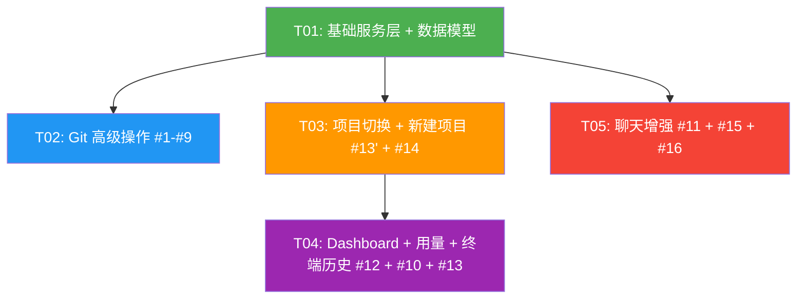

# 白泽功能补全 TDD — 系统架构设计与任务分解

> **项目**: baize_feature_completion  
> **架构师**: 高见远  
> **日期**: 2025-07-11  
> **基于**: PRD_Baize_Feature_Completion.md v1.0  
> **代码库**: 75 个 Swift 文件约 17000 行，Vite/SwiftUI/libgit2/nodejs-mobile/CPython 3.13

---

## Part A: 系统设计

### 1. 实现方案与框架选型

#### 1.1 核心技术挑战分析

| 挑战 | 难度 | 说明 |
|------|------|------|
| **项目切换全子系统联动** | 高 | 8+ 子系统需同步更新：GitService 重建、GitViewModel 重建、TerminalVM cwd、ProjectContext reload、FileSystemService rootPath、RuntimeExecutor ios_setMiniRoot、ConversationStore 过滤、EditorState 清空。GitService 是 actor 且 repositoryPath 是 `let`，必须销毁重建。 |
| **libgit2 高级操作（11 个新方法）** | 高 | fetch/pull/merge/rebase/stash/reset/tag/clone/deleteBranch/renameBranch/listRemoteBranches/checkoutRemoteBranch。每个方法都涉及多个 libgit2 C API 调用 + defer 配对 free + 错误处理。clone 是长耗时操作需进度回调。 |
| **UsageTracker 非侵入式注入** | 中 | 不能破坏 `toOpenAIMergedFormat`/`toAnthropicMessages`（铁律 #11）。需在 APIGateway 层包装 Provider 流，拦截 usage 数据。OpenAI 流式默认不返回 usage，需加 `stream_options`。 |
| **长内容渲染 O(n²) 修复** | 中 | SwiftUI `Text` 对超长字符串布局是 O(n²)。需折叠/分段方案，但折叠状态是纯 UI 层 @State，不可新增 Message enum case（铁律 #10）。 |
| **会话全文搜索性能** | 中 | 100 会话 × 50 消息 = 5000 条文本扫描，需 < 500ms。在 ConversationStore actor 内执行避免阻塞 UI。 |
| **Git clone 进度回调** | 中 | libgit2 `git_clone` 的进度回调需通过 `Unmanaged` 传递 payload（与现有 credentialsCallback 模式一致）。iOS 无后台执行保证，App 被后台化可能中断。 |

#### 1.2 框架与库选型

**结论：不需要新增任何 SPM 依赖。**

所有功能基于现有技术栈实现：

| 功能领域 | 技术方案 | 依赖 |
|---------|---------|------|
| Git 操作（#1-#9） | libgit2 C API（已 link `libgit2.xcframework`） | 已有 |
| 项目注册/切换（#14） | ProjectRegistry actor + JSON 持久化 | Foundation（已有） |
| 用量统计（#12） | UsageTracker actor + JSON 按日持久化 | Foundation（已有） |
| 终端历史（#10） | TerminalHistoryStore actor + JSON 按项目持久化 | Foundation（已有） |
| 长内容渲染（#11） | SwiftUI @State 折叠 + 分段 LazyVStack | SwiftUI（已有） |
| 会话搜索（#15） | ConversationStore.search() 纯文本扫描 | Foundation（已有） |
| 对话导出（#16） | ConversationExporter + UIActivityViewController | UIKit + Foundation（已有） |
| 新建项目模板（#13） | App Bundle resources + FileManager.copyItem | Foundation（已有） |

#### 1.3 关键架构决策

**决策 1：ProjectRegistry 设计为 actor**

与 ConversationStore、GitService 保持一致的并发模型。UI 通过 async 调用获取数据，结果通过 `@Published` 属性在 AppState 中回传。ProjectEntry 模型变为 `Codable` 持久化版本（去掉 `iconColor: Color` 非 Codable 字段，改为从 icon 名映射颜色）。

**决策 2：GitService 切换项目时销毁重建实例**

`GitService.repositoryPath` 是 `let`（不可变）。切换项目时在 AppState 中重新创建 GitService + GitViewModel 实例，替换旧引用。旧实例由 ARC 自动回收（actor 析构时 libgit2 handle 已 defer free）。

**决策 3：UsageTracker 注入点 — APIGateway 流包装**

APIGateway.streamComplete() 包装 Provider 返回的 `AsyncThrowingStream<LLMChunk>`，在包装层拦截 `.usage(LLMUsage)` chunk 记录用量。Provider 侧通过 `stream_options: {include_usage: true}`（OpenAI 兼容）或解析 `message_delta`（Anthropic）获取真实 usage。无 usage 时用 token 估算兜底。不修改 `toOpenAIMergedFormat`/`toAnthropicMessages`。

**决策 4：长内容折叠 — 纯 UI @State，不触碰 Message enum**

`ChatMessageList` 新增 `@State private var expandedMessageIds: Set<String>`。超过阈值（2000 字或 50 行）的 assistant 消息默认折叠，显示前 N 行 + "展开全文" 按钮。折叠状态不持久化，不存入 Message。流式输出中的 streamingText 不折叠（实时显示）。

**决策 5：终端历史按项目路径隔离**

持久化路径 `BaizePath.terminalHistory/terminal_history_{projectHash}.json`，projectHash 为项目路径的稳定哈希。切换项目时加载对应历史文件。上限 1000 条，连续相同命令去重，clear/cls 不记入。

**决策 6：Git clone 完整克隆（非 shallow）**

遵循用户确认的架构决策 #2 — 默认完整克隆，不用 `--depth 1`。`git_clone_options` 不设置 `GIT_FETCH_DEPTH`。

**决策 7：导出对话弹窗选精简/完整**

遵循用户确认的架构决策 #3 — 导出前弹窗让用户选"精简（仅对话文本）"或"完整（含工具调用结果）"。

#### 1.4 libgit2 API 可行性验证

| 操作 | libgit2 API | iOS 可用性 | 风险 |
|------|------------|-----------|------|
| fetch | `git_remote_fetch` + `git_remote_callbacks` | ✅ 已有 push 验证 | 无 |
| pull | fetch + `git_merge` | ✅ | 无 |
| merge | `git_annotated_commit_from_ref` → `git_merge` → `git_index_has_conflicts` | ✅ | 冲突枚举 `git_index_conflict_iterator` 需验证 |
| rebase | `git_rebase_init` → `git_rebase_next` → `git_rebase_commit` → `git_rebase_abort` | ✅ libgit2 v0.25+ | `git_rebase_commit` 冲突返回码需特殊处理 |
| stash | `git_stash_save` / `git_stash_foreach` / `git_stash_pop` / `git_stash_drop` | ✅ | `git_stash_foreach` 回调模式与 diff_foreach 一致 |
| reset | `git_commit_lookup` → `git_reset(repo, target, type, &opts)` | ✅ | `GIT_RESET_HARD` 需 `git_checkout_options` |
| tag | `git_tag_create` / `git_tag_create_lightweight` / `git_tag_list` / `git_tag_delete` | ✅ | `git_tag_list` 返回 `git_strarray` 需手动 free |
| clone | `git_clone(&repo, url, path, &clone_opts)` | ✅ | 进度回调 `git_indexer_progress_cb` 需 Unmanaged payload |
| deleteBranch | `git_branch_lookup` → `git_branch_delete` | ✅ | 删除当前分支返回错误码需检测 |
| renameBranch | `git_branch_lookup` → `git_branch_move` | ✅ | 无 |
| listRemoteBranches | `git_branch_iterator_new(GIT_BRANCH_REMOTE)` | ✅ | 需先 fetch 确保最新 |
| checkoutRemoteBranch | `git_branch_create` + `git_branch_set_upstream` + checkout | ✅ | 无 |

**结论：所有 libgit2 API 在 iOS 上可用，无需替代方案。** xcframework 已 link（holz/Settings.swift 验证）。

#### 1.5 iOS 限制验证

| 限制 | 影响需求 | 规避方式 |
|------|---------|---------|
| 无 `pclose` / `WIFEXITED` / `WEXITSTATUS` | 所有 Git 操作 | 全部走 libgit2 C API，不走 shell git |
| App 被后台化可能终止 | Git clone（长耗时） | UI 显示进度提示，P1 不做取消功能；用户需保持 App 前台 |
| `ios_setMiniRoot` 是进程级 | 项目切换 | 切换项目时重新调用 `ios_setMiniRoot(newPath)` |
| 无后台任务保证 | 用量持久化 | 每次记录即写文件（.atomic），不依赖后台刷新 |

---

### 2. 文件列表

#### 2.1 新增文件（10 个）

| 路径（相对 `Baize/Baize/`） | 所属任务 | 说明 |
|---------------------------|---------|------|
| `Services/ProjectRegistry.swift` | T01 | 项目注册表 actor + ProjectEntry 模型 |
| `Services/UsageTracker.swift` | T01 | 用量统计 actor + UsageRecord/UsageSummary 模型 |
| `Utils/BaizePricing.swift` | T01 | 模型价格表 + 费用估算 |
| `Services/TerminalHistoryStore.swift` | T01 | 终端历史持久化 actor + TerminalHistoryRecord |
| `Services/ConversationExporter.swift` | T01 | 对话导出服务 + ExportFormat 枚举 |
| `Services/ProjectTemplate.swift` | T01 | 项目模板定义 + 模板信息 |
| `Views/Git/GitStashView.swift` | T02 | Stash 子 Tab 视图 |
| `Views/Git/GitTagListView.swift` | T02 | 标签列表视图 |
| `Views/Dashboard/NewProjectWizard.swift` | T03 | 新建项目向导（空项目/模板/clone） |
| `Views/Chat/ShareSheet.swift` | T05 | UIActivityViewController SwiftUI 包装 |

#### 2.2 修改文件（23 个）

| 路径（相对 `Baize/Baize/`） | 所属任务 | 修改范围 |
|---------------------------|---------|---------|
| `Models/GitModels.swift` | T01 | 新增 GitStashEntry / GitTag / GitFetchResult / GitMergeResult / GitResetMode；GitSubTab 新增 `.stash` case；GitError 新增 merge/rebase/clone/Conflict 相关 case |
| `Utils/Constants.swift` | T01 | BaizePath 新增 projectsRegistry / usageData / terminalHistory / exportsDir 子路径常量 |
| `Services/GitService.swift` | T02 | 新增 16 个方法：fetch / pull / merge / rebase / rebaseAbort / stashPush / stashList / stashPop / stashDrop / reset / createTag / listTags / deleteTag / clone / deleteBranch / renameBranch / listRemoteBranches / checkoutRemoteBranch |
| `ViewModels/GitViewModel.swift` | T02 | 新增上述 Git 操作对应的 VM 方法 + @Published 状态（stashList / tags / remoteBranches / cloneProgress 等） |
| `Infrastructure/RuntimeExecutor.swift` | T02 | 修复 git 拦截文案（移除虚假 "pull"，改为引导使用 Git Tab）；新增 `git clone` 专项拦截文案 |
| `Views/Git/GitSubTabView.swift` | T02 | GitSubTab 新增 `.stash` 分支；改动子 Tab 新增 Pull 按钮；分支子 Tab 新增 Fetch 按钮 |
| `Views/Git/GitBranchView.swift` | T02 | 分支行新增 swipeActions（删除/重命名/合并/变基）；新增远程分支分区 |
| `Views/Git/GitLogView.swift` | T02 | commit 行新增 tag 徽章 + 长按菜单（重置/创建标签） |
| `Models/AppState.swift` | T03 | 新增 `projectRegistry` / `usageTracker` 属性；新增 `switchProject(to:)` 方法；GitService/GitViewModel 重建逻辑 |
| `App/BaizeApp.swift` | T03 | init 中创建 ProjectRegistry / UsageTracker 实例并注入 AppState |
| `Views/ContentView.swift` | T03 | 工作区顶部工具栏新增项目名下拉菜单（项目切换入口） |
| `Views/Sidebar/FileExplorerView.swift` | T03 | 文件树根目录从 `BaizePath.projectRoot` 改为 `appState.currentProjectPath` |
| `Agent/ProjectContext.swift` | T03 | 支持 `updateRootPath(_:)` 方法（切换项目后重新加载 BAIZE.md） |
| `Infrastructure/FileSystemService.swift` | T03 | 支持 `updateRootPath(_:)` 方法（切换项目后更新文件服务根路径） |
| `Views/Chat/ChatView.swift` | T03 | 会话列表加载时按 `appState.currentProjectPath` 过滤 |
| `Views/Dashboard/DashboardView.swift` | T04 | 替换 mockProjects 为 ProjectRegistry 真实数据；替换硬编码用量为 UsageTracker 数据；新增"新建项目"按钮；删除 ProjectEntry.mockProjects |
| `Infrastructure/APIGateway.swift` | T04 | 新增 `usageTracker` 属性；streamComplete 包装 Provider 流拦截 usage；LLMChunk 新增 `.usage(LLMUsage)` case + LLMUsage 结构体 |
| `Infrastructure/Providers/OpenAICompatibleHelper.swift` | T04 | buildRequest 新增 `stream_options: {include_usage: true}`；interpretSSEEvent 解析 usage 字段并 yield `.usage` |
| `Infrastructure/Providers/AnthropicProvider.swift` | T04 | 解析 `message_delta` 事件中的 usage 数据，yield `.usage` |
| `Views/Terminal/TerminalViewModel.swift` | T04 | init 异步加载 TerminalHistoryStore；execute 后增量保存历史；按项目隔离 |
| `Views/Settings/SettingsView.swift` | T04 | 新增"项目管理"子页（列表/移除）；新增"价格覆盖"设置区 |
| `Views/Chat/ChatMessageList.swift` | T05 | 新增 `expandedMessageIds: Set<String>` @State；长消息折叠逻辑 |
| `Views/Chat/MessageBubble.swift` | T05 | AssistantMessageBubble 新增折叠/展开逻辑 + 分段渲染 |
| `Views/Chat/SessionListView.swift` | T05 | 顶部新增搜索框 + 搜索结果列表；会话行新增导出 swipeAction |
| `Agent/ConversationStore.swift` | T05 | 新增 `search(query:projectPath:)` 方法；`listSessions(projectPath:)` 可选过滤 |

#### 2.3 按模块分组总览

```
Git 模块（#1-#9）:
  修改: GitService.swift, GitViewModel.swift, RuntimeExecutor.swift,
        GitSubTabView.swift, GitBranchView.swift, GitLogView.swift, GitModels.swift
  新增: GitStashView.swift, GitTagListView.swift

项目管理模块（#13' + #14）:
  修改: AppState.swift, BaizeApp.swift, ContentView.swift, FileExplorerView.swift,
        ProjectContext.swift, FileSystemService.swift, ChatView.swift
  新增: ProjectRegistry.swift, NewProjectWizard.swift, ProjectTemplate.swift

Dashboard 模块（#12 + #13 Dashboard）:
  修改: DashboardView.swift, APIGateway.swift, OpenAICompatibleHelper.swift,
        AnthropicProvider.swift, SettingsView.swift
  新增: UsageTracker.swift, BaizePricing.swift

终端模块（#10）:
  修改: TerminalViewModel.swift
  新增: TerminalHistoryStore.swift

聊天模块（#11 + #15 + #16）:
  修改: ChatMessageList.swift, MessageBubble.swift, SessionListView.swift,
        ConversationStore.swift
  新增: ConversationExporter.swift, ShareSheet.swift

基础设施:
  修改: Constants.swift
```

---

### 3. 数据结构和接口（类图）

> 完整类图见 `docs/class-diagram.mermaid`

#### 3.1 新增数据模型

```swift
// ProjectRegistry.swift
struct ProjectEntry: Codable, Identifiable {
    let id: UUID
    var name: String
    var path: String        // 绝对路径
    var stack: String       // 技术栈描述
    var icon: String        // SF Symbol name
    var lastOpened: Date
    
    /// 从 icon 名推导颜色（不持久化 Color）
    var iconColor: Color { /* mapping */ }
}

// UsageTracker.swift
struct UsageRecord: Codable {
    let timestamp: Date
    let provider: String
    let model: String
    let promptTokens: Int
    let completionTokens: Int
    let estimatedCost: Double
}

struct UsageSummary {
    let totalTokens: Int
    let apiCallCount: Int
    let totalCost: Double
}

// TerminalHistoryStore.swift
struct TerminalHistoryRecord: Codable {
    let projectPath: String
    var commands: [String]
    var lastUpdated: Date
}

// ConversationExporter.swift
enum ExportFormat: String, CaseIterable {
    case markdown
    case plaintext
    case json
}

enum ExportContentMode {
    case minimal    // 精简：仅对话文本
    case full       // 完整：含工具调用结果
}

// GitModels.swift (新增类型)
struct GitStashEntry: Identifiable {
    let id = UUID()
    let index: Int
    let message: String
    let date: Date
}

struct GitTag: Identifiable {
    let id = UUID()
    let name: String
    let oid: String
    let date: Date
    let message: String?
    let isAnnotated: Bool
}

struct GitFetchResult {
    let updatedBranches: Int
    let receivedBytes: Int
}

struct GitMergeResult {
    let success: Bool
    let conflictFiles: [String]
    let isFastForward: Bool
}

enum GitResetMode: String, CaseIterable {
    case soft
    case mixed
    case hard
}

// APIGateway.swift (新增)
struct LLMUsage: Sendable {
    let promptTokens: Int
    let completionTokens: Int
}

// ConversationStore.swift (新增)
struct SessionSearchResult: Identifiable {
    let id: UUID               // session.id
    let sessionId: UUID
    let sessionTitle: String
    let matchedSnippet: String  // 匹配片段（前后各 30 字）
    let matchCount: Int
    let matchedMessageId: String
}

// ProjectTemplate.swift
enum ProjectTemplate: String, CaseIterable {
    case reactVite
    case swiftPackage
    case python
    case nodejs
    case staticHTML
    
    var displayName: String { ... }
    var iconName: String { ... }
    var stackDescription: String { ... }
    var bundleDirectoryName: String { ... }
}
```

#### 3.2 新增 Actor / Service 接口

```swift
// ProjectRegistry.swift
actor ProjectRegistry {
    private var projects: [ProjectEntry]
    private let storePath: String  // BaizePath.projectsRegistry
    
    init(storePath: String)
    
    /// 加载持久化的项目列表
    func load() -> [ProjectEntry]
    
    /// 获取所有项目（按 lastOpened 降序）
    func list() -> [ProjectEntry]
    
    /// 注册新项目
    func add(_ entry: ProjectEntry)
    
    /// 移除项目（仅从注册表删除，不删文件）
    func remove(id: UUID)
    
    /// 更新项目信息（如 lastOpened）
    func update(_ entry: ProjectEntry)
    
    /// 按路径查找项目
    func find(path: String) -> ProjectEntry?
    
    /// 持久化到 projects.json
    private func save()
}

// UsageTracker.swift
actor UsageTracker {
    private let storeDir: String  // BaizePath.usageData
    
    init(storeDir: String)
    
    /// 记录一次 API 调用的 usage
    func record(_ record: UsageRecord)
    
    /// 获取今日用量摘要
    func getTodaySummary() -> UsageSummary
    
    /// 加载指定日期的用量记录
    func loadDay(_ date: Date) -> [UsageRecord]
    
    /// 清理超过 30 天的明细（保留月度聚合）
    func cleanupOldRecords()
}

// TerminalHistoryStore.swift
actor TerminalHistoryStore {
    private let storeDir: String  // BaizePath.terminalHistory
    
    init(storeDir: String)
    
    /// 加载指定项目的命令历史
    func load(projectPath: String) -> [String]
    
    /// 追加命令到历史（增量保存）
    func append(command: String, projectPath: String)
    
    /// 清空指定项目的历史
    func clear(projectPath: String)
}

// ConversationExporter.swift
struct ConversationExporter {
    /// 导出会话
    /// - Parameters:
    ///   - session: 对话会话
    ///   - format: 导出格式
    ///   - projectPath: 当前项目路径（用于确定 exports/ 目录）
    ///   - contentMode: 精简/完整
    /// - Returns: 导出文件 URL
    func export(
        session: ConversationSession,
        format: ExportFormat,
        projectPath: String,
        contentMode: ExportContentMode
    ) throws -> URL
    
    private func exportMarkdown(_ session: ConversationSession, includeToolResults: Bool) -> String
    private func exportPlaintext(_ session: ConversationSession, includeToolResults: Bool) -> String
    private func exportJSON(_ session: ConversationSession) throws -> Data
    private func sanitizeFilename(_ name: String) -> String
}
```

#### 3.3 GitService 新增方法签名

```swift
// GitService.swift (在现有 actor 内新增)

// MARK: - Fetch & Pull (#1)
func fetch() async throws -> GitFetchResult
func pull() async throws -> GitMergeResult

// MARK: - Merge (#2)
func merge(branch: String) async throws -> GitMergeResult

// MARK: - Rebase (#3)
func rebase(branch: String) async throws -> GitMergeResult
func rebaseAbort() async throws

// MARK: - Stash (#4)
func stashPush(message: String?) async throws
func stashList() async throws -> [GitStashEntry]
func stashPop() async throws -> GitMergeResult
func stashDrop(index: Int) async throws

// MARK: - Reset (#5)
func reset(to oid: String, mode: GitResetMode) async throws

// MARK: - Tag (#6)
func createTag(name: String, message: String?, targetOid: String?) async throws
func listTags() async throws -> [GitTag]
func deleteTag(name: String) async throws

// MARK: - Clone (#7)
func clone(remoteURL: String, toPath: String, 
           progressHandler: ((Double, String) -> Void)?) async throws

// MARK: - Branch CRUD (#8)
func deleteBranch(name: String) async throws
func renameBranch(oldName: String, newName: String) async throws

// MARK: - Remote Branches (#9)
func listRemoteBranches() async throws -> [GitBranch]
func checkoutRemoteBranch(name: String) async throws
```

#### 3.4 ConversationStore 新增方法

```swift
// ConversationStore.swift (在现有 actor 内新增)

/// 全文搜索会话
/// - Parameters:
///   - query: 搜索关键词（大小写不敏感）
///   - projectPath: 限制搜索范围（当前项目）
/// - Returns: 匹配的会话搜索结果列表
func search(query: String, projectPath: String) async -> [SessionSearchResult]

/// 列出会话（可选按项目路径过滤）
/// - Parameter projectPath: 项目路径，nil 返回全部
func listSessions(projectPath: String?) -> [ConversationSession]
```

#### 3.5 GitSubTab 枚举变更

```swift
// GitModels.swift (修改现有枚举)
enum GitSubTab: String, CaseIterable, Hashable {
    case changes
    case history
    case branches
    case stash  // 新增
    
    var title: String {
        switch self {
        case .changes: return "改动"
        case .history: return "历史"
        case .branches: return "分支"
        case .stash: return "贮藏"
        }
    }
    
    var systemImage: String {
        switch self {
        case .changes: return "doc.text"
        case .history: return "clock.arrow.circlepath"
        case .branches: return "arrow.triangle.branch"
        case .stash: return "tray.fill"
        }
    }
}
```

#### 3.6 GitError 新增 case

```swift
// GitModels.swift (修改现有枚举)
enum GitError: LocalizedError {
    // ... 现有 case ...
    
    /// merge 冲突（附带冲突文件列表）
    case mergeConflict([String])
    /// rebase 冲突（附带冲突文件列表）
    case rebaseConflict([String])
    /// clone 失败
    case cloneFailed(String)
    /// 目标目录已存在且非空
    case directoryExists(String)
    /// stash 为空
    case stashEmpty
    /// 标签已存在
    case tagExists(String)
    /// 不能删除当前分支
    case cannotDeleteCurrentBranch
}
```

#### 3.7 APIGateway / LLMChunk 变更

```swift
// APIGateway.swift

/// LLM 响应增量 chunk（新增 .usage case）
enum LLMChunk: Sendable {
    case textDelta(String)
    case toolCallBegin(id: String, name: String)
    case toolCallDelta(id: String, argumentsDelta: String)
    case usage(LLMUsage)      // 新增：usage 数据（APIGateway 拦截，不转发 AgentLoop）
    case done(finishReason: String)
}

actor APIGateway {
    // ... 现有属性 ...
    
    /// 用量统计器（新增）
    private var usageTracker: UsageTracker?
    
    /// 设置用量统计器
    func setUsageTracker(_ tracker: UsageTracker)
    
    /// streamComplete — 包装 Provider 流，拦截 usage 记录用量
    func streamComplete(
        messages: [Message],
        tools: [ToolDefinition],
        model: String? = nil
    ) -> AsyncThrowingStream<LLMChunk, Error>
    // 内部实现：包装 provider.streamComplete()，拦截 .usage chunk，
    // 在 .done 时记录 UsageRecord（有真实 usage 用真实值，否则估算）
}
```

---

### 4. 程序调用流程（时序图）

> 完整时序图见 `docs/sequence-diagram.mermaid`

#### 4.1 项目切换联动流程（#14）

```
User → Dashboard: 点击项目卡片
Dashboard → AppState: switchProject(to: newPath)
AppState → AppState: 检查 EditorState 是否有未保存改动
  alt 有未保存改动 → 提示用户保存 → 等待确认
AppState → ProjectRegistry: update(entry.lastOpened = now)
AppState → AppState: currentProjectPath = newPath
AppState → GitService: 创建新 GitService(repositoryPath: newPath)
AppState → GitViewModel: 创建新 GitViewModel(gitService: newGitService)
AppState → TerminalViewModel: currentWorkingDir = newPath
AppState → ProjectContext: updateRootPath(newPath) → 重新加载 BAIZE.md
AppState → FileSystemService: updateRootPath(newPath)
AppState → RuntimeExecutor: ios_setMiniRoot(newPath)
  note: FileExplorerView / ChatView 通过 @Published currentProjectPath 自动响应
AppState → Dashboard: 切换完成
```

#### 4.2 Git clone + 新建项目联动流程（#7 + #13'）

```
User → NewProjectWizard: 选择"从 Git clone 创建" → 输入 URL + 项目名
NewProjectWizard → GitService: clone(remoteURL: url, toPath: projectRoot/projectName)
  loop 传输进度
    GitService → NewProjectWizard: progressHandler(percent, message)
    NewProjectWizard → User: 更新进度条
  end
GitService → NewProjectWizard: clone 成功
NewProjectWizard → ProjectRegistry: add(ProjectEntry(path: projectRoot/projectName))
NewProjectWizard → AppState: switchProject(to: projectRoot/projectName)
  note: 触发完整的项目切换联动（见 4.1）
NewProjectWizard → User: 项目创建完成，自动切换到新项目
```

#### 4.3 UsageTracker 记录流程（#12）

```
AgentLoop → APIGateway: streamComplete(messages, tools, model)
APIGateway → Provider: provider.streamComplete(messages, tools, model)
Provider -->> APIGateway: 原始 AsyncThrowingStream<LLMChunk>
  note: APIGateway 包装流 — 拦截 .usage 和 .done
APIGateway -->> AgentLoop: 包装后的流

loop 每个 chunk
  Provider → APIGateway: yield chunk
  alt chunk == .usage(LLMUsage)
    APIGateway → APIGateway: 缓存 usage 数据，不转发
  else chunk == .done(finishReason)
    APIGateway → BaizePricing: estimateCost(model, promptTokens, completionTokens)
    BaizePricing -->> APIGateway: cost
    alt 有真实 usage
      APIGateway → UsageTracker: record(UsageRecord(真实 token 数))
    else 无 usage（估算）
      APIGateway → UsageTracker: record(UsageRecord(估算 token 数))
    end
    UsageTracker → Disk: 追加写入 usage/{yyyy-MM-dd}.json
  end
  APIGateway → AgentLoop: yield chunk（.usage 不转发）
end
```

#### 4.4 会话搜索流程（#15）

```
User → SessionListView: 输入关键词
SessionListView → SessionListView: debounce 300ms
SessionListView → ConversationStore: search(query: keyword, projectPath: current)
ConversationStore → Disk: 读取所有会话 JSON 文件
Disk -->> ConversationStore: [ConversationSession]
ConversationStore → ConversationStore: 过滤 projectPath 匹配的会话
  loop 每个会话
    ConversationStore → ConversationStore: 遍历 messages[].content，大小写不敏感匹配
    alt 匹配成功
      ConversationStore → ConversationStore: 提取匹配片段（前后各 30 字）
    end
  end
ConversationStore -->> SessionListView: [SessionSearchResult]
SessionListView → User: 显示搜索结果（标题 + 高亮片段 + 匹配数）
User → SessionListView: 点击结果
SessionListView → SessionListView: 加载会话 + 滚动到匹配消息
```

---

### 5. 任务列表

#### T01: 基础服务层 + 共享数据模型

| 字段 | 值 |
|------|-----|
| **任务 ID** | T01 |
| **任务名称** | 基础服务层 + 共享数据模型（ProjectRegistry / UsageTracker / TerminalHistoryStore / ConversationExporter / ProjectTemplate + GitModels 扩展 + BaizePath 扩展） |
| **涉及文件** | **新增**: `Services/ProjectRegistry.swift`, `Services/UsageTracker.swift`, `Utils/BaizePricing.swift`, `Services/TerminalHistoryStore.swift`, `Services/ConversationExporter.swift`, `Services/ProjectTemplate.swift`<br>**修改**: `Models/GitModels.swift`（新增 GitStashEntry/GitTag/GitFetchResult/GitMergeResult/GitResetMode + GitSubTab.stash + GitError 新 case）, `Utils/Constants.swift`（BaizePath 新增子路径） |
| **依赖任务** | 无 |
| **优先级** | P0（基础设施，所有其他任务依赖） |
| **预估复杂度** | 中 |
| **风险点** | ① ProjectEntry 需替换 DashboardView 中的旧定义（非 Codable 版本），注意 iconColor 处理 ② GitSubTab 新增 .stash case 后，GitSubTabView 的 ForEach(GitSubTab.allCases) 自动包含 .stash，需确保 T02 同步实现 GitStashView 否则编译通过但运行 crash ③ BaizePricing 价格表需覆盖 Constants.swift 中 BaizeModels 定义的所有模型 ID |

**任务描述**：

创建所有新增的基础服务 actor 和共享数据模型，为后续任务提供基础设施。此任务不涉及 UI 修改，纯 service/model 层。

1. **ProjectRegistry.swift** — actor，持久化项目列表到 `BaizePath.projectsRegistry`。ProjectEntry 模型为 Codable 版本（`let id: UUID`, `var path: String`, `var name: String`, `var stack: String`, `var icon: String`, `var lastOpened: Date`）。iconColor 为 computed property（从 icon 名映射 Color，不持久化）。首次启动自动注册默认项目（BaizePath.projectRoot）。
   - JSON 编解码使用 `.iso8601` 日期策略（与 ConversationStore 一致）
   - 文件写入用 `.atomic` 选项（与 ConversationStore.save 一致）

2. **UsageTracker.swift** — actor，按日持久化到 `BaizePath.usageData/{yyyy-MM-dd}.json`。每次 `record()` 追加到当日数组并原子写入。`getTodaySummary()` 返回 UsageSummary（totalTokens / apiCallCount / totalCost）。`cleanupOldRecords()` 删除超过 30 天的文件。

3. **BaizePricing.swift** — 硬编码主流模型价格表（input/output 每百万 token 美元价）。覆盖 BaizeModels 中所有模型 ID（OpenAI / Anthropic / OpenRouter / Custom）。`estimateCost(model:prompt:completion:)` 计算费用。支持用户覆盖（UserDefaults 存储覆盖值）。

4. **TerminalHistoryStore.swift** — actor，按项目路径隔离持久化到 `BaizePath.terminalHistory/terminal_history_{projectHash}.json`。projectHash = projectPath 的 SHA256 前 16 位。`append()` 增量保存（读取→追加→写入，debounce 不需要因为 actor 串行化）。上限 1000 条，连续相同命令去重，clear/cls 不记入。

5. **ConversationExporter.swift** — struct（非 actor，无状态）。`export()` 方法生成文件到 `{projectPath}/exports/{sanitizedTitle}.{ext}`。Markdown 格式：按角色分段渲染，工具调用渲染 name + arguments，工具结果渲染 content。文件名合法化：替换 `/\:*?"<>|` 为 `_`。

6. **ProjectTemplate.swift** — enum，5 个 case（reactVite / swiftPackage / python / nodejs / staticHTML）。每个 case 提供 displayName / iconName / stackDescription / bundleDirectoryName。模板文件打包在 App Bundle 的 `templates/` 目录中（本任务只定义 enum，模板文件由构建配置添加）。

7. **GitModels.swift 修改** — 在现有文件末尾新增 GitStashEntry / GitTag / GitFetchResult / GitMergeResult / GitResetMode 结构体。GitSubTab 枚举新增 `.stash` case。GitError 新增 mergeConflict / rebaseConflict / cloneFailed / directoryExists / stashEmpty / tagExists / cannotDeleteCurrentBranch case。

8. **Constants.swift 修改** — BaizePath 新增：
   ```swift
   static let projectsRegistry = internalData + "projects.json"
   static let usageData = internalData + "usage/"
   static let terminalHistory = internalData + "terminal_history/"
   static let exportsDirName = "exports"  // 相对项目根的目录名
   ```

---

#### T02: Git 高级操作全量实现（#1-#9）

| 字段 | 值 |
|------|-----|
| **任务 ID** | T02 |
| **任务名称** | Git 高级操作全量实现 — fetch/pull/merge/rebase/stash/reset/tag/clone/deleteBranch/renameBranch/listRemoteBranches/checkoutRemoteBranch + Git UI 扩展 |
| **涉及文件** | **修改**: `Services/GitService.swift`（16 个新方法）, `ViewModels/GitViewModel.swift`（VM 方法 + @Published 状态）, `Infrastructure/RuntimeExecutor.swift`（修复 git 拦截文案）, `Views/Git/GitSubTabView.swift`（.stash tab + Pull/Fetch 按钮）, `Views/Git/GitBranchView.swift`（删除/重命名/合并/变基/远程分支）, `Views/Git/GitLogView.swift`（reset/tag）<br>**新增**: `Views/Git/GitStashView.swift`, `Views/Git/GitTagListView.swift` |
| **依赖任务** | T01（GitModels 新增类型 + GitSubTab.stash） |
| **优先级** | P0（#1 pull/fetch、#2 merge、#7 clone 是 P0 需求） |
| **预估复杂度** | 高 |
| **风险点** | ① libgit2 所有对象必须 defer 配对 free — `git_annotated_commit_free` / `git_index_free` / `git_index_conflict_iterator_free` / `git_rebase_free` / `git_signature_free` / `git_tag_free` / `git_strarray_free` / `git_reference_free` / `git_commit_free` / `git_remote_free` ② clone 进度回调需通过 Unmanaged 传递 payload（与 credentialsCallback 模式一致），`git_indexer_progress_cb` 的回调签名需确认 libgit2 版本 ③ rebase 冲突时 `git_rebase_commit` 返回 `GIT_EAPPLIED` 或冲突码，需检测并返回友好错误 ④ `git_merge` 后需检查 `git_repository_state` 是否为 `GIT_REPOSITORY_STATE_MERGE` 检测冲突 ⑤ clone 是长耗时操作（30s+），iOS 无后台保证，用户需保持 App 前台 ⑥ 不能删除当前分支 — `git_branch_delete` 对当前分支返回错误码，需检测 ⑦ `git_tag_list` 返回 `git_strarray` 需手动 `git_strarray_free` |

**任务描述**：

在 GitService actor 中实现 16 个新方法，覆盖 PRD #1-#9 全部 Git 操作。每个方法严格遵循 libgit2 C API 模式：open repo → 操作 → defer free → 错误处理。所有操作在 actor 内部执行（libgit2 非线程安全）。

**GitService 方法实现要点**：

- **fetch()**: `git_remote_lookup` → 配置 `git_remote_callbacks`（复用 credentialsCallback）→ `git_remote_fetch` → 返回 GitFetchResult（updatedBranches / receivedBytes）。defer `git_remote_free`。
- **pull()**: 调 `fetch()` → `git_reference_lookup` 获取远程跟踪分支 → `git_annotated_commit_from_ref` → `git_merge` → 检查冲突。defer `git_annotated_commit_free` / `git_index_free`。
- **merge(branch:)**: `git_branch_lookup` → `git_annotated_commit_from_ref` → `git_merge` → `git_index_has_conflicts` + `git_index_conflict_iterator` 枚举冲突文件。合并前检查工作区干净（调 `status()`）。defer free all。
- **rebase(branch:)**: `git_rebase_init` → 循环 `git_rebase_next` + `git_rebase_commit` → 冲突时暂停返回冲突列表。`rebaseAbort()`: `git_rebase_abort`。defer `git_rebase_free`。
- **stashPush(message:)**: `git_signature_now` → `git_stash_save`。defer `git_signature_free`。空工作区检测（调 `status()`）。
- **stashList()**: `git_stash_foreach` 回调收集（index + message + commit time）。
- **stashPop()**: `git_stash_pop(repo, 0, &opts)` → 冲突检测。冲突时保留 stash 不删除。
- **stashDrop(index:)**: `git_stash_drop(repo, index)`。
- **reset(to:mode:)**: `git_commit_lookup` → `git_reset(repo, target, GIT_RESET_SOFT/MIXED/HARD, &checkout_opts)`。defer `git_commit_free`。注意 `git_reset` 第二参数是 `git_object*`。
- **createTag(name:message:targetOid:)**: 有 message → `git_tag_create`（附注标签），无 message → `git_tag_create_lightweight`。targetOid 为 nil 时在 HEAD 创建。defer `git_signature_free`。
- **listTags()**: `git_tag_list` → 遍历 `git_strarray` → `git_tag_lookup` 获取详情。defer `git_strarray_free` / `git_tag_free`。
- **deleteTag(name:)**: `git_tag_delete(repo, name)`。
- **clone(remoteURL:toPath:progressHandler:)**: `git_clone_options` 配置 `remote_callbacks`（credentials + progress）→ `git_clone`。进度回调通过 `Unmanaged<CloneProgressPayload>` 传递。clone 完成后 `git_repository_free`。目标目录已存在非空返回 `GitError.directoryExists`。
- **deleteBranch(name:)**: `git_branch_lookup(GIT_BRANCH_LOCAL)` → 检查是否当前分支 → `git_branch_delete`。defer `git_reference_free`。
- **renameBranch(oldName:newName:)**: `git_branch_lookup` → `git_branch_move` → `git_reference_free`。
- **listRemoteBranches()**: 先调 `fetch()` → `git_branch_iterator_new(GIT_BRANCH_REMOTE)` → 遍历。defer `git_branch_iterator_free` / `git_reference_free`。
- **checkoutRemoteBranch(name:)**: `git_branch_create`（从远程分支创建本地跟踪分支）→ `git_branch_set_upstream` → `git_checkout_branch`。检查工作区干净 + 本地同名分支不存在。

**GitViewModel 方法**：为每个 GitService 新方法添加对应的 VM 方法，模式与现有 `push()` / `checkoutBranch()` 一致（设置 loading 状态 → 调 GitService → 刷新 status/log/branches → showSuccessMessage/showError）。新增 @Published 状态：`stashList: [GitStashEntry]`, `tags: [GitTag]`, `remoteBranches: [GitBranch]`, `cloneProgress: Double`, `cloneStatus: String`。

**RuntimeExecutor 修改**：第 152-160 行 git 拦截文案更新为：
```
⚠️ 'git' 命令在 iOS 沙箱中不可用。
白泽使用 Git Tab (libgit2) 提供完整 Git 操作支持。

可用操作：status, log, diff, stage, commit, push, pull, fetch, merge, rebase, stash, reset, tag, branch, checkout

请切换到 Git Tab 进行操作。
```
新增 `git clone` 专项拦截：
```
⚠️ Git clone 请通过 Dashboard → 新建项目 → 从 Git clone 创建 进行操作。
```

**Git UI 修改**：
- GitSubTabView: 新增 `.stash` case 渲染 `GitStashView`；改动子 Tab 顶部新增 `[↓ Pull]` 按钮；分支子 Tab 新增 `[↓ Fetch]` 按钮。
- GitBranchView: 本地分支行新增 swipeActions（删除/重命名/合并到当前/变基到当前）；新增远程分支分区。
- GitLogView: commit 行旁显示 tag 徽章（如有）；commit 行新增 contextMenu（重置到此提交 / 在此创建标签）。
- GitStashView (新): stash 列表 + `[+ Stash Push]` 按钮 + 每行 `[Pop]` `[×]` 操作。
- GitTagListView (新): 标签列表视图（名称 + OID + 时间 + 消息）。

---

#### T03: 项目切换联动 + 新建项目流程（#13' + #14）

| 字段 | 值 |
|------|-----|
| **任务 ID** | T03 |
| **任务名称** | 项目切换全子系统联动 + 新建项目向导（空项目/模板/Git clone） |
| **涉及文件** | **修改**: `Models/AppState.swift`（switchProject + ProjectRegistry/UsageTracker 属性 + GitService/GitViewModel 重建）, `App/BaizeApp.swift`（init 新服务）, `Views/ContentView.swift`（项目切换下拉菜单）, `Views/Sidebar/FileExplorerView.swift`（根路径动态化）, `Agent/ProjectContext.swift`（updateRootPath）, `Infrastructure/FileSystemService.swift`（updateRootPath）, `Views/Chat/ChatView.swift`（会话按 projectPath 过滤）<br>**新增**: `Views/Dashboard/NewProjectWizard.swift` |
| **依赖任务** | T01（ProjectRegistry, ProjectTemplate） |
| **优先级** | P0（#14 项目切换是 P0 需求） |
| **预估复杂度** | 高 |
| **风险点** | ① GitService 是 actor 且 repositoryPath 是 `let`，切换时必须重建实例 — AppState 中的 `gitService: GitService?` 和 `gitViewModel: GitViewModel?` 需为 `var` ② `ios_setMiniRoot` 是进程级操作，切换项目时必须重新调用，且必须在串行队列上执行（RuntimeExecutor.executeQueue） ③ ProjectContext 和 FileSystemService 的 rootPath 如果是 `let` 需改为 `var` 或提供 update 方法 ④ 切换项目时如果有未保存的编辑器改动，需提示用户保存 — 需 EditorState/MonacoBridge 暴露 `hasUnsavedChanges` 属性 ⑤ ContentView 工具栏项目切换下拉菜单需在 NavigationSplitView 的 detail 区域顶部，不能遮挡 FocusModeBar ⑥ 首次启动需自动注册默认项目到 ProjectRegistry ⑦ NewProjectWizard 的 Git clone 流程依赖 T02 的 GitService.clone 方法 — 如果 T02 未完成，clone 路径不可用但空项目/模板路径可独立工作 |

**任务描述**：

实现多项目注册/切换/新建的完整机制。这是本次最大的架构变更，涉及 8+ 文件修改。

**AppState.switchProject(to:) 实现要点**：

```swift
/// 切换当前项目，触发全子系统联动
func switchProject(to path: String) {
    // 1. 检查是否已在当前项目
    guard path != currentProjectPath else { return }
    
    // 2. 检查编辑器未保存改动
    if let editorState = editorState, editorState.hasUnsavedChanges {
        // 弹出保存提示（通过 @Published showSavePrompt = true）
        pendingSwitchPath = path
        return
    }
    
    // 3. 执行切换
    performSwitch(to: path)
}

private func performSwitch(to path: String) {
    currentProjectPath = path
    
    // 更新 ProjectRegistry lastOpened
    Task {
        if let entry = await projectRegistry?.find(path: path) {
            var updated = entry
            updated.lastOpened = Date()
            await projectRegistry?.update(updated)
        }
    }
    
    // 重建 GitService + GitViewModel
    if let keychain = keychainService {
        let newGitService = GitService(repositoryPath: path, keychainService: keychain)
        let newGitVM = GitViewModel(gitService: newGitService)
        gitService = newGitService
        gitViewModel = newGitVM
    }
    
    // 更新终端工作目录
    terminalViewModel?.currentWorkingDir = path
    
    // 更新 ProjectContext（重新加载 BAIZE.md）
    projectContext?.updateRootPath(path)
    Task { try await projectContext?.load() }
    
    // 更新 FileSystemService
    fileSystemService?.updateRootPath(path)
    
    // 更新 ios_setMiniRoot（进程级）
    runtimeExecutor?.updateMiniRoot(path)
    
    // 清空编辑器打开的文件
    openFiles = []
    selectedFilePath = nil
}
```

**NewProjectWizard 实现要点**：

NavigationStack 多页流程：
1. **选择创建方式**页：三个选项卡片（空项目 / 从模板创建 / 从 Git clone 创建）
2. **空项目流程**：输入项目名 → 创建目录 → 生成 BAIZE.md → `git init` → 注册 ProjectRegistry → `switchProject`
3. **模板流程**：选择模板（5 种）→ 输入项目名 → `FileManager.copyItem` 从 Bundle 复制模板 → 生成 BAIZE.md → git init → 注册 → 切换
4. **Git clone 流程**：输入 URL + 项目名 → 调 `GitService.clone`（显示进度）→ 注册 → 切换
5. **项目名校验**：非空 / 仅 `[a-zA-Z0-9_-]` / 不与已有项目重名
6. **失败回滚**：创建失败时删除已创建的目录

**ContentView 修改**：工作区 detail 区域顶部新增项目名下拉菜单（`Menu` 组件），显示所有项目 + 当前项目标记 + "新建项目" 入口。

**FileExplorerView 修改**：文件树根目录从 `BaizePath.projectRoot` 改为 `appState.currentProjectPath`。通过 `@EnvironmentObject` 观察 currentProjectPath 变化自动刷新。

**ChatView 修改**：加载会话列表时调用 `conversationStore.listSessions(projectPath: appState.currentProjectPath)` 过滤当前项目的会话。

---

#### T04: Dashboard 真实化 + 用量注入 + 终端历史（#12 + #10 + #13 Dashboard）

| 字段 | 值 |
|------|-----|
| **任务 ID** | T04 |
| **任务名称** | Dashboard 真实数据替换（用量统计 + 最近项目 + 新建项目入口）+ UsageTracker 注入 APIGateway + 终端历史持久化集成 |
| **涉及文件** | **修改**: `Views/Dashboard/DashboardView.swift`（真实项目列表 + 真实用量 + 新建项目按钮 + 删除 mockProjects）, `Infrastructure/APIGateway.swift`（streamComplete 流包装 + usageTracker 属性 + LLMChunk.usage + LLMUsage）, `Infrastructure/Providers/OpenAICompatibleHelper.swift`（stream_options + usage 解析）, `Infrastructure/Providers/AnthropicProvider.swift`（message_delta usage 解析）, `Views/Terminal/TerminalViewModel.swift`（TerminalHistoryStore 集成）, `Views/Settings/SettingsView.swift`（项目管理子页 + 价格覆盖） |
| **依赖任务** | T01（UsageTracker, BaizePricing, TerminalHistoryStore, ProjectRegistry）, T03（switchProject 用于 Dashboard 项目卡片点击切换） |
| **优先级** | P1（#12 用量、#10 终端历史、#13 Dashboard 最近项目均为 P1） |
| **预估复杂度** | 中 |
| **风险点** | ① APIGateway.streamComplete 包装流时，Task 内部访问 `self` 需捕获 actor 属性到局部变量（与现有模式一致）② LLMChunk 新增 `.usage` case 后，AgentLoop 的 switch 不匹配 .usage 不会编译报错（Swift switch 不强制 exhaustive 对 enum？实际上 Swift enum switch 是 exhaustive 的）— **需确认 AgentLoop 是否有 default 分支** ③ OpenAI `stream_options: {include_usage: true}` 可能在部分 OpenAI 兼容 API（如 DeepSeek）不被支持，需 try-catch 忽略错误 ④ TerminalViewModel 是 @MainActor，TerminalHistoryStore 是 actor，跨 actor 调用需 async ⑤ DashboardView 的 ProjectEntry 需从 T01 的新定义导入，删除旧的 mockProjects 和非 Codable 定义 ⑥ 删除 ProjectEntry.mockProjects 后，DashboardView 中的 `@State private var recentProjects` 改为从 ProjectRegistry async 加载 |

**任务描述**：

将 Dashboard 从硬编码 mock 数据替换为真实数据，实现 UsageTracker 在 APIGateway 的非侵入式注入，集成终端历史持久化。

**APIGateway UsageTracker 注入实现**：

```swift
// APIGateway.swift 修改

// 新增属性
private var usageTracker: UsageTracker?

func setUsageTracker(_ tracker: UsageTracker) {
    self.usageTracker = tracker
}

// streamComplete 包装 Provider 流
func streamComplete(messages: [Message], tools: [ToolDefinition], model: String? = nil) 
    -> AsyncThrowingStream<LLMChunk, Error> {
    let resolvedModel = model ?? activeModel
    let currentProviderId = activeProviderId
    guard let provider = providers[activeProviderId] else { /* error */ }
    let tracker = self.usageTracker  // 捕获到局部变量
    
    let rawStream = provider.streamComplete(messages: messages, tools: tools, model: resolvedModel)
    
    return AsyncThrowingStream { continuation in
        let task = Task {
            var receivedUsage: LLMUsage?
            var completionTextLength = 0
            do {
                for try await chunk in rawStream {
                    switch chunk {
                    case .usage(let usage):
                        receivedUsage = usage
                        continue  // 不转发 .usage 给 AgentLoop
                    case .textDelta(let text):
                        completionTextLength += text.count
                    case .done(let reason):
                        // 记录用量
                        let promptTokens = receivedUsage?.promptTokens 
                            ?? estimatePromptTokens(messages)
                        let completionTokens = receivedUsage?.completionTokens 
                            ?? estimateTokens(completionTextLength)
                        let cost = BaizePricing.estimateCost(
                            model: resolvedModel,
                            prompt: promptTokens,
                            completion: completionTokens
                        )
                        if let tracker = tracker {
                            await tracker.record(UsageRecord(
                                timestamp: Date(),
                                provider: currentProviderId,
                                model: resolvedModel,
                                promptTokens: promptTokens,
                                completionTokens: completionTokens,
                                estimatedCost: cost
                            ))
                        }
                    default:
                        break
                    }
                    continuation.yield(chunk)
                }
                continuation.finish()
            } catch {
                continuation.finish(throwing: error)
            }
        }
        continuation.onTermination = { _ in task.cancel() }
    }
}

// Token 估算（复用 BaizeToken 常数）
private func estimatePromptTokens(_ messages: [Message]) -> Int {
    let totalChars = messages.reduce(0) { $0 + $1.content.count }
    return Int(Double(totalChars) * BaizeToken.tokenEstimateMultiplier)
}

private func estimateTokens(_ charCount: Int) -> Int {
    Int(Double(charCount) * BaizeToken.tokenEstimateMultiplier)
}
```

**OpenAICompatibleHelper 修改**：
- `buildRequest` 的 body 中新增 `"stream_options": ["include_usage": true]`（仅对 OpenAI 兼容端点）
- `interpretSSEEvent` 解析 SSE JSON 中的 `usage` 字段（OpenAI 在 `[DONE]` 前的最后一个 chunk 包含 usage），yield `.usage(LLMUsage(promptTokens:completionTokens:))`

**AnthropicProvider 修改**：
- 解析 `message_delta` SSE 事件中的 `usage` 字段（`input_tokens` / `output_tokens`），yield `.usage`

**DashboardView 修改**：
- 删除 `ProjectEntry` 旧定义和 `mockProjects`（迁移到 T01 的 ProjectRegistry.swift）
- `@State private var recentProjects` 改为 async 加载：`Task { recentProjects = await appState.projectRegistry?.list() ?? [] }`
- DailyUsageSection 改为 async 加载：`Task { let summary = await appState.usageTracker?.getTodaySummary(); ... }`
- 项目卡片点击 → `appState.switchProject(to: project.path)`
- 当前项目卡片高亮（`project.path == appState.currentProjectPath`）
- 新增 `[+ 新建项目]` 按钮 → 弹出 NewProjectWizard sheet
- 项目卡片长按 → 从 ProjectRegistry 移除（不删文件）

**TerminalViewModel 修改**：
- `init` 中异步加载历史：`Task { commandHistory = await terminalHistoryStore?.load(projectPath: currentWorkingDir) ?? [] }`
- `addToHistory()` 中异步保存：`Task { await terminalHistoryStore?.append(command: trimmed, projectPath: currentWorkingDir) }`
- 历史上限 1000 条 + 连续去重 + clear/cls 不记入（TerminalHistoryStore 内部处理）
- 切换项目时（由 T03 的 switchProject 触发 currentWorkingDir 变更），重新加载对应项目的历史

**SettingsView 修改**：
- 新增"项目管理"子页：显示完整项目列表 + 添加/移除操作
- 新增"价格覆盖"设置区：允许用户覆盖 BaizePricing 默认价格

---

#### T05: 聊天体验增强 — 长内容渲染 + 会话搜索 + 对话导出（#11 + #15 + #16）

| 字段 | 值 |
|------|-----|
| **任务 ID** | T05 |
| **任务名称** | Bug 6 长内容折叠渲染 + 会话全文搜索 + 对话导出（Markdown/纯文本/JSON + Share Sheet） |
| **涉及文件** | **修改**: `Views/Chat/ChatMessageList.swift`（expandedMessageIds 状态 + 折叠逻辑）, `Views/Chat/MessageBubble.swift`（折叠/展开 UI + 分段渲染）, `Views/Chat/SessionListView.swift`（搜索框 + 搜索结果 + 导出 swipeAction）, `Agent/ConversationStore.swift`（search 方法 + listSessions 过滤）<br>**新增**: `Views/Chat/ShareSheet.swift` |
| **依赖任务** | T01（ConversationExporter, SessionSearchResult 模型） |
| **优先级** | P0（#11 Bug 6、#15 会话搜索是 P0 需求；#16 导出是 P1） |
| **预估复杂度** | 中 |
| **风险点** | ① 折叠状态是 @State，MessageBubble 是值类型 struct — 需将 expandedMessageIds 提升到 ChatMessageList 层级并通过 Binding 传递，或使用 @State 在 ChatMessageList + @Environment 传递 ② 流式输出中的 streamingText 不能折叠（需实时显示），折叠只对已完成的 message 生效 ③ 不破坏 MessageBubble 的 Markdown 代码块渲染 — 折叠时截断需在段落边界（`\n\n`）而非任意字符 ④ 搜索在 ConversationStore actor 内执行，结果通过 @MainActor 回传 — SessionListView 需 async 调用 ⑤ 导出超长对话（10000+ 消息）需 Task.detached 执行避免阻塞 UI ⑥ ShareSheet 的 UIActivityViewController 需通过 UIViewControllerRepresentable 包装 ⑦ 导出弹窗选精简/完整 — 需在 SessionListView 中弹出 Alert 或 Sheet 让用户选择 |

**任务描述**：

修复长内容渲染卡顿，实现会话全文搜索和对话导出。三个功能相互独立但都在聊天 UI 层。

**Bug 6 长内容折叠实现**：

```swift
// ChatMessageList.swift 修改

struct ChatMessageList: View {
    // ... 现有 @State ...
    
    // 新增：折叠状态管理（按 message.id）
    @State private var expandedMessageIds: Set<String> = []
    
    /// 折叠阈值
    private let collapseThreshold = 2000  // 字符数
    private let collapseLineThreshold = 50  // 行数
    
    var body: some View {
        ScrollViewReader { proxy in
            ScrollView {
                LazyVStack(spacing: 8) {
                    ForEach(messages) { message in
                        MessageBubble(
                            message: message,
                            isExpanded: expandedMessageIds.contains(message.id),
                            toggleExpansion: { toggleExpansion(message.id) }
                        )
                        .id(message.id)
                    }
                    // ... streaming text ...
                }
            }
        }
    }
    
    private func toggleExpansion(_ id: String) {
        withAnimation(.easeInOut(duration: 0.25)) {
            if expandedMessageIds.contains(id) {
                expandedMessageIds.remove(id)
            } else {
                expandedMessageIds.insert(id)
            }
        }
    }
}
```

```swift
// MessageBubble.swift 修改 — AssistantMessageBubble

private struct AssistantMessageBubble: View {
    let content: String
    let timestamp: Date
    let isExpanded: Bool
    let toggleExpansion: () -> Void
    
    /// 是否应折叠
    private var shouldCollapse: Bool {
        content.count > 2000 || content.components(separatedBy: "\n").count > 50
    }
    
    /// 折叠时显示的内容（前 N 行）
    private var collapsedContent: String {
        let lines = content.components(separatedBy: "\n")
        let previewLines = Array(lines.prefix(50))
        return previewLines.joined(separator: "\n")
    }
    
    var body: some View {
        VStack(alignment: .leading, spacing: 4) {
            // 渲染内容（折叠或完整）
            if shouldCollapse && !isExpanded {
                Text(collapsedContent)
                    .font(.system(size: 14))
                    .foregroundColor(.baizeTextPrimary)
                    // 分段渲染：将文本按 \n\n 分割，LazyVStack 内每个段落一个 Text
                    // 避免 SwiftUI Text 超长字符串 O(n²) 布局
            } else {
                // 完整渲染（同样分段）
                Text(content)
                    .font(.system(size: 14))
                    .foregroundColor(.baizeTextPrimary)
            }
            
            // 展开/折叠按钮
            if shouldCollapse {
                Button(action: toggleExpansion) {
                    HStack(spacing: 4) {
                        Image(systemName: isExpanded ? "chevron.up" : "chevron.down")
                            .font(.caption)
                        Text(isExpanded ? "收起" : "展开全文")
                            .font(.caption)
                    }
                    .foregroundColor(.baizeAccent)
                }
                .buttonStyle(.plain)
            }
        }
    }
}
```

**分段渲染优化**：对超长文本按 `\n\n`（段落）分割，在 LazyVStack 内每个段落一个 `Text`，SwiftUI 只布局可见段落，避免单个 Text 超长字符串的 O(n²) 布局。

**会话搜索实现**：

SessionListView 新增搜索框 + 搜索结果区。搜索调用 `ConversationStore.search(query:projectPath:)`，结果为 `[SessionSearchResult]`。搜索结果项显示：会话标题 + 匹配片段（关键词高亮）+ 匹配数 + 相对时间。点击结果 → 加载会话。

```swift
// SessionListView.swift 修改

struct SessionListView: View {
    // ... 现有参数 ...
    
    @State private var searchText: String = ""
    @State private var searchResults: [SessionSearchResult] = []
    @State private var isSearching: Bool = false
    @State private var searchDebounceTask: Task<Void, Never>?
    
    var body: some View {
        NavigationView {
            List {
                // 搜索框
                Section {
                    HStack {
                        Image(systemName: "magnifyingglass")
                            .foregroundColor(.secondary)
                        TextField("搜索对话内容...", text: $searchText)
                            .onChange(of: searchText) { query in
                                performSearch(query)
                            }
                    }
                }
                
                // 搜索结果
                if !searchText.isEmpty && !searchResults.isEmpty {
                    Section("搜索结果 (\(searchResults.count) 个匹配)") {
                        ForEach(searchResults) { result in
                            SearchRow(result: result)
                                .onTapGesture { /* load session + scroll to match */ }
                        }
                    }
                }
                
                // 完整会话列表（搜索框为空时显示）
                if searchText.isEmpty {
                    // ... 现有会话列表 ...
                }
            }
        }
    }
    
    private func performSearch(_ query: String) {
        searchDebounceTask?.cancel()
        guard !query.isEmpty else {
            searchResults = []
            return
        }
        searchDebounceTask = Task {
            try? await Task.sleep(nanoseconds: 300_000_000)  // 300ms debounce
            guard !Task.isCancelled else { return }
            isSearching = true
            // 通过回调调用 ConversationStore.search
            // 结果回传到 @MainActor
            isSearching = false
        }
    }
}
```

**对话导出实现**：

SessionListView 会话行新增 swipeActions 导出按钮 → 弹出格式选择 + 精简/完整选择 → 调用 `ConversationExporter.export()` → 弹出 ShareSheet。

```swift
// SessionRow swipeActions
.swipeActions(edge: .trailing) {
    Button {
        showExportSheet = true
        exportSession = session
    } label: {
        Label("导出", systemImage: "square.and.arrow.up")
    }
    .tint(.baizeAccent)
}
```

导出选择弹窗 → Alert 或 Sheet：
- 格式：Markdown / 纯文本 / JSON
- 内容：精简（仅对话文本）/ 完整（含工具调用结果）

ShareSheet.swift：
```swift
struct ShareSheet: UIViewControllerRepresentable {
    let items: [Any]  // [URL] for file sharing
    
    func makeUIViewController(context: Context) -> UIActivityViewController {
        UIActivityViewController(activityItems: items, applicationActivities: nil)
    }
    func updateUIViewController(_ uiViewController: UIActivityViewController, context: Context) {}
}
```

---

### 6. 依赖包列表

**结论：不需要新增任何 SPM 依赖。**

所有功能基于现有技术栈实现：

| 现有依赖 | 用途 | 本次是否需要修改 |
|---------|------|----------------|
| libgit2.xcframework | Git 操作（C API） | 否（已 link，直接调用新 API） |
| ios_system | Shell 命令执行 | 否 |
| nodejs-mobile | Node.js 运行时 | 否（铁律 #7） |
| CPython 3.13 | Python 运行时 | 否 |
| Foundation | JSON 持久化、文件操作 | 否 |
| SwiftUI | UI 框架 | 否 |
| UIKit | ShareSheet（UIActivityViewController） | 否（已可用） |

---

### 7. 共享知识（跨文件约定）

#### 7.1 模型共享关系

| 模型 | 定义文件 | 消费文件 |
|------|---------|---------|
| `ProjectEntry` | `Services/ProjectRegistry.swift` (T01) | `Models/AppState.swift` (T03), `Views/Dashboard/DashboardView.swift` (T04), `Views/Dashboard/NewProjectWizard.swift` (T03), `Views/Settings/SettingsView.swift` (T04) |
| `UsageRecord` / `UsageSummary` | `Services/UsageTracker.swift` (T01) | `Infrastructure/APIGateway.swift` (T04), `Views/Dashboard/DashboardView.swift` (T04) |
| `GitStashEntry` / `GitTag` / `GitMergeResult` / `GitFetchResult` / `GitResetMode` | `Models/GitModels.swift` (T01) | `Services/GitService.swift` (T02), `ViewModels/GitViewModel.swift` (T02), `Views/Git/*.swift` (T02) |
| `SessionSearchResult` | `Agent/ConversationStore.swift` (T05) | `Views/Chat/SessionListView.swift` (T05) |
| `LLMUsage` | `Infrastructure/APIGateway.swift` (T04) | `Infrastructure/Providers/*.swift` (T04) |
| `ExportFormat` / `ExportContentMode` | `Services/ConversationExporter.swift` (T01) | `Views/Chat/SessionListView.swift` (T05) |
| `ProjectTemplate` | `Services/ProjectTemplate.swift` (T01) | `Views/Dashboard/NewProjectWizard.swift` (T03) |
| `TerminalHistoryRecord` | `Services/TerminalHistoryStore.swift` (T01) | `Views/Terminal/TerminalViewModel.swift` (T04) |

#### 7.2 GitService 新增方法错误处理统一约定

- 所有 libgit2 C API 调用后检查返回码 `< 0` → 通过 `checkGit(code, operation:)` 转换为 `GitError`
- 所有 libgit2 对象（`OpaquePointer` / `UnsafeMutablePointer<git_signature>`）必须 `defer` 配对 free
- 网络操作（fetch/pull/clone）超时 15 秒，超时返回 `GitError.networkError`
- 无 Token 返回 `GitError.credentialsMissing`
- 无远程仓库返回 `GitError.operationFailed("尚未配置远程仓库")`
- merge/rebase 冲突返回 `GitError.mergeConflict([conflictFiles])` / `GitError.rebaseConflict([conflictFiles])`
- clone 目标目录已存在非空返回 `GitError.directoryExists(path)`
- 删除当前分支返回 `GitError.cannotDeleteCurrentBranch`

#### 7.3 持久化文件路径约定

```
/var/mobile/Documents/Baize/
├── .baize/                              # BaizePath.internalData
│   ├── projects.json                    # BaizePath.projectsRegistry (T01)
│   ├── usage/                           # BaizePath.usageData (T01)
│   │   ├── 2025-07-11.json              # 按日文件
│   │   └── 2025-07-12.json
│   ├── terminal_history/                # BaizePath.terminalHistory (T01)
│   │   ├── terminal_history_a1b2c3d4...json  # 按项目路径 hash 隔离
│   │   └── terminal_history_e5f6g7h8...json
│   └── conversations/                   # BaizePath.conversations (已有)
│       └── {uuid}.json
├── my-project/                          # 项目目录
│   ├── BAIZE.md
│   └── exports/                         # 导出目录 (T05)
│       └── {sessionTitle}.md
├── cloned-repo/                         # clone 的项目
└── new-project/                         # 新建的项目
```

#### 7.4 JSON 编解码统一约定

- 所有 JSON 持久化使用 `JSONEncoder` / `JSONDecoder`
- 日期策略统一为 `.iso8601`（与 ConversationStore 一致）
- 文件写入统一使用 `.atomic` 选项
- 模型统一遵循 `Codable` 协议

#### 7.5 Actor 并发模型约定

| Actor | 职责 | UI 访问方式 |
|-------|------|------------|
| `ProjectRegistry` | 项目列表 CRUD + 持久化 | AppState 通过 async 调用获取，结果存 @Published |
| `UsageTracker` | 用量记录 + 查询 | APIGateway async 调用 record()，DashboardView async 调用 getTodaySummary() |
| `TerminalHistoryStore` | 终端历史持久化 | TerminalViewModel async 调用 load/append |
| `GitService` | Git 操作（已有） | GitViewModel async 调用（已有模式） |
| `ConversationStore` | 会话存储 + 搜索（已有 + 新增 search） | ChatView/SessionListView async 调用 |

#### 7.6 铁律遵守确认

| 铁律 | 本设计遵守方式 |
|------|--------------|
| #7 不动 Node.js 代码 | 项目切换通过 HTTP 请求参数传递工作目录，不修改 NodeRuntimeEngine |
| #10 Message enum 6 case 不可删改 | 折叠状态是 @State，搜索遍历 message.content computed property，导出遍历 messages 按角色渲染 — 均不修改 Message.swift |
| #11 toOpenAIMergedFormat/toAnthropicMessages 不可破坏 | UsageTracker 注入在 APIGateway 流包装层 + buildRequest 添加 stream_options，不修改 Message 格式转换方法 |
| #14 压缩后必须写回 session.messages | 不修改 ContextManager 压缩逻辑 |

---

### 8. 待明确事项

| # | 事项 | 影响 | 建议 |
|---|------|------|------|
| 1 | **AgentLoop 的 switch 是否有 default 分支** — LLMChunk 新增 `.usage` case 后，如果 AgentLoop 的 switch 是 exhaustive 的，编译会报错 | T04 | 工程师需检查 AgentLoop.swift 第 226-244 行的 switch 是否有 default 分支。如有则无需修改；如无则添加 `case .usage: break` 或 `default: break` |
| 2 | **ProjectContext.rootPath 和 FileSystemService.rootPath 是否为 `let`** — 如果是 let，T03 需要改为 var 或提供 updateRootPath 方法 | T03 | 工程师需检查这两个文件。建议方案：如果 rootPath 是 let，添加 `func updateRootPath(_ path: String)` 方法更新属性并重新加载 |
| 3 | **EditorState/MonacoBridge 是否有 hasUnsavedChanges 属性** — 项目切换时需要检查未保存改动 | T03 | 工程师需检查。如果没有，需在 EditorState 中新增 `var hasUnsavedChanges: Bool` 属性，由 MonacoBridge 在内容变更时更新 |
| 4 | **libgit2 版本确认** — `git_indexer_progress_cb`（clone 进度回调）在 libgit2 v0.25+ 可用，v1.0+ 改名。xcframework 的具体版本需确认 | T02 | 工程师需检查 holz/Settings.swift 中 link 的 libgit2 版本。如版本较旧，使用 `git_transfer_progress_cb`（旧名）替代 |
| 5 | **OpenAI 兼容 API 对 stream_options 的支持** — DeepSeek 等第三方 API 可能不支持 `stream_options: {include_usage: true}` | T04 | 建议在 buildRequest 中对 CustomOpenAIProvider 不添加 stream_options（仅对 OpenAI/OpenRouter 添加），或添加后 try-catch 忽略 API 返回的未知字段错误 |
| 6 | **模板文件如何打包到 App Bundle** — ProjectTemplate.swift 定义了模板枚举，但实际的模板文件（package.json, main.py 等）需要添加到 Xcode 项目的 resources 中 | T03 | 工程师需在 Xcode 项目中创建 `templates/` 目录引用，添加到 Build Phases → Copy Bundle Resources。本 TDD 不涉及 Xcode 项目文件修改（走 GitHub Actions CI） |
| 7 | **ChatView 中会话列表加载的具体位置** — T03 需要修改会话列表按 projectPath 过滤，但 ChatView 是 620 行的大文件，具体修改位置需工程师定位 | T03 | 工程师需搜索 ChatView.swift 中调用 `conversationStore.listSessions()` 的位置，添加 projectPath 过滤参数 |
| 8 | **ContentView 工具栏项目切换菜单与 FocusModeBar 的布局兼容性** — 两者都在 detail 区域顶部，需确保不互相遮挡 | T03 | 建议项目切换菜单放在 FocusModeBar 左侧（HStack 排列），或使用 NavigationStack 的 toolbar |

---

### 9. 任务依赖图



**并行执行策略**：
- T01 完成后，T02 / T03 / T05 可并行开发（三者互不依赖）
- T03 完成后，T04 可开始（T04 依赖 T03 的 switchProject）
- T02 和 T05 完全独立，可由不同工程师并行

**关键路径**：T01 → T03 → T04（最长依赖链 3 层）

---

*TDD 版本: v1.0*  
*架构师: 高见远*  
*日期: 2025-07-11*
