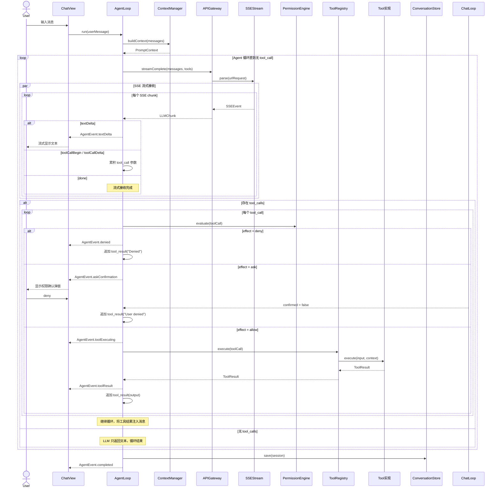
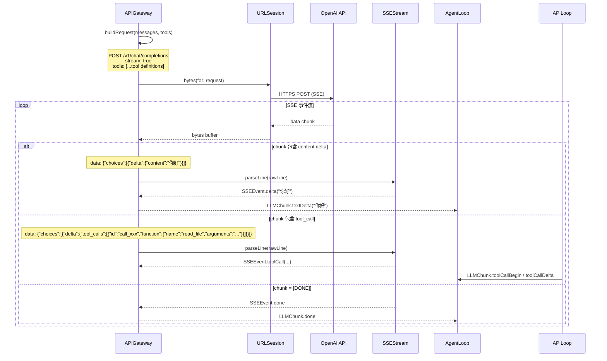
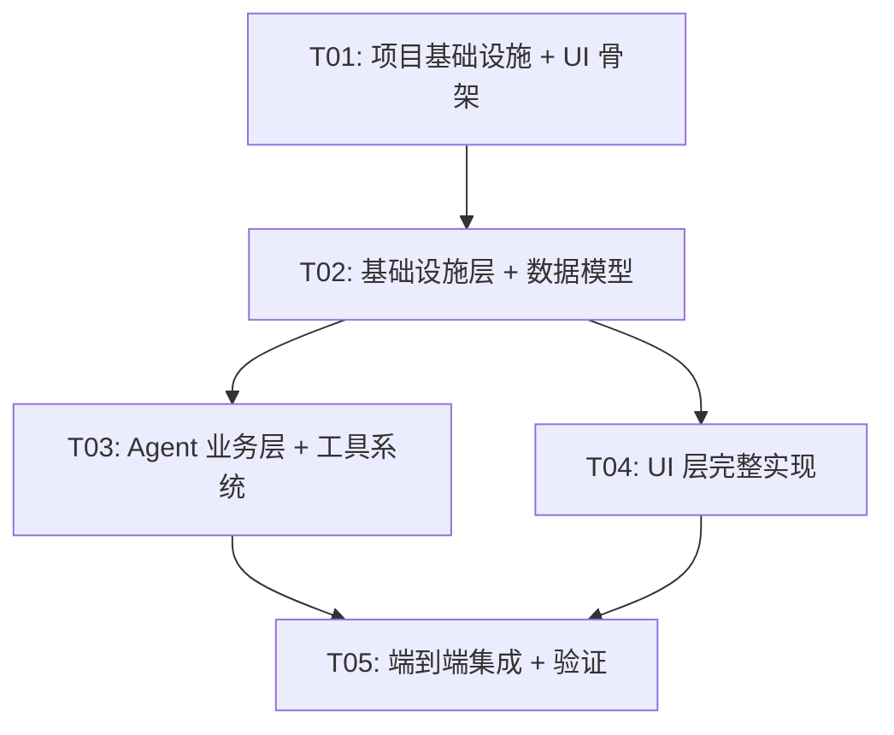

# 白泽（Baize）— iOS 本地编程智能体 系统架构设计

> **文档版本**：1.0 | **日期**：2026-06-17 | **架构师**：高见远（Gao）
> **目标设备**：iPad Pro 2021 M1 | iOS 16.6.1 | TrollStore 免签安装
> **范围**：Phase 1 — MVP 核心链路（13 项功能）
> **输入文档**：白泽 PRD v1.0、完整架构方案 v1.0、技术可行性验证报告

---

## 1. 实现方案与框架选型

### 1.1 总体架构

白泽采用**三层架构**，严格单向数据依赖：

```
┌─────────────────────────────────────────────────────────────────────┐
│                     UI 层（SwiftUI + WKWebView）                     │
│  DashboardView · ChatView · EditorView · FileExplorerView           │
│  SettingsView · PermissionDialog · APIKeySettingsView               │
├─────────────────────────────────────────────────────────────────────┤
│                     业务层（Agent 服务层）                            │
│  AgentLoop · ToolRegistry · PermissionEngine · ProjectContext       │
│  ContextManager · ConversationStore                                  │
├─────────────────────────────────────────────────────────────────────┤
│                     基础设施层（平台抽象层）                          │
│  APIGateway · SSEStream · RuntimeExecutor · FileSystemService       │
│  KeychainService · MonacoBridge                                      │
├─────────────────────────────────────────────────────────────────────┤
│                     TrollStore Entitlements                          │
│  no-sandbox · platform-application · storage.AppDataContainers      │
└─────────────────────────────────────────────────────────────────────┘
```

**数据流方向**：UI 层 → 业务层 → 基础设施层（严格单向），事件通过 `AsyncThrowingStream<AgentEvent, Error>` 从基础设施层向上推送。

### 1.2 核心设计模式

| 模式 | 应用场景 | 理由 |
|------|---------|------|
| **Actor 并发模型** | AgentLoop、APIGateway、ConversationStore | Swift Actor 天然串行化，避免 iOS 内存竞争 |
| **Protocol-Oriented** | Tool 协议、LLMProvider 协议 | 运行时可替换实现，支持未来多模型扩展 |
| **Event-Driven** | AgentEvent 枚举驱动 UI 更新 | SSE 流式场景下，事件驱动是唯一合理模型 |
| **Bridge Pattern** | MonacoBridge（Swift ↔ JS 双向通信） | WKWebView 与原生代码必须通过消息桥接 |
| **Strategy Pattern** | PermissionEngine 策略评估 | 运行时切换 allow/ask/deny 策略 |
| **Repository Pattern** | ConversationStore 持久化 | 隔离存储细节，业务层只操作领域对象 |

### 1.3 关键技术挑战与选型决策

| 挑战 | 决策 | 依据 |
|------|------|------|
| **iOS 禁止 fork()** | 终端采用「命令-输出」模式（ios_system） | a-Shell/CodeApp 已验证；对 Agent Tool Use 已足够 |
| **iOS 禁止 JIT** | Node.js 使用 --jitless V8 解释模式 | CodeApp 生产环境验证；Agent I/O 为主影响小 |
| **WKWebView ↔ Swift 通信** | MonacoBridge 使用 WKScriptMessageHandler + evaluateJavaScript | CodeApp 验证的成熟方案 |
| **SSE 流式解析** | URLSession AsyncThrowingStream + 手动 SSE 解析 | iOS 15+ 原生支持，无需第三方库 |
| **代码执行隔离** | TrollStore no-sandbox 下 posix_spawn 主进程执行 | 简化架构，Phase 1 无需 App Extension |
| **API Key 安全** | iOS Keychain 存储 | 系统级安全，TrollStore 不破坏 Keychain |
| **Function Calling** | OpenAI Chat Completions tools 参数 | Phase 1 仅支持 OpenAI 格式 |
| **项目上下文** | BAIZE.md（类似 CLAUDE.md） | 文件即配置，自然可发现 |

### 1.4 框架与依赖选型

| 依赖 | 版本 | 用途 | 选型理由 |
|------|------|------|---------|
| **ios_system** | 2.x | Shell 命令执行（70+ 命令） | CodeApp/a-Shell 生产验证，无需 fork |
| **nodejs-mobile** | Node 18.19.0 (1Conan fork) | Node.js 代码执行 | CodeApp 验证，--jitless 模式稳定 |
| **CPython** | 3.13+ | Python 代码执行 | 官方 iOS 嵌入模式支持 |
| **Monaco Editor** | 0.45+ | 代码编辑器 | CodeApp fork 版本已适配 iOS WKWebView |
| **SwiftUI** | iOS 16+ | UI 框架 | 原生框架，iOS 16.6.1 完全支持 |
| **KeychainAccess** | 4.x | Keychain 简化访问 | 成熟社区库，简化 Security.framework 使用 |
| **Zip** | 2.x | IPA 打包辅助 | GitHub Actions 构建流程使用 |

---

## 2. 文件列表

### 2.1 项目配置文件

| 文件路径 | 职责 | 行数估算 | 依赖 |
|---------|------|---------|------|
| `Baize/Baize.xcodeproj/project.pbxproj` | Xcode 项目配置 | 800 | - |
| `Baize/Baize.xcodeproj/xcshareddata/xcschemes/Baize.xcscheme` | 构建方案 | 50 | - |
| `Baize/Baize/Info.plist` | App 元数据与权限声明 | 40 | - |
| `Baize/Baize/Baize.entitlements` | TrollStore entitlements | 20 | - |
| `Baize/Baize/App/BaizeApp.swift` | SwiftUI App 入口 | 30 | - |
| `Baize/Baize/Resources/Assets.xcassets` | 图标与资源 | - | - |
| `Baize/Baize/Resources/monaco-editor/` | Monaco Editor 静态资源 | - | - |
| `.github/workflows/build.yml` | GitHub Actions 构建流程 | 80 | - |
| `Package.swift` | SPM 依赖声明 | 60 | - |

### 2.2 UI 层 — 视图文件

| 文件路径 | 职责 | 行数估算 | 依赖 |
|---------|------|---------|------|
| `Baize/Baize/App/BaizeApp.swift` | SwiftUI @main 入口，注册依赖 | 50 | ContentView |
| `Baize/Baize/Views/ContentView.swift` | 三栏布局根视图（NavigationSplitView） | 120 | ChatView, EditorView, FileExplorerView |
| `Baize/Baize/Views/Sidebar/FileExplorerView.swift` | 文件浏览器（树形目录） | 250 | FileSystemService |
| `Baize/Baize/Views/Sidebar/FileSearchView.swift` | 文件搜索（文件名 + 内容） | 120 | FileSystemService |
| `Baize/Baize/Views/Editor/EditorContainerView.swift` | 编辑器容器（WKWebView 宿主） | 80 | MonacoBridge |
| `Baize/Baize/Views/Editor/EditorTabBar.swift` | 多 Tab 栏 | 100 | EditorState |
| `Baize/Baize/Views/Chat/ChatView.swift` | 对话面板（消息列表 + 输入框） | 200 | AgentLoop, ConversationStore |
| `Baize/Baize/Views/Chat/MessageBubble.swift` | 消息气泡（文本/工具调用/结果） | 150 | AgentEvent |
| `Baize/Baize/Views/Chat/ToolCallView.swift` | 工具调用状态展示 | 80 | AgentEvent |
| `Baize/Baize/Views/Chat/ChatInputView.swift` | 输入框（支持多行 + 发送） | 100 | - |
| `Baize/Baize/Views/Settings/SettingsView.swift` | 设置主页 | 120 | - |
| `Baize/Baize/Views/Settings/APIKeySettingsView.swift` | API Key 配置 | 100 | KeychainService |
| `Baize/Baize/Views/Settings/PermissionSettingsView.swift` | 权限模式选择 | 80 | PermissionEngine |
| `Baize/Baize/Views/Dialogs/PermissionDialog.swift` | 权限确认弹窗 | 80 | PermissionEngine |
| `Baize/Baize/Views/Dashboard/DashboardView.swift` | 项目首页 | 150 | - |

### 2.3 业务层 — Agent 服务

| 文件路径 | 职责 | 行数估算 | 依赖 |
|---------|------|---------|------|
| `Baize/Baize/Agent/AgentLoop.swift` | 核心循环（while true → LLM → Tool → Loop） | 200 | APIGateway, ToolRegistry, PermissionEngine, ContextManager |
| `Baize/Baize/Agent/AgentEvent.swift` | 事件枚举（textDelta/toolCall/toolResult/denied/askConfirmation） | 60 | - |
| `Baize/Baize/Agent/Message.swift` | 消息模型（user/assistant/tool_result） | 80 | - |
| `Baize/Baize/Agent/ToolRegistry.swift` | 工具注册表（名称→实例映射） | 80 | Tool protocol |
| `Baize/Baize/Agent/ProjectContext.swift` | 项目上下文（BAIZE.md 解析 + 加载） | 120 | FileSystemService |
| `Baize/Baize/Agent/ContextManager.swift` | 上下文构建（系统提示+历史+文件+配置） | 150 | ProjectContext, Message |
| `Baize/Baize/Agent/PermissionEngine.swift` | 权限引擎（allow/ask/deny 三态） | 100 | - |
| `Baize/Baize/Agent/ConversationStore.swift` | 对话持久化（JSON 文件存储） | 100 | Message |

### 2.4 业务层 — 工具系统

| 文件路径 | 职责 | 行数估算 | 依赖 |
|---------|------|---------|------|
| `Baize/Baize/Tools/Tool.swift` | Tool 协议定义 | 50 | - |
| `Baize/Baize/Tools/ToolResult.swift` | 工具执行结果模型 | 30 | - |
| `Baize/Baize/Tools/ReadFileTool.swift` | 读取文件 | 60 | FileSystemService |
| `Baize/Baize/Tools/WriteFileTool.swift` | 写入/创建文件 | 60 | FileSystemService, PermissionEngine |
| `Baize/Baize/Tools/EditFileTool.swift` | 精确字符串替换编辑 | 80 | FileSystemService, PermissionEngine |
| `Baize/Baize/Tools/ListDirectoryTool.swift` | 列出目录内容 | 50 | FileSystemService |
| `Baize/Baize/Tools/SearchFilesTool.swift` | Glob 模式搜索文件名 | 70 | FileSystemService |
| `Baize/Baize/Tools/SearchContentTool.swift` | Grep 搜索文件内容 | 80 | FileSystemService |
| `Baize/Baize/Tools/ExecuteCommandTool.swift` | 执行 Shell 命令（ios_system） | 100 | RuntimeExecutor, PermissionEngine |
| `Baize/Baize/Tools/RunNodeTool.swift` | 运行 Node.js 脚本 | 80 | RuntimeExecutor, PermissionEngine |
| `Baize/Baize/Tools/RunPythonTool.swift` | 运行 Python 脚本 | 80 | RuntimeExecutor, PermissionEngine |

### 2.5 基础设施层

| 文件路径 | 职责 | 行数估算 | 依赖 |
|---------|------|---------|------|
| `Baize/Baize/Infrastructure/APIGateway.swift` | OpenAI API 调用（SSE 流式） | 200 | SSEStream, KeychainService |
| `Baize/Baize/Infrastructure/SSEStream.swift` | SSE 协议解析（URLSession AsyncThrowingStream） | 150 | - |
| `Baize/Baize/Infrastructure/RuntimeExecutor.swift` | 代码执行引擎（posix_spawn 封装） | 200 | - |
| `Baize/Baize/Infrastructure/FileSystemService.swift` | 文件系统操作（FileManager 封装） | 150 | - |
| `Baize/Baize/Infrastructure/KeychainService.swift` | Keychain 安全存储 | 80 | Security.framework |
| `Baize/Baize/Infrastructure/MonacoBridge.swift` | WKWebView ↔ Monaco 双向桥接 | 250 | WKWebView |

### 2.6 辅助文件

| 文件路径 | 职责 | 行数估算 | 依赖 |
|---------|------|---------|------|
| `Baize/Baize/Utils/Constants.swift` | 全局常量（路径、超时、Token 预算） | 40 | - |
| `Baize/Baize/Utils/Logger.swift` | 统一日志（os.Logger） | 30 | - |
| `Baize/Baize/Utils/Extensions.swift` | Swift 标准类型扩展 | 60 | - |
| `Baize/Baize/Models/EditorState.swift` | 编辑器状态（打开文件、光标、Tab） | 50 | - |
| `Baize/Baize/Models/AppState.swift` | 全局 App 状态 | 40 | - |

### 2.7 文件依赖关系总览

```
BaizeApp.swift
  └── ContentView.swift
        ├── FileExplorerView.swift ──→ FileSystemService.swift
        │     └── FileSearchView.swift ──→ FileSystemService.swift
        ├── EditorContainerView.swift ──→ MonacoBridge.swift
        │     └── EditorTabBar.swift ──→ EditorState.swift
        └── ChatView.swift ──→ AgentLoop.swift
              ├── MessageBubble.swift ──→ AgentEvent.swift
              ├── ToolCallView.swift ──→ AgentEvent.swift
              ├── ChatInputView.swift
              └── ConversationStore.swift ──→ Message.swift

AgentLoop.swift
  ├── APIGateway.swift ──→ SSEStream.swift + KeychainService.swift
  ├── ToolRegistry.swift ──→ Tool.swift (protocol)
  ├── PermissionEngine.swift
  ├── ContextManager.swift ──→ ProjectContext.swift
  └── [各 Tool 实现] ──→ FileSystemService.swift / RuntimeExecutor.swift

SettingsView.swift
  ├── APIKeySettingsView.swift ──→ KeychainService.swift
  └── PermissionSettingsView.swift ──→ PermissionEngine.swift
```

---

## 3. 类图（Mermaid classDiagram）

```mermaid
classDiagram
    direction TB

    class AgentLoop {
        -session: ConversationSession
        -toolRegistry: ToolRegistry
        -permissionEngine: PermissionEngine
        -contextManager: ContextManager
        -apiGateway: APIGateway
        +run(userMessage: String) AsyncThrowingStream~AgentEvent~
        -waitForUserConfirmation() Bool
        -buildToolDefinitions() [ToolDefinition]
    }

    class AgentEvent {
        <<enum>>
        textDelta(String)
        toolCall(ToolCall)
        toolExecuting(ToolCall)
        toolResult(ToolCall, ToolResult)
        denied(ToolCall, String)
        askConfirmation(ToolCall, String)
        error(Error)
        completed
    }

    class ToolRegistry {
        -tools: [String: Tool]
        +register(tool: Tool)
        +execute(toolCall: ToolCall) async ToolResult
        +getToolDefinitions() [ToolDefinition]
    }

    class Tool {
        <<protocol>>
        +name: String
        +description: String
        +inputSchema: [String: Any]
        +isReadOnly: Bool
        +isDestructive: Bool
        +execute(input: [String: Any], context: ToolExecutionContext) async ToolResult
    }

    class ToolResult {
        +output: String
        +isError: Bool
        +metadata: [String: Any]
    }

    class ToolCall {
        +id: String
        +name: String
        +arguments: [String: Any]
    }

    class APIGateway {
        -apiKey: String
        -baseURL: URL
        -sseStream: SSEStream
        +streamComplete(messages: [Message], tools: [ToolDefinition]) AsyncThrowingStream~LLMChunk~
        -buildRequest(messages: [Message], tools: [ToolDefinition]) URLRequest
        -parseSSEChunk(data: Data) LLMChunk?
    }

    class SSEStream {
        +parse(urlRequest: URLRequest) AsyncThrowingStream~SSEEvent~
        -parseLine(line: String) SSEEvent?
        -buffer: String
    }

    class LLMChunk {
        <<enum>>
        textDelta(String)
        toolCallBegin(id: String, name: String)
        toolCallDelta(id: String, argumentsDelta: String)
        done(finishReason: String)
    }

    class PermissionEngine {
        -mode: PermissionMode
        -dangerousTools: Set~String~
        +evaluate(toolCall: ToolCall, context: ToolExecutionContext) PermissionDecision
        +setMode(mode: PermissionMode)
    }

    class PermissionMode {
        <<enum>>
        `default`
        acceptEdits
        plan
        bypass
    }

    class PermissionDecision {
        +effect: Effect
        +reason: String
    }

    class Effect {
        <<enum>>
        allow
        ask
        deny
    }

    class ProjectContext {
        -rootPath: String
        -config: BaizeConfig?
        +load(from path: String) async throws
        +systemPromptExtension: String
        +allowedCommands: [String]
        +codingConventions: [String]
    }

    class ContextManager {
        -projectContext: ProjectContext
        -tokenBudget: Int
        +buildContext(messages: [Message]) PromptContext
        +shouldCompact(messages: [Message]) Bool
        +compact(messages: [Message]) [Message]
        -buildSystemPrompt() String
        -estimateTokens(messages: [Message]) Int
    }

    class ConversationStore {
        -storeDirectory: URL
        +save(session: ConversationSession) throws
        +load(id: UUID) ConversationSession?
        +listSessions() [ConversationSession]
        +delete(id: UUID) throws
    }

    class ConversationSession {
        +id: UUID
        +title: String
        +messages: [Message]
        +projectPath: String
        +createdAt: Date
        +updatedAt: Date
    }

    class Message {
        <<enum>>
        user(String)
        assistant(String)
        toolCall(id: String, name: String, arguments: String)
        toolResult(id: String, content: String)
    }

    class RuntimeExecutor {
        -nodeBinaryPath: String
        -pythonBinaryPath: String
        +executeCommand(command: String, args: [String], workingDir: String) async ExecutionResult
        +executeNode(script: String, workingDir: String) async ExecutionResult
        +executePython(script: String, workingDir: String) async ExecutionResult
        -spawnProcess(path: String, args: [String], workingDir: String) pid_t
        -collectOutput(pid: pid_t) ExecutionResult
        -writeTempScript(content: String, ext: String) String
    }

    class ExecutionResult {
        +stdout: String
        +stderr: String
        +exitCode: Int32
        +isError: Bool
    }

    class FileSystemService {
        -rootPath: String
        +readFile(path: String) throws String
        +writeFile(path: String, content: String) throws
        +editFile(path: String, oldString: String, newString: String) throws Bool
        +listDirectory(path: String) throws [FileItem]
        +searchFiles(pattern: String, in path: String) [String]
        +searchContent(pattern: String, in path: String) [SearchResult]
        +createDirectory(path: String) throws
        +deleteItem(path: String) throws
        +itemExists(path: String) Bool
    }

    class FileItem {
        +name: String
        +path: String
        +isDirectory: Bool
        +children: [FileItem]
        +size: Int64
        +modifiedAt: Date
    }

    class KeychainService {
        +save(key: String, value: String) throws
        +load(key: String) String?
        +delete(key: String) throws
    }

    class MonacoBridge {
        -webView: WKWebView
        -messageHandler: WKScriptMessageHandler
        +loadEditor()
        +openFile(path: String, content: String)
        +getContent() async String
        +setContent(content: String)
        +setLanguage(language: String)
        +onContentChanged(callback: (String) -> Void)
        +onSave(callback: () -> Void)
        -evaluateJavaScript(_ script: String) async Any?
    }

    class ReadFileTool {
        +name: "read_file"
        +isReadOnly: true
    }

    class WriteFileTool {
        +name: "write_file"
        +isDestructive: true
    }

    class EditFileTool {
        +name: "edit_file"
        +isDestructive: true
    }

    class ListDirectoryTool {
        +name: "list_directory"
        +isReadOnly: true
    }

    class SearchFilesTool {
        +name: "search_files"
        +isReadOnly: true
    }

    class SearchContentTool {
        +name: "search_content"
        +isReadOnly: true
    }

    class ExecuteCommandTool {
        +name: "execute_command"
        +isDestructive: true
    }

    class RunNodeTool {
        +name: "run_node"
        +isDestructive: true
    }

    class RunPythonTool {
        +name: "run_python"
        +isDestructive: true
    }

    %% 核心关联
    AgentLoop --> AgentEvent : yields
    AgentLoop --> ToolRegistry : uses
    AgentLoop --> APIGateway : calls
    AgentLoop --> PermissionEngine : checks
    AgentLoop --> ContextManager : builds context
    AgentLoop --> ConversationStore : persists

    ToolRegistry --> Tool : manages
    ToolRegistry ..> ToolCall : executes
    ToolRegistry --> ToolResult : returns

    Tool <|.. ReadFileTool
    Tool <|.. WriteFileTool
    Tool <|.. EditFileTool
    Tool <|.. ListDirectoryTool
    Tool <|.. SearchFilesTool
    Tool <|.. SearchContentTool
    Tool <|.. ExecuteCommandTool
    Tool <|.. RunNodeTool
    Tool <|.. RunPythonTool

    ReadFileTool --> FileSystemService
    WriteFileTool --> FileSystemService
    EditFileTool --> FileSystemService
    ListDirectoryTool --> FileSystemService
    SearchFilesTool --> FileSystemService
    SearchContentTool --> FileSystemService
    ExecuteCommandTool --> RuntimeExecutor
    RunNodeTool --> RuntimeExecutor
    RunPythonTool --> RuntimeExecutor

    WriteFileTool --> PermissionEngine
    EditFileTool --> PermissionEngine
    ExecuteCommandTool --> PermissionEngine
    RunNodeTool --> PermissionEngine
    RunPythonTool --> PermissionEngine

    APIGateway --> SSEStream : parses
    APIGateway --> KeychainService : reads key
    APIGateway --> LLMChunk : yields

    PermissionEngine --> PermissionMode
    PermissionEngine --> PermissionDecision
    PermissionDecision --> Effect

    ContextManager --> ProjectContext
    ContextManager --> Message

    ConversationStore --> ConversationSession
    ConversationSession --> Message

    RuntimeExecutor --> ExecutionResult : returns
```



---

## 4. 时序图

### 4.1 Agent Loop 完整流程



### 4.2 SSE 流式对话流程



---

## 5. 任务列表

> **约束**：最多 5 个任务，每个任务至少 3 个文件，按功能模块分组。T01 必须是项目基础设施。

### T01: 项目基础设施与 UI 骨架

| 属性 | 值 |
|------|-----|
| **任务名** | 项目基础设施 + SwiftUI 应用壳 + 三栏布局 |
| **优先级** | P0 |
| **复杂度** | L |
| **依赖** | 无 |

**涉及文件**（17 个）：
- `Package.swift` — SPM 依赖声明
- `Baize/Baize.xcodeproj/project.pbxproj` — Xcode 项目配置
- `Baize/Baize/Info.plist` — App 元数据
- `Baize/Baize/Baize.entitlements` — TrollStore entitlements
- `Baize/Baize/App/BaizeApp.swift` — SwiftUI @main 入口
- `Baize/Baize/Views/ContentView.swift` — 三栏布局（NavigationSplitView）
- `Baize/Baize/Views/Sidebar/FileExplorerView.swift` — 文件浏览器占位
- `Baize/Baize/Views/Editor/EditorContainerView.swift` — 编辑器容器占位
- `Baize/Baize/Views/Chat/ChatView.swift` — 对话面板占位
- `Baize/Baize/Views/Chat/ChatInputView.swift` — 输入框
- `Baize/Baize/Views/Settings/SettingsView.swift` — 设置页占位
- `Baize/Baize/Views/Dashboard/DashboardView.swift` — 项目首页
- `Baize/Baize/Utils/Constants.swift` — 全局常量
- `Baize/Baize/Utils/Logger.swift` — 统一日志
- `Baize/Baize/Utils/Extensions.swift` — 扩展方法
- `Baize/Baize/Models/AppState.swift` — 全局状态
- `.github/workflows/build.yml` — GitHub Actions 构建

**描述**：
1. 创建 Xcode 项目，配置 SPM 依赖（ios_system, KeychainAccess）
2. 配置 TrollStore entitlements（no-sandbox, platform-application, storage.AppDataContainers）
3. 实现 BaizeApp 入口和 ContentView 三栏布局（NavigationSplitView：文件浏览器 | 编辑器 | 对话面板）
4. 各面板使用占位视图，确保布局可用
5. 配置 GitHub Actions macOS runner 构建 IPA 流程（xcodebuild archive → ldid fakesign → zip IPA）
6. 定义全局常量（项目路径 `/var/mobile/Documents/Baize/`、API 超时、Token 预算）

**验收标准**：
- GitHub Actions 成功编译 IPA
- TrollStore 安装后 App 可启动
- 三栏布局横屏正常显示，竖屏自适应

---

### T02: 基础设施层 + Agent 核心数据模型

| 属性 | 值 |
|------|-----|
| **任务名** | 基础设施层（API/SSE/文件系统/Keychain/运行时）+ Agent 数据模型 |
| **优先级** | P0 |
| **复杂度** | L |
| **依赖** | T01 |

**涉及文件**（12 个）：
- `Baize/Baize/Infrastructure/APIGateway.swift` — OpenAI API 调用（SSE 流式）
- `Baize/Baize/Infrastructure/SSEStream.swift` — SSE 协议解析
- `Baize/Baize/Infrastructure/FileSystemService.swift` — 文件系统操作
- `Baize/Baize/Infrastructure/KeychainService.swift` — Keychain 安全存储
- `Baize/Baize/Infrastructure/RuntimeExecutor.swift` — posix_spawn 代码执行
- `Baize/Baize/Infrastructure/MonacoBridge.swift` — WKWebView ↔ Monaco 双向桥接
- `Baize/Baize/Agent/AgentEvent.swift` — 事件枚举
- `Baize/Baize/Agent/Message.swift` — 消息模型
- `Baize/Baize/Agent/Tool.swift` — Tool 协议定义
- `Baize/Baize/Agent/ToolResult.swift` — 工具执行结果
- `Baize/Baize/Agent/ToolCall.swift` — 工具调用模型
- `Baize/Baize/Models/EditorState.swift` — 编辑器状态模型

**描述**：
1. **SSEStream**：实现 SSE 协议解析器（URLSession AsyncThrowingStream），处理 `data: [DONE]`、content delta、tool_call delta
2. **APIGateway**：实现 OpenAI Chat Completions API 调用，构建 tools 参数，返回 AsyncThrowingStream<LLMChunk>
3. **FileSystemService**：封装 FileManager，提供 readFile/writeFile/editFile/listDirectory/searchFiles/searchContent
4. **KeychainService**：封装 Security.framework，提供 API Key 的安全存储/读取/删除
5. **RuntimeExecutor**：封装 posix_spawn，支持 executeCommand（ios_system）/ executeNode（nodejs-mobile）/ executePython（CPython）
6. **MonacoBridge**：加载 Monaco Editor 到 WKWebView，实现打开文件/获取内容/保存/语言切换/内容变更回调
7. **Agent 数据模型**：定义 AgentEvent/Message/Tool/ToolResult/ToolCall 等核心类型

**验收标准**：
- SSEStream 可解析 OpenAI SSE 流（可用 mock server 测试）
- FileSystemService 可读写 /var/mobile/Documents/Baize/ 下的文件
- KeychainService 可安全存储和读取 API Key
- RuntimeExecutor 可通过 ios_system 执行 ls/cat 等命令
- MonacoBridge 可加载 Monaco Editor 并打开/编辑文件

---

### T03: Agent 业务层 + 工具系统

| 属性 | 值 |
|------|-----|
| **任务名** | Agent Loop + 9 个工具 + 权限引擎 + 项目上下文 + 对话存储 |
| **优先级** | P0 |
| **复杂度** | L |
| **依赖** | T02 |

**涉及文件**（14 个）：
- `Baize/Baize/Agent/AgentLoop.swift` — 核心循环
- `Baize/Baize/Agent/ToolRegistry.swift` — 工具注册表
- `Baize/Baize/Agent/PermissionEngine.swift` — 权限引擎
- `Baize/Baize/Agent/ProjectContext.swift` — 项目上下文（BAIZE.md）
- `Baize/Baize/Agent/ContextManager.swift` — 上下文构建
- `Baize/Baize/Agent/ConversationStore.swift` — 对话持久化
- `Baize/Baize/Tools/ReadFileTool.swift` — 读取文件
- `Baize/Baize/Tools/WriteFileTool.swift` — 写入文件
- `Baize/Baize/Tools/EditFileTool.swift` — 编辑文件
- `Baize/Baize/Tools/ListDirectoryTool.swift` — 列出目录
- `Baize/Baize/Tools/SearchFilesTool.swift` — 搜索文件
- `Baize/Baize/Tools/SearchContentTool.swift` — 搜索内容
- `Baize/Baize/Tools/ExecuteCommandTool.swift` — 执行命令
- `Baize/Baize/Tools/RunNodeTool.swift` — 运行 Node.js
- `Baize/Baize/Tools/RunPythonTool.swift` — 运行 Python

**描述**：
1. **AgentLoop**（核心）：实现 while-true 循环 → 调用 APIGateway → 解析 LLM 响应 → 有 tool_call 则执行 → 无则结束。通过 AsyncThrowingStream<AgentEvent> 向 UI 推送事件
2. **ToolRegistry**：管理工具注册，根据 tool_call.name 查找并执行对应 Tool 实例，返回 ToolResult
3. **PermissionEngine**：实现 allow/ask/deny 三态。Phase 1 简化策略：readOnly 工具 → allow，destructive 工具 → ask，删除关键文件 → deny。支持 4 种权限模式切换
4. **9 个工具实现**：6 个文件工具 + execute_command + run_node + run_python。每个工具实现 Tool 协议，定义 inputSchema（JSON Schema），声明 isReadOnly/isDestructive
5. **ProjectContext**：扫描项目根目录下的 BAIZE.md，解析 YAML 前置元数据（编码规范、常用命令、安全策略），生成 system prompt 扩展
6. **ContextManager**：构建完整 LLM 请求上下文（system prompt + BAIZE.md + 对话历史 + tool definitions）。Phase 1 实现简单 Token 估算和 Snip 压缩
7. **ConversationStore**：将对话序列化为 JSON 文件存储在 App Documents 目录，支持保存/加载/列表/删除

**验收标准**：
- AgentLoop 可完成完整循环：用户输入 → LLM 推理 → 工具调用 → 执行 → 结果返回 → 循环/结束
- 6 个文件工具可在 TrollStore 免沙箱环境下正确操作文件
- PermissionEngine 对 write_file/edit_file 等操作弹出确认
- BAIZE.md 可被自动发现和加载
- 对话可持久化并在 App 重启后恢复

---

### T04: UI 层完整实现 + Monaco Editor 集成

| 属性 | 值 |
|------|-----|
| **任务名** | 完整 UI 视图 + Monaco Editor + 文件浏览器 + 对话面板 + 设置页 |
| **优先级** | P0 |
| **复杂度** | L |
| **依赖** | T02 |

**涉及文件**（11 个）：
- `Baize/Baize/Views/Sidebar/FileExplorerView.swift` — 文件浏览器（树形目录完整实现）
- `Baize/Baize/Views/Sidebar/FileSearchView.swift` — 文件搜索
- `Baize/Baize/Views/Editor/EditorContainerView.swift` — 编辑器容器（集成 MonacoBridge）
- `Baize/Baize/Views/Editor/EditorTabBar.swift` — 多 Tab 栏
- `Baize/Baize/Views/Chat/ChatView.swift` — 对话面板（集成 AgentLoop 事件流）
- `Baize/Baize/Views/Chat/MessageBubble.swift` — 消息气泡（文本/工具调用/结果）
- `Baize/Baize/Views/Chat/ToolCallView.swift` — 工具调用状态可视化
- `Baize/Baize/Views/Settings/APIKeySettingsView.swift` — API Key 配置
- `Baize/Baize/Views/Settings/PermissionSettingsView.swift` — 权限模式设置
- `Baize/Baize/Views/Dialogs/PermissionDialog.swift` — 权限确认弹窗
- `Baize/Baize/Resources/monaco-editor/` — Monaco Editor 静态资源（HTML/JS/CSS）

**描述**：
1. **文件浏览器**：树形目录结构（递归 OutlineGroup），展开/折叠，文件类型图标，右键菜单（新建/重命名/删除），文件名搜索，BAIZE.md 高亮标记
2. **Monaco Editor 集成**：通过 MonacoBridge 加载 Monaco Editor，支持语法高亮（根据文件扩展名自动切换语言）、多 Tab 编辑、内容变更检测、保存（Cmd+S）
3. **对话面板**：订阅 AgentLoop 的 AsyncThrowingStream，流式显示文本，工具调用状态可视化（read_file ✅ → /path/to/file），输入框支持多行 + Shift+Enter 换行 + Enter 发送
4. **消息气泡**：区分文本消息、工具调用、工具结果三种类型，工具调用显示工具名 + 参数摘要 + 执行状态
5. **权限确认弹窗**：显示工具名、操作描述、目标路径/命令，Allow/Deny 按钮，支持「本次会话不再询问」选项
6. **设置页**：API Key 配置（输入 → KeychainService 存储 → 验证连接），权限模式切换（4 种模式），运行时状态显示
7. **Monaco Editor 资源**：将 Monaco Editor 打包为离线资源（HTML + JS + CSS），嵌入 App Bundle

**验收标准**：
- 文件浏览器可浏览 /var/mobile/Documents/Baize/ 下的项目文件
- Monaco Editor 可打开文件、编辑、语法高亮、多 Tab 切换
- 对话面板可流式显示 LLM 响应，工具调用有可视化状态
- 权限弹窗在写入/删除操作时正确弹出
- 设置页可配置 API Key 并切换权限模式

---

### T05: 端到端集成 + TrollStore 验证

| 属性 | 值 |
|------|-----|
| **任务名** | 全链路集成 + Node.js/Python 运行时嵌入 + TrollStore 安装验证 |
| **优先级** | P0 |
| **复杂度** | L |
| **依赖** | T03, T04 |

**涉及文件**（涉及全局，重点调试以下文件）：
- `Baize/Baize/App/BaizeApp.swift` — 注入所有依赖，启动流程
- `Baize/Baize/Views/ContentView.swift` — 事件流连接，面板联动
- `Baize/Baize/Infrastructure/RuntimeExecutor.swift` — Node.js/Python 二进制嵌入与 posix_spawn
- `Baize/Baize/Agent/AgentLoop.swift` — 端到端调试，边界情况处理
- `.github/workflows/build.yml` — 完整构建流程（含运行时打包）
- `Baize/Baize/Baize.entitlements` — 最终 entitlements 确认

**描述**：
1. **依赖注入**：在 BaizeApp 中创建所有服务实例（APIGateway, ToolRegistry, PermissionEngine, ContextManager, ConversationStore），注入到各视图
2. **事件流连接**：ChatView 订阅 AgentLoop 事件流 → MessageBubble 渲染 → 工具执行后刷新 FileExplorerView 和 EditorView
3. **面板联动**：Agent 调用 read_file → 自动在 Monaco Editor 中打开该文件；Agent 调用 write_file/edit_file → 编辑器自动刷新
4. **Node.js 运行时嵌入**：将 nodejs-mobile 编译的 node 二进制嵌入 App Bundle/Frameworks，验证 posix_spawn 可在 TrollStore no-sandbox 环境下执行
5. **Python 运行时嵌入**：将 CPython iOS XCFramework 嵌入 App Bundle，验证嵌入式 Python 可执行脚本
6. **GitHub Actions 完整流程**：macOS runner → xcodebuild（含运行时打包）→ ldid fakesign → IPA → upload artifact
7. **TrollStore 端到端验证**：在 iPad Pro M1 iOS 16.6.1 上安装 IPA → 验证 no-sandbox 文件访问 → 验证 ios_system 命令执行 → 验证 posix_spawn 运行时执行 → 验证 Agent Loop 完整闭环

**4 项实测**：
- T1: nodejs-mobile 在 TrollStore no-sandbox 下的 child_process
- T2: ios_system 在 no-sandbox 下的文件系统访问范围
- T3: posix_spawn 在 TrollStore 下能否 spawn Bundle 外二进制
- T4: nodejs-mobile 不使用 App Extension 直接主进程运行的稳定性

**验收标准**：
- GitHub Actions 成功编译含运行时的 IPA
- TrollStore 安装后所有功能可用
- Agent Loop 可完成：用户输入 → LLM → 工具调用 → 本地执行 → 结果返回
- Node.js/Python 脚本可执行并返回输出
- 文件读写、编辑、搜索功能正常
- 权限弹窗在危险操作前正确弹出

---

### 任务依赖图



---

## 6. 依赖包列表

### SPM 包（Swift Package Manager）

| 包名 | 版本 | 用途 | 备注 |
|------|------|------|------|
| `ios_system` | 2.x | Shell 命令执行（70+ 命令） | GitHub: holzschu/ios_system |
| `KeychainAccess` | 4.2.x | Keychain 简化访问 | GitHub: kishikawakatsumi/KeychainAccess |

### 嵌入运行时

| 运行时 | 版本 | 体积 | 来源 | 嵌入方式 |
|--------|------|------|------|---------|
| **nodejs-mobile** | Node 18.19.0 (1Conan fork) | ~40MB | GitHub: 1Conan/nodejs-mobile | App Bundle/Frameworks 内二进制 |
| **CPython** | 3.13+ | ~30MB | BeeWare Python-Apple-support | XCFramework 嵌入 |
| **Monaco Editor** | 0.45+ | ~8MB | npm @anthropic/monaco-editor 或 CodeApp fork | WKWebView 离线资源 |

### npm 包（Monaco Editor 资源构建）

| 包名 | 版本 | 用途 |
|------|------|------|
| `monaco-editor` | 0.45+ | 代码编辑器核心 |
| `monaco-editor-webpack-plugin` | latest | 按需打包语言支持 |

### 系统框架

| 框架 | 用途 |
|------|------|
| `SwiftUI` | UI 框架 |
| `Foundation` | 基础类型、URLSession、FileManager |
| `Security` | Keychain 访问 |
| `WebKit` | WKWebView（Monaco Editor 宿主） |
| `os` | Logger 日志 |

---

## 7. 共享知识

### 7.1 命名规范

| 类别 | 规范 | 示例 |
|------|------|------|
| **文件名** | PascalCase，与主类型同名 | `AgentLoop.swift`, `APIGateway.swift` |
| **类型名** | PascalCase | `AgentLoop`, `SSEStream`, `ToolRegistry` |
| **协议名** | PascalCase，能力描述 | `Tool`, 不加 Protocol 后缀 |
| **函数名** | camelCase，动词开头 | `streamComplete()`, `evaluate()`, `buildContext()` |
| **变量名** | camelCase | `toolRegistry`, `apiGateway`, `permissionEngine` |
| **常量** | camelCase（Swift 风格） | `tokenBudget`, `maxResultSize` |
| **枚举值** | camelCase | `.textDelta`, `.toolCall`, `.allow` |
| **工具名** | snake_case | `read_file`, `write_file`, `execute_command` |

### 7.2 错误处理

```swift
/// 白泽统一错误类型
enum BaizeError: LocalizedError {
    case apiError(String)           // API 调用失败
    case sseParseError(String)      // SSE 解析失败
    case fileSystemError(String)    // 文件系统操作失败
    case toolExecutionError(String) // 工具执行失败
    case spawnError(Int32)          // posix_spawn 失败
    case permissionDenied(String)   // 权限被拒绝
    case apiKeyMissing              // API Key 未配置
    case runtimeNotAvailable(String)// 运行时不可用

    var errorDescription: String? {
        switch self {
        case .apiError(let msg): return "API 错误: \(msg)"
        case .sseParseError(let msg): return "SSE 解析错误: \(msg)"
        case .fileSystemError(let msg): return "文件系统错误: \(msg)"
        case .toolExecutionError(let msg): return "工具执行错误: \(msg)"
        case .spawnError(let code): return "进程启动失败 (code: \(code))"
        case .permissionDenied(let msg): return "权限被拒绝: \(msg)"
        case .apiKeyMissing: return "API Key 未配置，请在设置中添加"
        case .runtimeNotAvailable(let name): return "运行时 \(name) 不可用"
        }
    }
}
```

**错误处理原则**：
- 所有 async throws 函数使用 `BaizeError` 或其子类型
- UI 层通过 `.task {}` 捕获错误，显示 Alert
- AgentLoop 内部捕获工具执行错误，将其作为 tool_result 返回给 LLM（isError: true）
- 网络错误自动重试 1 次（SSE 断开重连）

### 7.3 日志规范

```swift
import os

/// 白泽统一日志器
let baizeLogger = Logger(subsystem: "com.baize.app", category: "General")

// 按模块分类
let agentLogger = Logger(subsystem: "com.baize.app", category: "Agent")
let apiLogger = Logger(subsystem: "com.baize.app", category: "API")
let toolLogger = Logger(subsystem: "com.baize.app", category: "Tool")
let runtimeLogger = Logger(subsystem: "com.baize.app", category: "Runtime")
```

**日志级别使用**：
- `debug`：SSE chunk 详情、posix_spawn 参数、Monaco JS 调用
- `info`：Agent Loop 迭代开始/结束、工具调用/结果、文件操作
- `error`：API 调用失败、posix_spawn 失败、文件操作失败
- `fault`：数据损坏、不可恢复错误

### 7.4 并发模型

| 场景 | 并发方式 | 理由 |
|------|---------|------|
| AgentLoop | `actor` | 内部状态需要串行化（messages、toolCalls） |
| APIGateway | `actor` | 防止并发 SSE 流解析冲突 |
| Tool 执行 | `async let` / `TaskGroup` | 多个工具可并行执行（未来优化） |
| UI 更新 | `@MainActor` | SwiftUI 要求主线程更新 |
| Monaco Bridge | MainActor + completionHandler | WKWebView evaluateJavaScript 必须主线程 |
| 文件监听 | `Task` + AsyncStream | FileManager delegate 回调转 AsyncStream |
| posix_spawn 输出 | `FileHandle` + AsyncStream | 子进程 stdout/stderr 通过 pipe 读取 |

**关键并发规则**：
1. `AgentLoop` 是 `actor`，所有公开方法自动串行化
2. `Tool.execute()` 是 `async`，在 AgentLoop 的执行上下文中调用
3. SSE 流通过 `AsyncThrowingStream` 传递，消费者在 `Task` 中 for-await
4. posix_spawn 的 stdout/stderr 通过 `dispatch_source_read` 转为 `AsyncStream<String>`
5. **禁止**在 Actor 隔离域外直接修改 Actor 状态

### 7.5 API 调用规范

```
# OpenAI Chat Completions API
POST https://api.openai.com/v1/chat/completions
Headers:
  Authorization: Bearer {api_key}
  Content-Type: application/json
Body:
  model: gpt-4o
  stream: true
  messages: [{role, content}]
  tools: [{type: "function", function: {name, description, parameters}}]
```

**SSE 响应格式**：
```
data: {"id":"chatcmpl-xxx","choices":[{"delta":{"content":"你"},"finish_reason":null}]}
data: {"id":"chatcmpl-xxx","choices":[{"delta":{"content":"好"},"finish_reason":null}]}
data: {"id":"chatcmpl-xxx","choices":[{"delta":{"tool_calls":[{"index":0,"id":"call_xxx","type":"function","function":{"name":"read_file","arguments":""}}]},"finish_reason":null}]}
data: {"id":"chatcmpl-xxx","choices":[{"delta":{"tool_calls":[{"index":0,"function":{"arguments":"{\"path\":"}}]},"finish_reason":null}]}
data: [DONE]
```

### 7.6 文件路径规范

| 路径 | 用途 | 访问权限 |
|------|------|---------|
| `/var/mobile/Documents/Baize/` | 用户项目根目录 | 读写（no-sandbox） |
| `/var/mobile/Documents/Baize/.baize/` | 白泽内部数据 | 读写 |
| `/var/mobile/Documents/Baize/.baize/conversations/` | 对话持久化 | 读写 |
| `/var/mobile/Documents/Baize/.baize/config.json` | 全局配置 | 读写 |
| `App Bundle/Frameworks/node` | Node.js 二进制 | 只读执行 |
| `App Bundle/Frameworks/python3` | Python 二进制 | 只读执行 |
| `App Bundle/monaco-editor/` | Monaco Editor 静态资源 | 只读 |

---

## 8. 待明确事项

### 8.1 需要用户确认的设计决策

| # | 问题 | 影响范围 | 当前假设 | 备选方案 |
|---|------|---------|---------|---------|
| Q1 | **Node.js 运行时架构**：嵌入主进程还是 App Extension 隔离？ | 代码执行稳定性 | 嵌入主进程 posix_spawn（TrollStore 免沙箱无需隔离，简化架构） | App Extension 隔离（CodeApp 方案，更稳定但复杂，需 SwiftNIO IPC） |
| Q2 | **Monaco Editor 版本**：CodeApp fork 还是官方版本？ | 编辑器功能和维护成本 | CodeApp fork（已验证 iOS 兼容性） | 官方 Monaco（功能更新快，需自行适配 iOS） |
| Q3 | **Python 包预装范围** | App 体积 | 最小集（pip, setuptools）+ run_python 时 pip install | 完整科学计算集（numpy, pandas，App 增加 100MB+） |
| Q4 | **Phase 1 对话持久化**：SQLite 还是 JSON 文件？ | 性能和复杂度 | JSON 文件（简单，Phase 1 对话量小） | SQLite（Phase 2 对话量大时切换） |
| Q5 | **posix_spawn 的 Node.js 脚本超时** | 用户体验 | 默认 30 秒，可配置 | 无超时（可能导致无限等待） |

### 8.2 需要实测确认的技术点

| # | 待测项 | 影响任务 | 风险 | 回退方案 |
|---|-------|---------|------|---------|
| T1 | **nodejs-mobile 在 TrollStore no-sandbox 下的 child_process** | T05 RunNodeTool | 中 | 退化为单文件执行模式（不依赖 child_process） |
| T2 | **ios_system 在 no-sandbox 下的文件系统访问范围** | T05 ExecuteCommandTool | 低 | 仅支持 App 数据目录内操作 |
| T3 | **posix_spawn 在 TrollStore 下能否 spawn Bundle 外二进制** | T05（Phase 2 Root Helper） | 低（Phase 1 不依赖） | 所有二进制嵌入 Bundle |
| T4 | **nodejs-mobile 主进程运行稳定性** | T05 | 中 | 切换为 App Extension 隔离（增加 2 周工作量） |
| T5 | **Monaco + Agent Loop 同时运行的内存和 CPU 竞争** | T04, T05 | 低 | 限制 Monaco 语言服务，减少内存占用 |

### 8.3 已做的设计假设

1. **Phase 1 仅支持 OpenAI API**：简化 API 适配层，gpt-4o 作为默认模型
2. **PermissionEngine Phase 1 用简化策略**：readOnly→allow, destructive→ask, 删除关键文件→deny。完整 ABAC 7 层优先级留 Phase 2
3. **对话存储用 JSON 文件**：Phase 1 对话量小，JSON 文件足够。Phase 2 切换 SQLite
4. **ContextManager Phase 1 仅实现 Snip 压缩**：移除旧历史消息。完整 5 层压缩留 Phase 2
5. **终端通过对话面板展示**：命令输出在对话面板中作为 tool_result 显示。独立终端 UI 留 Phase 2
6. **ios_system 替代 posix_spawn 执行 Shell 命令**：ios_system 不需要 spawn，直接调用函数。更可靠
7. **Node.js/Python 脚本通过 posix_spawn 执行**：写入临时文件 → spawn 运行时 → 收集输出 → 清理临时文件

---

*文档结束。本文档基于白泽 PRD v1.0、完整架构方案 v1.0、技术可行性验证报告编写，所有设计决策均有技术验证支撑。*
