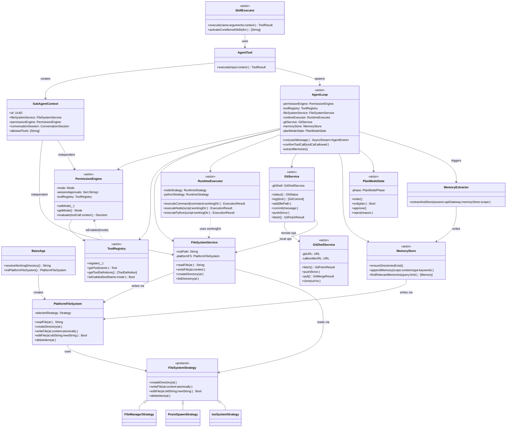
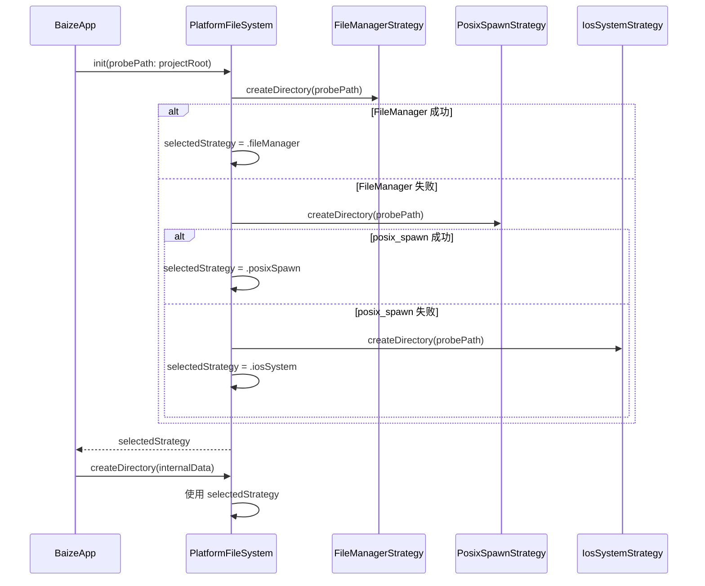
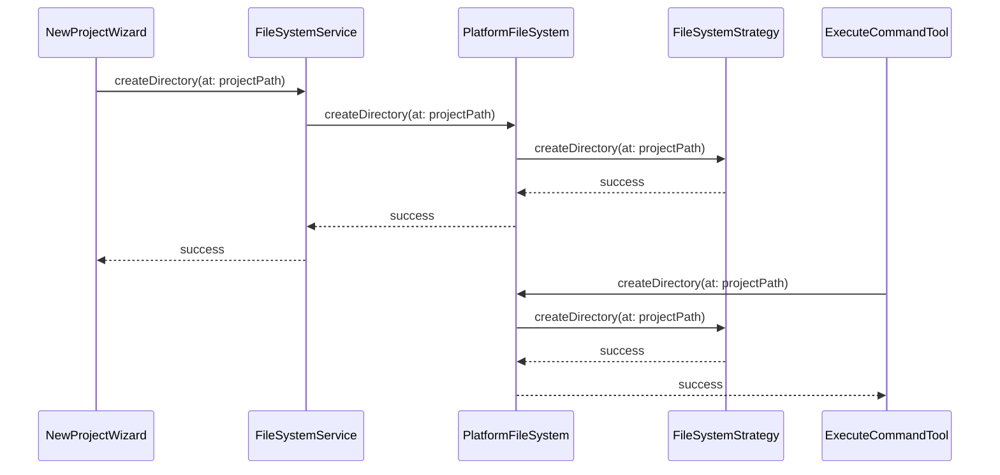
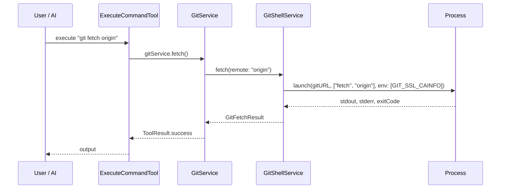
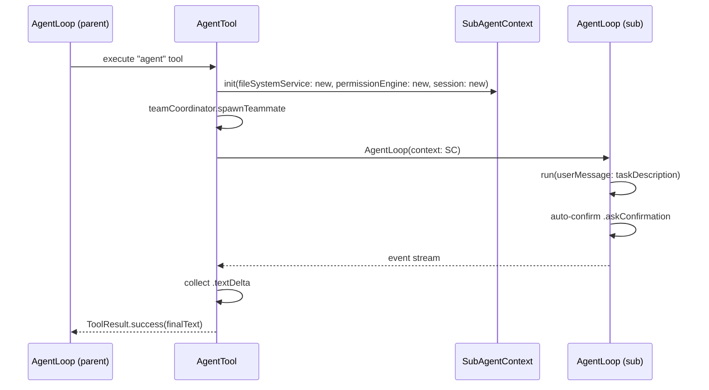
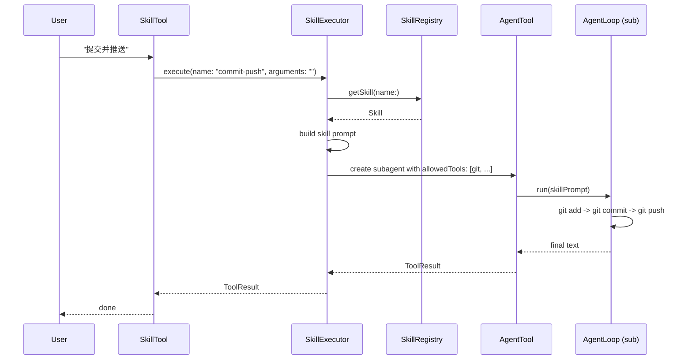
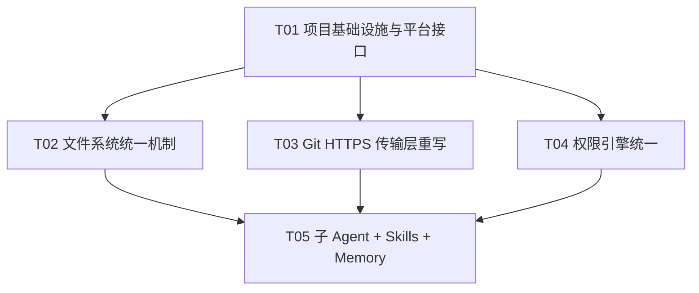

# 白泽 v15 架构重构设计

> **版本**: v15  
> **角色**: 架构师高见远  
> **日期**: 2026-06-23  
> **文档性质**: 基于 v14 两轮 39 Bug 修复失败后的根因重构设计  
> **核心原则**: iOS TrollStore 端真正可行；基于 Claude Code 源码与实际代码证据；每个选型写明落地方式与验证点。

---

## 1. 重构背景与根因

v14 两轮修复 39 个 Bug，但 3 个核心 Bug 反复修不好：

1. **B01 创建目录失败** — FileManager / posix_spawn / ios_system 三套机制互不兼容，AI 与 UI 使用不同路径。
2. **B02/B03 Git fetch/push 0 字节或失败** — libgit2 + OpenSSL 在 iOS TrollStore 无法访问系统 Keychain CA 证书。
3. **B08 子 Agent 进程工具卡死** — 子 Agent 共享父 Agent 的 `RuntimeExecutor` / `FileSystemService` / `PermissionEngine`，并发污染。

PM PRD v15 诊断出 5 个架构层根因：

| 根因 | 症状 | 重构方向 |
|------|------|----------|
| 文件系统访问层未做平台验证 | B01 目录创建 4 级回退 | 统一为单一可靠机制，AI/UI 共用 |
| Git HTTPS 传输层有不可修复的平台缺陷 | B02/B03 TLS 失败 | 放弃 libgit2 HTTPS，改用可验证 CA 的传输方案 |
| 子 Agent 共享基础设施 | B08/B09 并发污染 | 完全隔离执行环境（Claude Code createSubagentContext 模式） |
| Skills / Memory 是占位实现 | P1-#13 / P1-#14 不工作 | Skills 全 fork 执行；Memory 接 stopHooks 并预创建目录 |
| 权限引擎三层决策不同步 | B05/B06/B07 绕过/失效 | 统一为单一决策点 + PlanMode 硬拦截层 |

---

## 2. 技术选型结论（Q1-Q6）

### Q1: Git HTTPS 传输层方案

**选型结论：方案 A — 打包静态编译 git 二进制 + Swift `Process` / `posix_spawn` shell out，本地操作保留 libgit2。**

**为什么**：
- Claude Code 和 Operit 均 shell out 到系统 git 二进制，这是经过验证的 agent 级做法。
- libgit2 + OpenSSL 在 iOS TrollStore 无法访问系统 Keychain CA 证书，这是平台级死结，补丁"接受任何证书"是安全漏洞且 fetch 仍 0 字节。
- iOS 不能 fork，但 `posix_spawn` 可在 TrollStore 下启动 App Bundle 内已签名的二进制；`Process`（`NSTask`）在 iOS 上受限，但 TrollStore + `platform-application` 权利通常允许 spawn 同 bundle 内二进制。

**iOS 落地方式**：
1. 构建或引入 iOS arm64 静态 git 二进制（约 4-6 MB），放入 `Baize/Baize/Frameworks/git`。
2. 将 Mozilla CA 证书（`cacert.pem`）打包进 `Baize/Baize/Resources/cacert.pem`。
3. 新增 `GitShellService` actor，使用 `Process(executableURL: gitURL, arguments: args)`，环境变量注入：
   - `GIT_SSL_CAINFO = cacert.pem 路径`
   - `GIT_TERMINAL_PROMPT = 0`
   - `HOME` 指向项目目录
4. `GitService` 的 `fetch()` / `push(force:)` / `pull()` / `clone(url:)` 改为调用 `GitShellService`；status / log / diff / add / commit / branch / checkout 继续用 libgit2（本地操作无 TLS 问题）。
5. `ExecuteCommandTool` 的 git 命令路由优先用 `GitShellService` 而非 libgit2，保证 AI 通过 `git fetch` 得到真实远程输出。

**验证点**：
- 真机执行 `git fetch origin`，日志打印 `received_bytes > 0`。
- 真机执行 `git push` 后，远程仓库出现新 commit。
- 抓包确认 TLS 握手使用证书链验证，没有 `cert_check` 返回 0 的代码。

**备选方案**：如果 `Process` 在 TrollStore 下无法 spawn 同 bundle 二进制，退到 **isomorphic-git 在 Node.js --jitless 运行时执行**，利用 Node.js 自带的 TLS 栈。但首选仍是 git 二进制，因为它与 Claude Code 同源且可离线运行。

---

### Q2: 子 Agent 隔离方案

**选型结论：方案 A 增强版 — 每个子 Agent 拥有独立的 `FileSystemService` 实例和独立的 `PermissionEngine` 实例；`RuntimeExecutor` 升级为全局 actor，内部用单条串行队列执行 ios_system 命令，避免进程级状态污染。**

**为什么**：
- Claude Code 的 `createSubagentContext` 做了 11 项隔离：readFileState 克隆、toolDecisions 重置、setAppState no-op、UI 回调 nil、localDenialTracking 独立等。
- 白泽当前 `AgentTool` 已克隆 `PermissionEngine` 和 `ConversationSession`，但仍共享 `fileSystemService` 和 `runtimeExecutor`。
- `RuntimeExecutor` 内部使用 `ios_system` 的 `ios_popen`，而 `ios_setDirectoryURL()` / `ios_setMiniRoot()` 是进程级全局状态，多线程并发必然冲突。
- iOS 无法 fork，因此不能走 Claude Code 的进程隔离；唯一可行的是把 `RuntimeExecutor` 变成全局 actor，命令执行串行化，同时给每个子 agent 独立的文件系统上下文（rootPath、projectPath）。

**iOS 落地方式**：
1. 新建 `SubAgentContext` struct：包含 `id: UUID`、独立 `fileSystemService: FileSystemService`、独立 `permissionEngine: PermissionEngine`、独立 `conversationSession: ConversationSession`、不继承父 `planModeState`。
2. `RuntimeExecutor` 从 `class` 改为 `actor`（或在外层加 `actor RuntimeExecutor`），所有 `executeCommand` / `executeNode` / `executePython` 方法都通过 `await` 串行执行。
3. 每次执行命令前显式保存/恢复 `ios_setDirectoryURL` 和 `ios_setMiniRoot`，并传入本次调用的 `workingDir`，命令之间不残留状态。
4. `AgentTool` 创建子 agent 时，实例化新的 `FileSystemService(rootPath: context.projectPath)` 和新的 `PermissionEngine`，而不是从父 context 共享引用。
5. 子 agent 的事件流只消费 `.textDelta` 和 `.completed` / `.error`；`.askConfirmation` 自动确认（因为子 agent 无 UI），`.toolExecuting` / `.toolResult` 等中间事件不写入主对话。

**验证点**：
- 同时启动 3 个子 agent 执行 `run_python`，3 个都返回正确输出，无输出串扰或进程卡死。
- 子 agent 执行 `execute_command` 时，工作目录与父 agent 不同，不互相覆盖当前目录。
- 主对话消息流中只出现子 agent 最终结果，不出现中间工具调用。

---

### Q3: Skills 执行模型

**选型结论：方案 A 的 fork 增强版 — 全部走 fork 模式，砍 inline；SKILL.md 保持 YAML frontmatter；通过 `SkillExecutor` 启动子 agent 执行。**

**为什么**：
- Claude Code 的 Skills 有两种执行模式：`inline`（prompt 注入，依赖 shell 反引号实际执行）和 `fork`（在子 agent 中执行）。
- iOS 不能 spawn shell，inline 模式的 `!`command`` 注入不可行，必须全部 fork。
- 当前白泽 `SkillRegistry.executeSkill` 只是返回 workflow 文本，属于 prompt 注入，AI 可能偏离 workflow，且无法保证执行。

**iOS 落地方式**：
1. 保留 `SKILL.md` + frontmatter 格式（`name`、`description`、`when_to_use`、`allowed-tools`、`context: fork`）。
2. 条件 skill（`paths` 字段）在文件操作时按 gitignore 风格匹配激活。
3. 新增 `SkillExecutor`：
   - 接收 skill 和用户参数
   - 将 skill 内容作为 user message 注入新 subagent
   - 限制 subagent 的工具集合为 `allowed-tools`
   - 运行 subagent 并返回最终结果
4. `SkillTool` 不再调用 `skillRegistry.executeSkill` 返回文本，而是调用 `skillExecutor.execute(skill, arguments)` 真正执行。
5. 内置 8 个 skill（commit-push / review / debug-error / fix-bug / refactor / test-gen / explain-code / new-feature）已打包在 `Resources/skills/`，确认 `project.yml` 已配置资源拷贝。

**验证点**：
- 设置中能看到已加载的 skill 列表。
- 用户说"提交并推送"，触发 `commit-push` skill，子 agent 按 workflow 实际执行 `git add`、`git commit`、`git push`。
- 子 agent 返回的结果写入主对话，中间过程不可见。

---

### Q4: Memory 存储方案

**选型结论：方案 A 改进版 — 继续使用 JSONL 文件，但改造目录创建、触发时机和提取流程；不引入 SQLite（避免 R4 前增加依赖）。**

**为什么**：
- 当前 JSONL 在记忆条数 < 1000 时性能足够，PM PRD 明确"可妥协"向量检索。
- 真正的问题是：目录创建静默失败（`try?` 吞错）、提取从未被触发、没有接 stopHooks。
- SQLite 会增加迁移和建表复杂度，放到 R4 阶段再做。

**iOS 落地方式**：
1. `MemoryStore` 的 `ensureDirectoriesExist()` 改为通过 `PlatformFileSystem` 创建目录，失败时抛错并记录日志，不再静默吞错。
2. 在 `ContextManager.buildContext()` 构建系统提示前，预调用 `memoryStore.ensureDirectoriesExist()`，保证目录在 LLM 写 memory 前已存在。
3. 在 `AgentLoop.run()` 每次 query loop 结束（模型产出无 tool_call 的最终响应）时触发 `extractMemories()` — 参考 Claude Code `stopHooks.ts:149` 的 `handleStopHooks`。
4. 记忆提取改为 forked subagent：
   - 主 agent 写过 memory 则跳过 forked 提取（避免重复）
   - 使用 `SubAgentContext` 运行记忆提取子 agent，不阻塞主对话完成事件
5. 提取 prompt 采用 mem0 的 `ADDITIVE_EXTRACTION_PROMPT` 单 pass 模式，只 ADD 不 UPDATE/DELETE。
6. 检索保留 `keywordMatchCount + recencyScore` 算法；R4 再引入 BM25 + 远程嵌入。

**验证点**：
- 对话结束后 `~/.baize/memory/user/memories.jsonl` 文件有内容。
- 新会话中提到相关话题时，系统提示注入相关记忆。
- 目录创建失败时日志明确报错，而不是静默失败。

---

### Q5: 文件系统访问统一机制

**选型结论：方案 B（启动时探测）+ 方案 C（核验 entitlements）并行；统一封装为 `PlatformFileSystem`；AI 和 UI 共用同一入口。**

**为什么**：
- 当前 `ensureDirectoryExists` 有 4 级回退，每级都是补丁，不知道哪级成功，路径不一致导致模块找不到文件。
- `FileManager.default` 在 TrollStore 下仍有残留沙盒限制（具体机制不明，但实测创建目录失败）。
- `ios_system` 的 `ios_popen` 是 AI 通过 `execute_command` 创建目录能成功的那套机制，但缺少标准 API 接口。
- 全量切到 ios_system 不现实（缺少原子写入、属性获取等），需要保留 FileManager 的读/属性能力，但**写操作（创建目录/文件）统一走探测到的可靠机制**。

**iOS 落地方式**：
1. 新增 `PlatformFileSystem` actor 作为唯一入口：
   - 读操作：`readFile` / `listDirectory` / `searchFiles` / `searchContent` / `fileExists` / `fileSize` / `fileModifiedDate` — 继续用 `FileManager.default`（读通常不触发沙盒限制）。
   - 写操作：`createDirectory` / `writeFile` / `editFile` / `deleteItem` — 统一走 `PlatformFileSystem` 当前选定的策略。
2. 启动时做一次能力探测（App 启动阶段）：
   - 尝试用 `FileManager.createDirectory` 在 `/var/mobile/Documents/Baize/.probe/` 创建目录
   - 失败后尝试 `posix_spawn` 执行打包的 `mkdir` 二进制
   - 再失败后尝试 `ios_popen` 执行 `mkdir -p`
   - 记录成功的机制为 `selectedStrategy`（枚举：fileManager / posixSpawn / iosSystem）
3. 同时核验 `Baize.entitlements` 中 `com.apple.private.security.no-sandbox` 是否真正生效；如未生效，在日志中告警并在 UI 中提示用户。
4. `FileSystemService` 不再直接调用 `FileManager.default.ensureDirectoryExists`，而是调用 `PlatformFileSystem.createDirectory`。
5. 删除 `Extensions.swift` 中的 `ensureDirectoryExists` 4 级回退和 `createDirectoryWithIosSystem` 等私有方法，避免代码再次分散。

**验证点**：
- 用户手动创建项目目录 100% 成功。
- AI 通过 `execute_command mkdir` 创建目录 100% 成功。
- 两种方式最终都调用 `PlatformFileSystem.createDirectory`。
- 启动日志打印 `PlatformFileSystem selected strategy: iosSystem` 或 `fileManager`。

---

### Q6: 权限引擎统一方案

**选型结论：方案 A — Claude Code 5 模式 + 三层规则 + safetyCheck bypass 免疫；白泽增加 `ToolRegistry.isEnabled(mode)` 硬拦截层作为独立安全约束。**

**为什么**：
- 当前 `PermissionEngine` 的 `evaluate` 有 4 层逻辑，且 `PlanModeState` 在 `AgentLoop` 中独立拦截，导致 bypass 能绕过 PlanMode、会话级授权失效。
- Claude Code 的 `permissions.ts` 流水线清晰：denyRule → askRule → tool.checkPermissions → safetyCheck → mode-allow → default-ask。`safetyCheck` 是 bypass 也不能跳过的步骤。
- 白泽需要比 Claude Code 更强的 PlanMode 硬拦截：Claude Code 只靠 prompt 软约束，白泽要在工具注册层直接禁用写工具。

**iOS 落地方式**：
1. 权限模式扩展为 5 种：
   - `default`：每次危险操作确认
   - `acceptEdits`：自动接受文件编辑
   - `plan`：只读规划，禁止写操作
   - `bypassPermissions`：自动允许所有操作（仍需遵守 safetyCheck）
   - `dontAsk`：把 ask 转 deny（用户选择不打扰模式）
2. 规则来源三层：
   - `alwaysDeny`（整工具/危险模式，bypass 也遵守）
   - `alwaysAsk`（整工具/内容级 ask）
   - `sessionApprovals`（内存中，进程退出失效）
3. `PermissionEngine.evaluate(toolCall:context:)` 的决策流水线：
   - Step 1: denyRule（alwaysDenyPatterns、关键路径）
   - Step 2: askRule（危险关键词、工具 needsPermission）
   - Step 3: safetyCheck（PlanMode 写操作拦截，bypass 免疫）
   - Step 4: mode-allow（bypass / acceptEdits / default）
   - Step 5: default-ask → dontAsk 转 deny
4. `ToolRegistry.isEnabled(mode)` 硬拦截层：
   - 在 `plan` 模式下，写工具（write_file / edit_file / execute_command / run_node / run_python / delete_file）从 `getToolDefinitions()` 中过滤掉，LLM 根本看不到这些工具。
   - 在 `bypass` 模式下，所有工具可用。
5. `AgentLoop` 不再做独立的 `isInPlanMode` 检查；所有权限判断由 `PermissionEngine` 返回。
6. `ExitPlanModeTool` 的 `requiresUserInteraction()` 返回 `true`，确保 bypass 模式下也不能绕过计划审批。

**验证点**：
- bypass 模式下执行写操作不弹任何确认。
- PlanMode 下执行 `edit_file`，`ToolRegistry.isEnabled(.plan)` 返回 false，LLM 不会调用该工具。
- PlanMode + bypass 同时存在时，PlanMode 写工具仍然被禁用。
- "本次会话不再询问"实际生效，且进程退出后失效。

---

## 3. 重构后的文件结构

### 3.1 新增文件

| 文件 | 说明 |
|------|------|
| `Baize/Baize/Infrastructure/PlatformFileSystem.swift` | 文件系统统一入口 actor |
| `Baize/Baize/Infrastructure/PlatformFileSystemStrategy.swift` | 策略协议与三种实现：FileManager / posixSpawn / iosSystem |
| `Baize/Baize/Services/GitShellService.swift` | 通过 git 二进制执行 fetch / push / pull / clone |
| `Baize/Baize/Agent/SubAgent/SubAgentContext.swift` | 子 Agent 隔离上下文定义 |
| `Baize/Baize/Agent/Skills/SkillExecutor.swift` | 子 Agent 中真正执行 skill |
| `Baize/Baize/Frameworks/git` | 静态编译的 iOS arm64 git 二进制（构建产物） |
| `Baize/Baize/Resources/cacert.pem` | Mozilla CA 证书 bundle |
| `Baize/Baize/Resources/ios_system/bin/mkdir` | 打包的 mkdir 二进制（posix_spawn 策略用） |

### 3.2 修改文件

| 文件 | 修改内容 |
|------|----------|
| `project.yml` | 新增 git 二进制、ca 证书、mkdir 二进制资源拷贝；保持 skill 资源拷贝 |
| `Baize/Baize/Baize.entitlements` | 保留 `no-sandbox` + `platform-application`，加 `UIFileSharingEnabled` 核验 |
| `Baize/Baize/Utils/Constants.swift` | 新增 git 二进制路径、CA 证书路径、mkdir 路径、FileSystemStrategy 枚举 |
| `Baize/Baize/App/BaizeApp.swift` | 启动时探测文件系统策略并初始化 PlatformFileSystem；延迟启动运行时引擎 |
| `Baize/Baize/Utils/Extensions.swift` | 删除 `ensureDirectoryExists` 4 级回退及相关私有方法 |
| `Baize/Baize/Infrastructure/FileSystemService.swift` | 所有写操作改用 `PlatformFileSystem`；读操作保留 FileManager |
| `Baize/Baize/Infrastructure/RuntimeExecutor.swift` | 升级为 actor；命令执行串行化；保存/恢复 ios_system 全局状态 |
| `Baize/Baize/Services/GitService.swift` | fetch / push / pull / clone 调用 `GitShellService`；本地操作保留 libgit2 |
| `Baize/Baize/Tools/ExecuteCommandTool.swift` | git 命令路由改为 `GitShellService`（远程）或 `GitService`（本地） |
| `Baize/Baize/Agent/PermissionEngine.swift` | 重写为 5 模式 + 三层规则 + safetyCheck 流水线；暴露 `getMode()` |
| `Baize/Baize/Agent/Tool.swift` / `ToolRegistry.swift` | 增加 `isEnabled(mode)` 硬拦截层 |
| `Baize/Baize/Agent/PlanMode/PlanModeState.swift` | 简化为纯计划生命周期状态机（进入/退出/审批） |
| `Baize/Baize/Agent/AgentLoop.swift` | 移除独立 PlanMode 拦截；权限只调 `PermissionEngine.evaluate`；stopHooks 触发 memory |
| `Baize/Baize/Agent/SubAgent/AgentTool.swift` | 创建 `SubAgentContext`，隔离 FileSystemService / PermissionEngine |
| `Baize/Baize/Agent/Skills/SkillRegistry.swift` | 砍掉 inline；`executeSkill` 调用 `SkillExecutor` |
| `Baize/Baize/Tools/SkillTool.swift` | 调用 `SkillExecutor` 而非返回文本 |
| `Baize/Baize/Agent/Memory/MemoryStore.swift` | 使用 `PlatformFileSystem`；失败抛错不静默 |
| `Baize/Baize/Agent/Memory/MemoryExtractor.swift` | 接 stopHooks；forked subagent 提取；预创建目录 |
| `Baize/Baize/Tools/AskUserQuestionTool.swift` | 答案写回 `updatedInput.answers` 并进入 tool_result |
| `Baize/Baize/Tools/ExitPlanModeTool.swift` | 提交计划前发射事件；requiresUserInteraction 恒 true |

### 3.3 删除文件 / 代码

| 删除项 | 说明 |
|--------|------|
| `Utils/Extensions.swift` 中的 `ensureDirectoryExists` 4 级回退 | 被 `PlatformFileSystem` 替代 |
| `GitService.swift` 中的 `certCheckCallback` 无条件返回 0 | 被 `GitShellService` + CA bundle 替代 |
| `PermissionEngine.findTool` 硬编码回退列表 | 被 `ToolRegistry` 动态查询完全替代 |
| `PlanModeState.reset()` | approve/reject 后自动 reset，无需显式调用 |
| `AgentLoop` 中的 `isToolReadOnly` 硬编码列表 | 被 `ToolRegistry.isEnabled(mode)` 替代 |

---

## 4. 关键接口定义

### 4.1 PlatformFileSystem

```swift
/// 文件系统统一入口 — 启动时探测可用策略，后续所有模块共用
actor PlatformFileSystem {

    enum Strategy: String, Sendable {
        case fileManager
        case posixSpawn
        case iosSystem
    }

    /// 启动时探测并选定策略
    init(probePath: String = BaizePath.projectRoot)

    /// 当前选定的策略（只读）
    var selectedStrategy: Strategy { get }

    // MARK: 读操作（保留 FileManager 实现）
    func readFile(at path: String) throws -> String
    func listDirectory(at path: String) throws -> [FileItem]
    func searchFiles(pattern: String, in path: String) throws -> [String]
    func searchContent(pattern: String, in path: String) throws -> [SearchResult]
    func itemExists(at path: String) -> Bool
    func fileSize(at path: String) -> Int64?
    func fileModifiedDate(at path: String) -> Date?

    // MARK: 写操作（统一走 selectedStrategy）
    func createDirectory(at path: String) throws
    func writeFile(at path: String, content: String, atomically: Bool) throws
    func editFile(at path: String, oldString: String, newString: String) throws -> Bool
    func deleteItem(at path: String) throws
}

/// 策略协议
protocol FileSystemStrategy: Sendable {
    func createDirectory(at path: String) throws
    func writeFile(at path: String, content: String, atomically: Bool) throws
    func editFile(at path: String, oldString: String, newString: String) throws -> Bool
    func deleteItem(at path: String) throws
}

/// 三种策略实现（内部）
final class FileManagerStrategy: FileSystemStrategy
final class PosixSpawnStrategy: FileSystemStrategy      // 使用打包的 mkdir / rm / cp
final class IosSystemStrategy: FileSystemStrategy       // 使用 ios_popen 执行命令
```

### 4.2 GitShellService

```swift
/// 通过 git 二进制执行远程操作
actor GitShellService {

    /// git 二进制路径（App Bundle 内）
    private let gitURL: URL
    /// CA 证书 bundle 路径
    private let caBundleURL: URL
    /// 仓库路径
    private let repositoryPath: String
    /// 凭据
    private let keychainService: KeychainService

    init(gitURL: URL, caBundleURL: URL, repositoryPath: String, keychainService: KeychainService)

    /// 执行 fetch
    func fetch(remote: String = "origin") async throws -> GitFetchResult

    /// 执行 push
    func push(remote: String = "origin", branch: String? = nil, force: Bool = false) async throws

    /// 执行 pull
    func pull(remote: String = "origin") async throws -> GitMergeResult

    /// 执行 clone
    func clone(url: String, to localPath: String) async throws

    /// 通用执行（供 ExecuteCommandTool 路由）
    func executeGitCommand(_ arguments: [String]) async throws -> (stdout: String, stderr: String, exitCode: Int32)
}
```

### 4.3 PermissionEngine

```swift
actor PermissionEngine {

    enum Mode: String, Codable, Sendable {
        case `default`
        case acceptEdits
        case plan
        case bypassPermissions
        case dontAsk
    }

    enum Effect: String, Codable, Sendable {
        case allow
        case ask
        case deny
    }

    struct Decision: Sendable {
        let effect: Effect
        let reason: String
    }

    init(mode: Mode = .default)

    func setMode(_ mode: Mode)
    func getMode() -> Mode
    func setToolRegistry(_ registry: ToolRegistry)

    /// 会话级授权
    func grantSessionApproval(forTool toolName: String, operation: String?)
    func hasSessionApproval(forTool toolName: String, operation: String?) -> Bool
    func clearSessionApprovals()

    /// 唯一权限门
    func evaluate(toolCall: ToolCall, context: ToolExecutionContext) async -> Decision
}
```

### 4.4 SubAgentContext

```swift
/// 子 Agent 隔离上下文
struct SubAgentContext: Sendable {
    let id: UUID
    let projectPath: String
    let fileSystemService: FileSystemService   // 独立实例
    let permissionEngine: PermissionEngine       // 独立实例
    let conversationSession: ConversationSession // 独立实例
    let allowedTools: [String]?                  // 可选工具白名单
    let planModeState: PlanModeState? = nil      // 子 agent 不继承父 plan
    let parentEventStream: AsyncStream<AgentEvent>? = nil // 用于回传最终结果
}
```

### 4.5 SkillExecutor

```swift
/// 真正执行 skill 的器
actor SkillExecutor {

    let skillRegistry: SkillRegistry
    let apiGateway: APIGateway
    let toolRegistry: ToolRegistry
    let teamCoordinator: TeamCoordinator

    init(skillRegistry: SkillRegistry,
         apiGateway: APIGateway,
         toolRegistry: ToolRegistry,
         teamCoordinator: TeamCoordinator)

    /// 执行指定 skill（fork 模式）
    func execute(name: String, arguments: String, context: ToolExecutionContext) async -> ToolResult

    /// 条件 skill 激活
    func activateConditionalSkills(for paths: [String]) async -> [String]
}
```

### 4.6 MemoryExtractor + MemoryStore

```swift
actor MemoryStore {
    init(baseDir: String = BaizePath.memoryDir, fileSystem: PlatformFileSystem)
    func ensureDirectoriesExist() async throws
    func appendMemory(scope: MemoryScope, content: String, type: MemoryType, keywords: [String]) async
    func findRelevantMemories(query: String, limit: Int) async -> [Memory]
}

struct MemoryExtractor {
    func extractAndStore(session: ConversationSession,
                         apiGateway: APIGateway,
                         memoryStore: MemoryStore,
                         scope: MemoryScope) async
}
```

---

## 5. 数据结构与调用流程

### 5.1 类图



### 5.2 序列图：App 启动与文件系统探测



### 5.3 序列图：创建目录（UI 与 AI 同一入口）



### 5.4 序列图：Git fetch 调用



### 5.5 序列图：权限评估（单一决策点）

```mermaid
sequenceDiagram
    participant Loop as AgentLoop
    participant PE as PermissionEngine
    participant TR as ToolRegistry
    participant PMS as PlanModeState

    Loop->>PE: evaluate(toolCall: edit_file, context:)
    PE->>PE: Step 1 denyRule
    PE->>PE: Step 2 askRule
    PE->>TR: getTool(name:), needsPermission
    TR-->>PE: destructive=true
    PE->>PMS: isInPlanMode()
    PMS-->>PE: true
    PE->>PE: Step 3 safetyCheck: plan mode + write tool -> deny
    PE-->>Loop: Decision(effect: .deny, reason: "计划模式下禁止写操作")
```

### 5.6 序列图：子 Agent 创建与隔离



### 5.7 序列图：Skill fork 执行



### 5.8 序列图：Memory 提取（stopHooks）

```mermaid
sequenceDiagram
    participant Loop as AgentLoop
    participant ME as MemoryExtractor
    participant Sub as AgentLoop (forked)
    participant MS as MemoryStore
    participant PFS as PlatformFileSystem

    Loop->>Loop: query loop 结束，无 tool_call
    Loop->>ME: extractAndStore(session:...)
    ME->>ME: 检查是否已写 memory
    alt 已写 memory
        ME->>ME: skip
    else 未写 memory
        ME->>Sub: runForkedAgent(extractPrompt, session)
        Sub->>Sub: LLM 提取 JSON
        Sub-->>ME: [ExtractedMemory]
        loop 每条记忆
            ME->>MS: appendMemory(...)
            MS->>PFS: createDirectory + writeFile
            PFS-->>MS: success
            MS-->>ME: done
        end
    end
    ME-->>Loop: done
```

---

## 6. 共享知识（给工程师）

1. **Actor 隔离**：所有服务类都是 actor。`RuntimeExecutor` 在 v15 中必须改为 actor，所有调用点加 `await`。
2. **文件系统写操作统一入口**：任何创建/写入/编辑/删除文件的地方，最终必须走 `PlatformFileSystem`。禁止直接调用 `FileManager.default.createDirectory` 或 `String.write(toFile:)`。
3. **Git 本地 vs 远程**：本地操作（status / log / diff / add / commit / branch / checkout）继续用 `GitService`（libgit2）；远程操作（fetch / push / pull / clone）必须走 `GitShellService`（git 二进制）。
4. **权限唯一门**：`AgentLoop` 中不再有独立的 PlanMode 拦截。所有权限判断走 `PermissionEngine.evaluate()`，`ToolRegistry.isEnabled(mode)` 在 LLM 侧硬拦截。
5. **子 Agent 不共享状态**：`AgentTool` 创建子 agent 时，`FileSystemService`、`PermissionEngine`、`ConversationSession` 必须 new 新实例。
6. **Memory 目录预创建**：在 `ContextManager.buildContext()` 调用 `memoryStore.ensureDirectoriesExist()`，失败时抛出错误。
7. **StopHooks 触发时机**：`AgentLoop.run()` 在每次 query loop 结束且 LLM 无 tool_call 时触发 `extractMemories()`。
8. **Skill 全 fork**：所有 skill 走 `SkillExecutor` 启动子 agent；移除 prompt 注入式 inline 执行。
9. **TLS 安全**：git 远程操作使用 `GIT_SSL_CAINFO` 指向 bundled `cacert.pem`，禁止任何"接受任何证书"的回调。
10. **Swift 6 严格模式**：所有 `@unchecked Sendable` 类必须确保内部状态无数据竞争；View struct 加 `@MainActor`。

---

## 7. 任务分解（5 个 Phase / 5 个任务）

> **硬性约束**：任务总数 ≤ 5；每个任务 ≥ 3 个相关文件；任务按依赖排列；每个 Phase 结束有可编译可运行的 IPA 里程碑。

### T01 Phase 1: 项目基础设施与平台接口

**任务**：搭建 v15 重构所需的基础设施和接口骨架，保证项目可编译。

**Source Files**:
- `project.yml` — 新增 git 二进制、CA 证书、mkdir 二进制资源拷贝配置
- `Baize/Baize/Baize.entitlements` — 核验 `no-sandbox` + `platform-application` + `UIFileSharingEnabled`
- `Baize/Baize/Utils/Constants.swift` — 新增 `gitBinaryPath`、`caBundlePath`、`mkdirBinaryPath`、`FileSystemStrategy` 枚举
- `Baize/Baize/App/BaizeApp.swift` — 启动时初始化 `PlatformFileSystem` 探测；调整服务初始化顺序
- `Baize/Baize/Infrastructure/PlatformFileSystem.swift` — 定义 actor 接口与 `FileSystemStrategy` 使用
- `Baize/Baize/Infrastructure/PlatformFileSystemStrategy.swift` — 定义策略协议（三种实现先放 stub）

**Dependencies**: 无

**Priority**: P0

**IPA 里程碑**: CI 编译通过，App 启动成功，日志打印 `PlatformFileSystem initialized`。

---

### T02 Phase 2: 文件系统统一机制

**任务**：实现并落地 `PlatformFileSystem` 三种策略，替换所有写操作的 4 级回退，AI 与 UI 使用同一入口。

**Source Files**:
- `Baize/Baize/Infrastructure/PlatformFileSystemStrategy.swift` — 实现 `FileManagerStrategy` / `PosixSpawnStrategy` / `IosSystemStrategy`
- `Baize/Baize/Infrastructure/PlatformFileSystem.swift` — 实现探测逻辑与读/写 API
- `Baize/Baize/Infrastructure/FileSystemService.swift` — 写操作改用 `PlatformFileSystem`，读操作保留 FileManager
- `Baize/Baize/Utils/Extensions.swift` — 删除 `ensureDirectoryExists` 4 级回退及辅助方法
- `Baize/Baize/App/BaizeApp.swift` — 用 `PlatformFileSystem` 创建所有启动目录
- `Baize/Baize/Views/Dashboard/NewProjectWizard.swift` — 创建项目目录走 `FileSystemService`
- `Baize/Baize/Infrastructure/RuntimeExecutor.swift` — 命令执行传入 `workingDir`，不依赖全局 CWD

**Dependencies**: T01

**Priority**: P0

**IPA 里程碑**: 用户手动创建项目 100% 成功；AI 通过 `execute_command mkdir` 创建目录 100% 成功；两种方式使用同一套 `PlatformFileSystem`。

---

### T03 Phase 3: Git HTTPS 传输层重写

**任务**：引入打包 git 二进制 + CA 证书，实现 `GitShellService`，让 fetch / push / pull / clone 正常工作。

**Source Files**:
- `Baize/Baize/Services/GitShellService.swift` — 新 actor：使用 `Process` 调 git 二进制，注入 `GIT_SSL_CAINFO`
- `Baize/Baize/Services/GitService.swift` — `fetch` / `push` / `pull` / `clone` 改为调用 `GitShellService`；删除 `certCheckCallback`
- `Baize/Baize/Tools/ExecuteCommandTool.swift` — git 命令路由到 `GitShellService`（远程）或 `GitService`（本地）
- `Baize/Baize/Utils/Constants.swift` — 新增 git 与 CA 证书路径常量
- `Baize/Baize/Frameworks/git` — 静态编译的 iOS arm64 git 二进制（构建产物）
- `Baize/Baize/Resources/cacert.pem` — Mozilla CA 证书 bundle
- `project.yml` — 配置上述资源拷贝到 App Bundle

**Dependencies**: T01

**Priority**: P0

**IPA 里程碑**: `git fetch` 接收远程对象（received_bytes > 0）；`git push` 成功推送；`git push --force` 可强制推送；抓包无证书绕过。

---

### T04 Phase 4: 权限引擎统一

**任务**：重写 `PermissionEngine` 为单一决策点，引入 `ToolRegistry.isEnabled(mode)` 硬拦截，统一 PlanMode 审批流程。

**Source Files**:
- `Baize/Baize/Agent/PermissionEngine.swift` — 重写为 5 模式 + 三层规则 + safetyCheck 流水线
- `Baize/Baize/Agent/Tool.swift` / `ToolRegistry.swift` — 增加 `isEnabled(mode:)` 方法；过滤工具定义
- `Baize/Baize/Agent/PlanMode/PlanModeState.swift` — 简化为纯生命周期状态机
- `Baize/Baize/Tools/ExitPlanModeTool.swift` — 提交计划前发射事件；`requiresUserInteraction` 恒 true
- `Baize/Baize/Tools/AskUserQuestionTool.swift` — 答案写回 `updatedInput.answers` 并进入 tool_result
- `Baize/Baize/Agent/AgentLoop.swift` — 移除 `isToolReadOnly` 和独立 PlanMode 拦截；统一调 `PermissionEngine.evaluate`
- `Baize/Baize/Views/Chat/ChatView.swift` — 绑定新的 PlanMode 审批事件

**Dependencies**: T01

**Priority**: P0

**IPA 里程碑**: bypass 模式下写操作不弹窗；PlanMode 下写工具不出现在 LLM 工具列表；PlanMode + bypass 时写工具仍被禁用；"本次会话不再询问"生效。

---

### T05 Phase 5: 子 Agent 隔离 + Skills + Memory 改造

**任务**：隔离子 Agent 执行环境；实现 Skill fork 执行；改造 Memory 触发与存储。

**Source Files**:
- `Baize/Baize/Infrastructure/RuntimeExecutor.swift` — 改为 actor；命令执行串行化；保存/恢复 ios_system 全局状态
- `Baize/Baize/Agent/SubAgent/SubAgentContext.swift` — 定义隔离上下文
- `Baize/Baize/Agent/SubAgent/AgentTool.swift` — 创建 `SubAgentContext`，new 独立服务实例
- `Baize/Baize/Agent/Skills/SkillExecutor.swift` — 新 actor：在子 agent 中执行 skill
- `Baize/Baize/Agent/Skills/SkillRegistry.swift` — 砍掉 inline；`executeSkill` 调用 `SkillExecutor`
- `Baize/Baize/Tools/SkillTool.swift` — 调用 `SkillExecutor`
- `Baize/Baize/Agent/Memory/MemoryStore.swift` — 使用 `PlatformFileSystem`；失败抛错
- `Baize/Baize/Agent/Memory/MemoryExtractor.swift` — 接 stopHooks；forked subagent 提取；预创建目录
- `Baize/Baize/Agent/AgentLoop.swift` — 在 query loop 结束时触发 `extractMemories()`
- `Baize/Baize/Infrastructure/ContextManager.swift` — buildContext 前调用 `memoryStore.ensureDirectoriesExist()`

**Dependencies**: T02, T03, T04

**Priority**: P1

**IPA 里程碑**: 3 个子 agent 同时执行 `run_python` 互不干扰；触发 skill 后子 agent 实际执行 workflow；对话结束后 `memory/user/memories.jsonl` 有内容；新会话能引用上一次记忆。

---

## 8. 任务依赖图



---

## 9. 风险与回退方案

| 风险 | 影响 | 回退方案 |
|------|------|----------|
| git 二进制无法在 TrollStore 下 spawn | Git 远程操作仍不可用 | 退到 isomorphic-git 在 Node.js --jitless 中执行；需测试 Node.js TLS 是否能用 bundled CA |
| `PlatformFileSystem` 探测全部失败 | 文件系统完全不可用 | 检查 entitlements 是否生效；TrollStore 重装；在 UI 中明确提示用户 |
| `RuntimeExecutor` actor 化后并发下降 | 多子 agent 命令串行 | 先保证正确性；后续将 Node.js / Python 运行时改为 per-subagent 进程以提升并行 |
| Skills 子 agent 执行不稳定 | 常见 workflow 无法一键执行 | 保留 skill 元数据，先降级为带强制步骤的高级 prompt，再迭代 |
| 权限引擎重写引入回归 | 常见工具被误拦 | 在 T04 阶段跑全量工具矩阵测试；保留 `sessionApprovals` 兜底 |

---

## 10. 验证清单（每个 Phase 必测）

| Phase | 必测项 | 通过标准 |
|-------|--------|----------|
| T01 | CI 编译 | CI 通过，无新增 Swift 6 错误 |
| T02 | 创建目录 | 手动 + AI 创建均成功，且用同一机制 |
| T03 | Git fetch / push | received_bytes > 0；远程出现新 commit；force push 生效 |
| T04 | 权限模式 | bypass 无弹窗；PlanMode 写工具禁用；会话授权生效 |
| T05 | 子 agent / skill / memory | 3 子 agent 并行；skill 实际执行；memory 文件有内容 |

---

*本设计基于 BAIZE_HANDOFF_V15.md、白泽重构PRD_v15.md、白泽架构师输入包.md、v14 第 7 节 iOS 约束、Claude Code 源码（permissions.ts / forkedAgent.ts / runAgent.ts / loadSkillsDir.ts / extractMemories.ts / ExitPlanModeV2Tool.ts / AskUserQuestionTool.tsx）以及白泽项目实际代码。所有技术选型均写明 iOS 端落地方式与验证点。*
