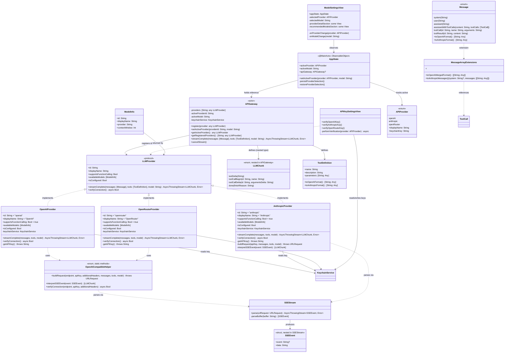
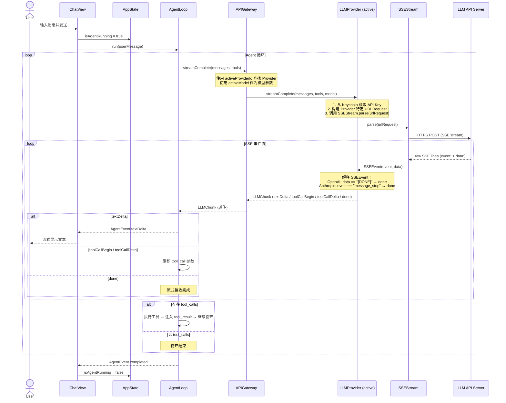
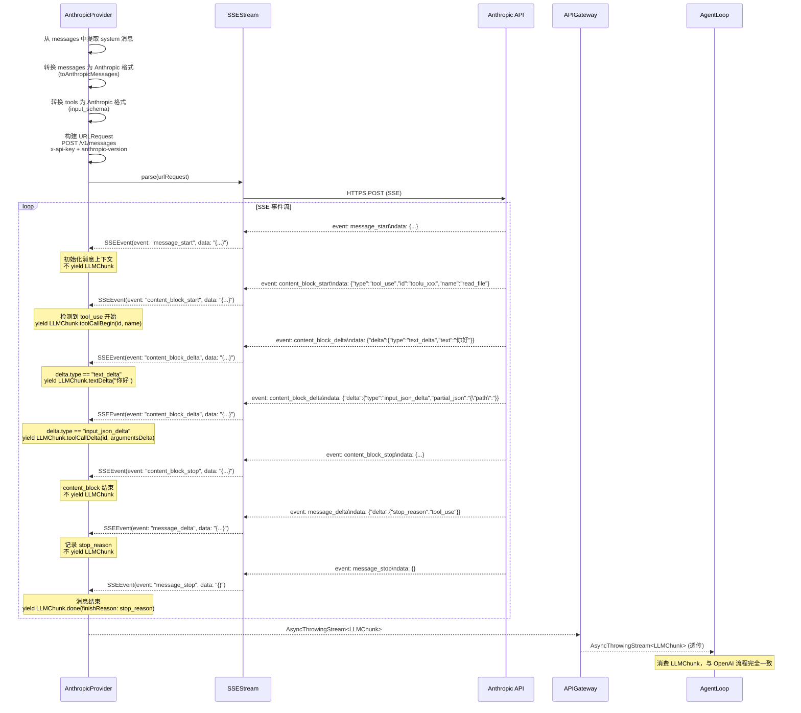
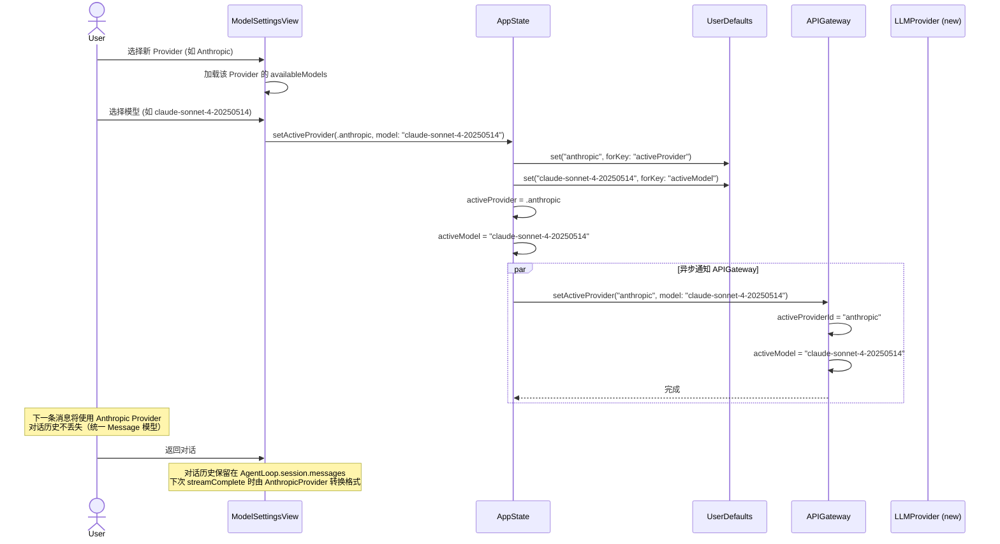
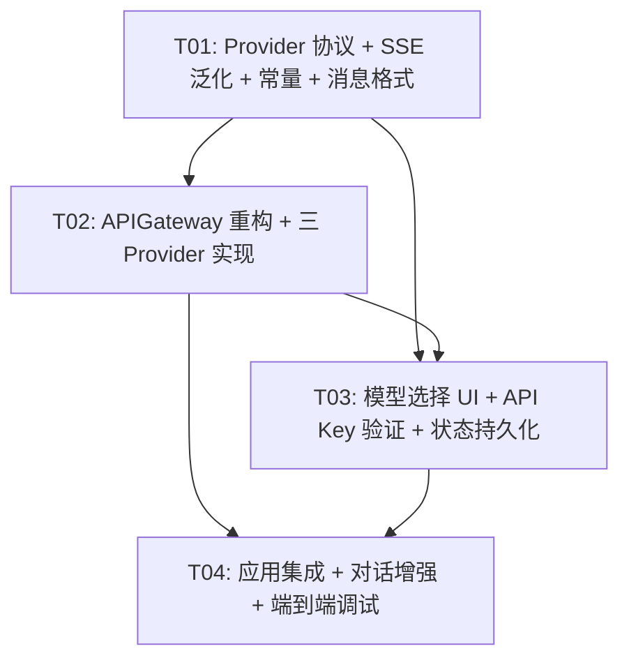

# 白泽 Phase 2C 增量架构设计 — 多模型支持

> **文档版本**：1.0 | **日期**：2026-06-17 | **架构师**：高见远（Gao）
> **增量范围**：在 Phase 1 架构基础上，仅描述 Phase 2C 多模型支持相关架构变更
> **前置阶段**：Phase 1（MVP 核心链路）✅ | Phase 2A（稳定性修复）✅ | Phase 2B（CI/CD + IPA 构建）✅
> **输入文档**：Phase 2C 增量 PRD v1.0、Phase 1 架构文档 v1.0

---

## 1. 实现方案与框架选型

### 1.1 总体架构方案

Phase 2C 的核心改造是将 `APIGateway` 从**硬编码 OpenAI 调用**重构为 **Provider 注册表 + 委托层**，引入 `LLMProvider` 协议抽象所有模型提供商的统一接口。

```
┌─────────────────────────────────────────────────────────────────────┐
│                     UI 层（SwiftUI）                                 │
│  ChatView · ModelSettingsView · APIKeySettingsView · SettingsView   │
│  ↓ @EnvironmentObject AppState                                       │
├─────────────────────────────────────────────────────────────────────┤
│                     业务层（Agent 服务层）— 零改动                    │
│  AgentLoop ──→ APIGateway.streamComplete() ──→ LLMChunk 流           │
│                  │ (委托)                                            │
├─────────────────────────────────────────────────────────────────────┤
│                     Provider 抽象层（新增）                           │
│  LLMProvider 协议                                                   │
│    ├── OpenAIProvider     ── OpenAI Chat Completions API            │
│    ├── AnthropicProvider  ── Anthropic Messages API                 │
│    └── OpenRouterProvider ── OpenAI 兼容 + 额外 Header              │
├─────────────────────────────────────────────────────────────────────┤
│                     基础设施层（扩展）                                │
│  SSEStream（泛化）· KeychainService（无改动）· Constants（扩展）      │
│  Message（扩展 toAnthropicFormat）                                   │
└─────────────────────────────────────────────────────────────────────┘
```

**核心设计原则**：

1. **AgentLoop 零改动**：`APIGateway.streamComplete(messages:tools:model:)` 签名不变，返回 `AsyncThrowingStream<APIGateway.LLMChunk, Error>` 不变，AgentLoop 消费 LLMChunk 的逻辑完全不变
2. **Provider 内部消化格式差异**：Anthropic 的 system 参数提取、Content Block 格式转换、SSE 事件类型路由全部在 AnthropicProvider 内部完成，上层无感知
3. **SSEStream 泛化**：从 OpenAI 专用解析器泛化为通用 SSE 解析器，返回原始 `(event, data)` 元组，由各 Provider 各自解释
4. **对话存储统一 Message 模型**：Provider 发送请求时负责格式转换，对话历史始终使用统一的 Message 枚举存储

### 1.2 关键技术决策

| 决策 | 方案 | 理由 |
|------|------|------|
| **Provider 类型** | `struct`，实现 `LLMProvider: Sendable` 协议 | 值类型天然线程安全，KeychainService 也是 struct，无需 actor 隔离 |
| **APIGateway 角色** | 保持 `actor`，变为 Provider 注册表 + 委托层 | 保持并发安全，AgentLoop 无需改动调用方式 |
| **SSEStream 泛化** | 返回 `SSEEvent(event: String?, data: String)` 原始结构 | 各 Provider 解释逻辑解耦，新增 Provider 无需修改 SSEStream |
| **LLMChunk 位置** | 保持 `APIGateway.LLMChunk` 嵌套类型 | AgentLoop 零改动，Provider 返回 `AsyncThrowingStream<APIGateway.LLMChunk, Error>` |
| **OpenRouter 复用** | 与 OpenAIProvider 共享 `OpenAICompatibleHelper` 工具方法 | 避免代码重复，OpenRouter 仅端点/Header/模型列表不同 |
| **Provider 注册** | 在 `BaizeApp.init()` 中注册到 APIGateway | 集中式依赖注入，与 Phase 1 模式一致 |
| **状态持久化** | `UserDefaults` 存储 activeProvider + activeModel | 轻量级，无需引入新依赖，App 重启后恢复 |
| **Anthropic tool_use 缓冲** | AnthropicProvider 内部缓冲 content_block，按类型转换为 LLMChunk | 对 AgentLoop 透明，Q-2C-1 的默认方案 |

### 1.3 无新增外部依赖

Phase 2C 不引入任何新的第三方包，全部使用 Swift/SwiftUI/Foundation 原生能力：
- SSE 解析：`URLSession.bytes(for:)` + 手动行解析（已有）
- 网络请求：`URLRequest` + `URLSession`（已有）
- 状态持久化：`UserDefaults`（Foundation 原生）
- UI 组件：SwiftUI `Picker` / `Form` / `Section`（已有）

---

## 2. 文件列表及相对路径

> 路径相对于 `Baize/Baize/`

### 2.1 新建文件

| 文件路径 | 职责 |
|---------|------|
| `Infrastructure/LLMProvider.swift` | `LLMProvider` 协议定义 + `ModelInfo` 结构体 + `ProviderError` 枚举 |
| `Infrastructure/Providers/OpenAIProvider.swift` | OpenAI Chat Completions API 适配（从 APIGateway 迁移现有逻辑） |
| `Infrastructure/Providers/AnthropicProvider.swift` | Anthropic Messages API 适配（system 提取、Content Block 转换、SSE 事件路由） |
| `Infrastructure/Providers/OpenRouterProvider.swift` | OpenRouter API 适配（复用 OpenAI 兼容格式 + 额外 Header） |
| `Infrastructure/Providers/OpenAICompatibleHelper.swift` | OpenAI/OpenRouter 共享的请求构建 + SSE 解释逻辑 |
| `Views/Settings/ModelSettingsView.swift` | Provider 选择 + 模型选择 UI（替换 ModelSettingsPlaceholder） |

### 2.2 修改文件

| 文件路径 | 改动类型 | 改动说明 |
|---------|---------|---------|
| `Infrastructure/APIGateway.swift` | **重构** | 移除硬编码 OpenAI 逻辑，改为 Provider 注册表 + `setActiveProvider` + 委托 `streamComplete`；保留 `LLMChunk` 和 `ToolDefinition` 类型定义 |
| `Infrastructure/SSEStream.swift` | **扩展** | 泛化为通用 SSE 解析器：`SSEEvent` 改为 `(event: String?, data: String)` 结构体；移除 OpenAI 专用解析逻辑（迁移到 OpenAICompatibleHelper） |
| `Agent/Message.swift` | **扩展** | 新增 `toAnthropicFormat()` 方法 + `Array<Message>.toAnthropicMessages()` 方法（system 提取 + 格式转换） |
| `Utils/Constants.swift` | **扩展** | 新增 `BaizeAPI.anthropicEndpoint`、`BaizeAPI.openRouterEndpoint`、`BaizeAPI.anthropicVersion`；新增各 Provider 的推荐模型列表常量 |
| `Models/AppState.swift` | **修改** | 新增 `setActiveProvider(_:model:)` 方法（持久化到 UserDefaults + 通知 APIGateway）；`init()` 从 UserDefaults 恢复选择 |
| `Views/Settings/SettingsView.swift` | **修改** | 替换 `ModelSettingsPlaceholder` 为 `ModelSettingsView`；subtitle 改为 `Provider / model` 格式 |
| `Views/Settings/APIKeySettingsView.swift` | **修改** | `verifyXxxKey()` 改为真实 API 验证调用（发送最小请求检测连接） |
| `Views/Chat/ChatView.swift` | **修改** | `ChatHeader` 新增 Provider/模型指示器 + 模型切换入口 |
| `App/BaizeApp.swift` | **修改** | `init()` 中创建三个 Provider 实例，注册到 APIGateway；初始化时从 UserDefaults 恢复 activeProvider/activeModel |

### 2.3 无改动文件（关键确认）

| 文件路径 | 不改动原因 |
|---------|-----------|
| `Agent/AgentLoop.swift` | LLMChunk 接口不变，streamComplete 签名不变，AgentLoop 不感知 Provider 差异 |
| `Agent/AgentEvent.swift` | 事件枚举不变 |
| `Agent/ToolRegistry.swift` | 工具系统与 Provider 无关 |
| `Agent/Tool.swift` / `ToolCall.swift` / `ToolResult.swift` | 工具模型不变 |
| `Infrastructure/KeychainService.swift` | 已支持三 Provider Key 存储 |
| `Infrastructure/FileSystemService.swift` | 与 Provider 无关 |
| `Infrastructure/RuntimeExecutor.swift` | 与 Provider 无关 |

---

## 3. 数据结构和接口（类图）



> 完整类图见 `docs/class-diagram.mermaid`

---

## 4. 程序调用流程（时序图）

### 4.1 用户发起对话 — Provider 委托流程



### 4.2 Anthropic SSE 流式解析流程



### 4.3 切换 Provider 流程



> 完整时序图见 `docs/sequence-diagram.mermaid`

---

## 5. 任务列表

> **约束**：最多 5 个任务，每个任务至少 3 个文件，按功能模块分组。

### T01: Provider 协议 + SSE 泛化 + 常量 + 消息格式扩展

| 属性 | 值 |
|------|-----|
| **任务名** | LLMProvider 协议定义 + SSEStream 泛化 + Constants 扩展 + Message Anthropic 格式 |
| **优先级** | P0 |
| **复杂度** | M |
| **依赖** | 无 |

**涉及文件**（4 个）：

| 文件 | 类型 | 改动内容 |
|------|------|---------|
| `Infrastructure/LLMProvider.swift` | 新建 | `LLMProvider` 协议（id, displayName, supportsFunctionCalling, availableModels, isConfigured, streamComplete, verifyConnection）+ `ModelInfo` 结构体 |
| `Infrastructure/SSEStream.swift` | 修改 | `SSEEvent` 改为 `(event: String?, data: String)` 结构体；移除 OpenAI 专用 JSON 解析逻辑（迁移到 OpenAICompatibleHelper）；`parseBuffer` 同时收集 `event:` 和 `data:` 字段 |
| `Agent/Message.swift` | 修改 | 新增 `toAnthropicFormat()` 方法（单条消息转换）；新增 `Array<Message>.toAnthropicMessages()` 扩展（system 提取 + 格式转换） |
| `Utils/Constants.swift` | 修改 | 新增 `BaizeAPI.anthropicEndpoint`、`BaizeAPI.openRouterEndpoint`、`BaizeAPI.anthropicVersion`；新增 `BaizeModels` 枚举（三 Provider 推荐模型列表） |

**描述**：
1. 定义 `LLMProvider: Sendable` 协议，包含 `streamComplete(messages:tools:model:) -> AsyncThrowingStream<APIGateway.LLMChunk, Error>` 方法签名
2. 定义 `ModelInfo` 结构体（Identifiable, Hashable, Sendable），包含 id/displayName/provider/contextWindow
3. 泛化 SSEStream：`SSEEvent` 从 OpenAI 专用枚举改为通用 `(event: String?, data: String)` 结构体；`parseBuffer` 同时收集 `event:` 和 `data:` 行
4. 在 `Message` 上新增 `toAnthropicFormat()` — 将单条 Message 转为 Anthropic API 格式字典
5. 在 `Array where Element == Message` 上新增 `toAnthropicMessages()` — 提取 system 消息为顶层参数，返回 `(system: String?, messages: [[String: Any]])`
6. 在 `ToolDefinition` 上新增 `toAnthropicFormat()` — 转换为 `{name, description, input_schema}` 格式
7. Constants 中新增 Anthropic 端点 `https://api.anthropic.com/v1/messages`、OpenRouter 端点 `https://openrouter.ai/api/v1/chat/completions`、`anthropic-version: 2023-06-01`

**验收标准**：
- `LLMProvider` 协议可被 struct 实现
- `SSEStream.parse()` 返回 `AsyncThrowingStream<SSEEvent, Error>`，SSEEvent 包含 event 和 data 字段
- `Message.toAnthropicFormat()` 正确转换所有 6 种 Message case
- `Array<Message>.toAnthropicMessages()` 正确提取 system 消息
- 编译通过（此时 Provider 尚未实现，APIGateway 尚未重构）

---

### T02: APIGateway 重构 + 三 Provider 实现

| 属性 | 值 |
|------|-----|
| **任务名** | APIGateway Provider 注册表重构 + OpenAI/Anthropic/OpenRouter Provider 实现 |
| **优先级** | P0 |
| **复杂度** | L |
| **依赖** | T01 |

**涉及文件**（5 个）：

| 文件 | 类型 | 改动内容 |
|------|------|---------|
| `Infrastructure/APIGateway.swift` | 重构 | 移除 OpenAI 硬编码逻辑；改为 `providers: [String: any LLMProvider]` 注册表 + `activeProviderId` + `activeModel`；`streamComplete` 委托到 active Provider；保留 `LLMChunk` 和 `ToolDefinition` 类型；新增 `setActiveProvider` / `register` / `getActiveProvider` 方法 |
| `Infrastructure/Providers/OpenAICompatibleHelper.swift` | 新建 | 从原 APIGateway 迁移的 OpenAI 请求构建逻辑 + SSE 事件解释逻辑（`buildRequest` + `interpretSSEEvent` + `verifyConnection`） |
| `Infrastructure/Providers/OpenAIProvider.swift` | 新建 | 实现 `LLMProvider` 协议；`streamComplete` 调用 `OpenAICompatibleHelper`；`availableModels` 返回 OpenAI 推荐列表；`verifyConnection` 发送最小请求 |
| `Infrastructure/Providers/AnthropicProvider.swift` | 新建 | 实现 `LLMProvider` 协议；独立构建 Anthropic URLRequest（system 提取 + Content Block 转换）；独立解释 Anthropic SSE 事件（content_block_delta/message_stop 等）；`availableModels` 返回 Claude 推荐列表 |
| `Infrastructure/Providers/OpenRouterProvider.swift` | 新建 | 实现 `LLMProvider` 协议；复用 `OpenAICompatibleHelper`；添加 `HTTP-Referer` + `X-Title` header；`availableModels` 返回 OpenRouter 推荐模型列表 |

**描述**：
1. **APIGateway 重构**：保留 `actor` 特性；新增 `providers` 字典和 `activeProviderId`/`activeModel` 属性；`streamComplete` 签名不变（model 参数保留默认值但内部使用 `activeModel` 覆盖）；查找 active provider 并委托 `streamComplete` 调用；新增 `register(provider:)` / `setActiveProvider(providerId:model:)` / `getActiveProvider()` / `getRegisteredProviders()` 方法
2. **OpenAICompatibleHelper**：提取原 APIGateway 的 `buildRequest`（OpenAI 格式）和 SSE 解释逻辑为静态方法；`interpretSSEEvent` 接收 `SSEStream.SSEEvent`，解析 JSON 中的 `choices[0].delta`，返回 `[APIGateway.LLMChunk]`；`verifyConnection` 发送 `POST /v1/chat/completions` 最小请求验证 Key
3. **OpenAIProvider**：持有 `KeychainService`；`streamComplete` 调用 `OpenAICompatibleHelper.buildRequest` + `SSEStream.parse` + `OpenAICompatibleHelper.interpretSSEEvent`；`availableModels` 硬编码 gpt-4o/gpt-4o-mini/gpt-4-turbo
4. **AnthropicProvider**：持有 `KeychainService`；`streamComplete` 内部调用 `messages.toAnthropicMessages()` 提取 system；构建 Anthropic URLRequest（`x-api-key` + `anthropic-version` header）；`interpretSSEEvent` 根据 `event` 字段路由：`content_block_delta`（delta.type 为 `text_delta` → textDelta，`input_json_delta` → toolCallDelta）、`content_block_start`（type 为 `tool_use` → toolCallBegin）、`message_stop` → done、`message_delta`（记录 stop_reason）；`availableModels` 硬编码 claude-sonnet-4-20250514/claude-haiku-4-20250414
5. **OpenRouterProvider**：复用 `OpenAICompatibleHelper.buildRequest`（传入额外 header `HTTP-Referer: https://baize.app` + `X-Title: Baize`）；`availableModels` 硬编码 ~15 个常用模型（deepseek/deepseek-chat, google/gemini-2.5-flash 等）

**验收标准**：
- APIGateway 注册三个 Provider 后，`streamComplete` 正确委托到 active Provider
- OpenAIProvider 的行为与重构前 APIGateway 完全一致（回归测试通过）
- AnthropicProvider 能解析 Anthropic SSE 事件流，输出与 OpenAI 格式一致的 LLMChunk
- OpenRouterProvider 能发送带额外 Header 的请求
- `verifyConnection()` 对三个 Provider 都能返回 Bool

---

### T03: 模型选择 UI + API Key 验证增强 + 状态持久化

| 属性 | 值 |
|------|-----|
| **任务名** | ModelSettingsView 实现 + APIKeySettingsView 真实验证 + AppState Provider 持久化 |
| **优先级** | P0 |
| **复杂度** | M |
| **依赖** | T01, T02 |

**涉及文件**（4 个）：

| 文件 | 类型 | 改动内容 |
|------|------|---------|
| `Views/Settings/ModelSettingsView.swift` | 新建 | Provider 选择 Picker + 模型选择 Picker（动态切换）+ Provider 详情卡片 + 推荐模型分类列表 |
| `Views/Settings/SettingsView.swift` | 修改 | 替换 `ModelSettingsPlaceholder` 为 `ModelSettingsView`；默认模型 subtitle 改为 `当前: Provider / model` 格式 |
| `Views/Settings/APIKeySettingsView.swift` | 修改 | `verifyOpenAIKey()` / `verifyAnthropicKey()` / `verifyOpenRouterKey()` 改为真实 API 调用验证；增加验证中 loading 状态；验证失败显示错误信息 |
| `Models/AppState.swift` | 修改 | 新增 `setActiveProvider(_:model:)` 方法（持久化到 UserDefaults + 异步通知 APIGateway）；`init()` 从 UserDefaults 恢复 activeProvider/activeModel |

**描述**：
1. **ModelSettingsView**：Form 布局，包含 Provider Picker（三选一）、模型 Picker（根据 Provider 动态切换 availableModels）、Provider 详情卡片（端点/Key 状态/验证按钮）、推荐模型分类列表（编程高质量/高性价比/快速任务）；选择变更时调用 `appState.setActiveProvider`
2. **SettingsView**：`SettingsDetail` 的 `.model` case 从 `ModelSettingsPlaceholder()` 改为 `ModelSettingsView(appState: appState)`；默认模型行 subtitle 改为 `"当前: \(appState.activeProvider.displayName) / \(appState.activeModel)"`
3. **APIKeySettingsView**：三个 `verifyXxxKey()` 方法改为 `Task { await performVerification(.xxx) }`，调用对应 Provider 的 `verifyConnection()`，更新 KeyStatus 为 `.verified` 或 `.failed`；增加 `isVerifying` loading 状态
4. **AppState**：新增 `setActiveProvider(_:model:)` 方法：更新 `activeProvider`/`activeModel` Published 属性 → 写入 UserDefaults → `Task { await apiGateway?.setActiveProvider(...) }`；`init()` 中从 UserDefaults 读取恢复

**验收标准**：
- ModelSettingsView 可选择三个 Provider 和对应模型
- 切换 Provider 后模型列表动态更新
- APIKeySettingsView 的"验证连接"按钮执行真实 API 调用
- App 重启后 activeProvider/activeModel 恢复上次选择
- 设置页默认模型 subtitle 显示 `Provider / model` 格式

---

### T04: 应用集成 + 对话界面增强 + 端到端调试

| 属性 | 值 |
|------|-----|
| **任务名** | BaizeApp Provider 注册 + ChatView 模型指示器 + 全链路调试 |
| **优先级** | P0 |
| **复杂度** | M |
| **依赖** | T02, T03 |

**涉及文件**（3 个）：

| 文件 | 类型 | 改动内容 |
|------|------|---------|
| `App/BaizeApp.swift` | 修改 | `init()` 中创建三个 Provider 实例并注册到 APIGateway；从 AppState 恢复 activeProvider/activeModel 并设置到 APIGateway |
| `Views/Chat/ChatView.swift` | 修改 | `ChatHeader` 新增 Provider/模型指示器文本（如 `OpenAI / gpt-4o`）；新增模型快捷切换 Menu（点击弹出 Provider+模型选择） |
| 端到端调试 | — | 全链路验证：三 Provider 各发起一次对话，验证流式输出 + tool_use + 模型切换 |

**描述**：
1. **BaizeApp 集成**：在 `init()` 中，创建 `OpenAIProvider`、`AnthropicProvider`、`OpenRouterProvider` 实例（注入 KeychainService）；调用 `apiGateway.register(provider:)` 注册三个 Provider；从 UserDefaults 读取 `activeProvider`/`activeModel`，调用 `apiGateway.setActiveProvider(...)` 初始化
2. **ChatView 模型指示器**：`ChatHeader` 中新增 `Text("\(appState.activeProvider.displayName) / \(appState.activeModel)")` 显示当前模型；可选添加 Menu 快捷切换（点击弹出 Provider+模型选择列表，选择后调用 `appState.setActiveProvider`）
3. **端到端调试**：
   - OpenAI：发送对话 → 验证流式文本输出 → 验证 tool_use（read_file）→ 验证工具结果注入
   - Anthropic：发送对话 → 验证 SSE 事件解析（content_block_delta → textDelta）→ 验证 tool_use 转换（content_block_start tool_use → toolCallBegin）→ 验证 message_stop → done
   - OpenRouter：发送对话 → 验证额外 Header → 验证流式输出
   - 模型切换：对话进行中切换 Provider → 验证下一条消息使用新 Provider → 验证对话历史不丢失
   - App 重启：切换 Provider 后重启 → 验证恢复上次选择

**验收标准**：
- 三个 Provider 均可正常流式对话
- Anthropic tool_use 正确转换为 LLMChunk.toolCallBegin/Delta，UI 展示与 OpenAI 一致
- 对话进行中切换模型，下一条消息使用新模型
- App 重启后恢复上次 Provider/模型选择
- ChatView 状态栏显示当前 Provider + 模型名

---

### 任务依赖图



### 任务摘要表

| 任务 ID | 任务名 | 涉及文件数 | 依赖 | 复杂度 | 优先级 |
|---------|--------|-----------|------|--------|--------|
| T01 | Provider 协议 + SSE 泛化 + 常量 + 消息格式 | 4 | 无 | M | P0 |
| T02 | APIGateway 重构 + 三 Provider 实现 | 5 | T01 | L | P0 |
| T03 | 模型选择 UI + API Key 验证 + 状态持久化 | 4 | T01, T02 | M | P0 |
| T04 | 应用集成 + 对话增强 + 端到端调试 | 3 | T02, T03 | M | P0 |

---

## 6. 依赖包列表

### 6.1 新增外部依赖

**无**。Phase 2C 不引入任何新的第三方包。

### 6.2 已有依赖（无变更）

| 包名 | 版本 | 用途 | 状态 |
|------|------|------|------|
| `ios_system` | 2.x | Shell 命令执行 | 无变更 |
| `KeychainAccess` | 4.2.x | Keychain 简化访问 | 无变更 |

### 6.3 系统框架（无变更）

| 框架 | 用途 |
|------|------|
| `SwiftUI` | UI 框架（Picker, Form, Section） |
| `Foundation` | URLSession, URLRequest, UserDefaults, JSONSerialization |
| `Security` | Keychain 访问（通过 KeychainAccess） |

---

## 7. 共享知识（跨文件约定）

### 7.1 命名约定

| 类别 | 规范 | 示例 |
|------|------|------|
| **Provider 文件** | `XxxProvider.swift`，放在 `Infrastructure/Providers/` 目录 | `OpenAIProvider.swift`, `AnthropicProvider.swift` |
| **Provider id** | 全小写，与 `APIProvider` 枚举 rawValue 一致 | `"openai"`, `"anthropic"`, `"openrouter"` |
| **模型 id** | 使用 API 官方模型标识 | `"gpt-4o"`, `"claude-sonnet-4-20250514"`, `"deepseek/deepseek-chat"` |
| **SSE 事件类型** | 原样保留 API 返回的 event 字段值 | `"content_block_delta"`, `"message_stop"` |
| **UserDefaults Key** | `com.baize.` 前缀 | `"com.baize.active-provider"`, `"com.baize.active-model"` |

### 7.2 错误处理约定

```swift
// Provider 层错误（新增到 BaizeError）
enum BaizeError {
    // 已有...
    case providerNotRegistered(String)   // Provider 未注册: "Provider 'xxx' not registered"
    case providerNotConfigured(String)   // Provider Key 未配置: "Provider 'xxx' API Key not configured"
    case anthropicAPIError(String)      // Anthropic API 特定错误
}
```

**错误处理原则**：
- Provider 内部捕获网络错误，转换为 `BaizeError` 抛出
- `APIGateway.streamComplete` 透传 Provider 的错误到 AgentLoop
- AgentLoop 捕获错误，通过 `AgentEvent.error` 推送给 UI
- `verifyConnection()` 不抛出错误，返回 `Bool`（成功/失败），错误信息通过日志记录

### 7.3 日志约定

```swift
// Provider 层日志（新增 category）
let providerLogger = Logger(subsystem: "com.baize.app", category: "Provider")

// 日志使用规范
providerLogger.info("Provider '\(providerId)' stream started, model: \(model)")
providerLogger.error("Provider '\(providerId)' API error: \(error.localizedDescription)")
providerLogger.debug("SSE event: \(event.event ?? "nil"), data: \(event.data.prefix(100))")
```

### 7.4 Swift 6 并发安全约定

| 类型 | 并发策略 | 理由 |
|------|---------|------|
| `LLMProvider` 协议 | `: Sendable` | Provider 实例需跨 actor 边界传递（从 APIGateway actor 传递到 Task 中） |
| `OpenAIProvider` 等 | `struct`（值类型） | struct 天然 Sendable（所有存储属性均为 Sendable：String, KeychainService, [ModelInfo]） |
| `ModelInfo` | `struct: Sendable, Hashable, Identifiable` | 纯值类型，跨线程安全 |
| `SSEStream.SSEEvent` | `struct: Sendable` | 纯值类型（String + String?） |
| `APIGateway` | `actor`（不变） | Provider 注册表需要串行化访问 |
| `AppState` | `@MainActor`（不变） | UI 状态，主线程更新 |
| Provider → APIGateway 通知 | `Task { await apiGateway.setActiveProvider(...) }` | AppState (@MainActor) → APIGateway (actor) 跨隔离域调用 |

**关键并发规则**：
1. Provider 的 `streamComplete` 方法在 `Task` 中执行（由 APIGateway 的 `AsyncThrowingStream` 启动），不在 actor 隔离域中
2. Provider 是 struct，每次 `streamComplete` 调用是独立的值拷贝，无共享状态
3. SSEStream 是 struct，无实例状态，线程安全
4. `APIGateway.setActiveProvider` 是 actor 方法，AppState 通过 `Task { await ... }` 异步调用

### 7.5 API 请求构建约定

| 约定 | 说明 |
|------|------|
| **超时** | 所有 Provider 使用 `BaizeAPI.streamTimeout`（120s） |
| **Content-Type** | 统一 `application/json` |
| **stream** | 统一 `"stream": true` |
| **JSON 序列化** | 使用 `JSONSerialization.data(withJSONObject:)`，与 Phase 1 一致 |
| **错误响应** | HTTP 非 2xx 时，解析 response body 中的 error.message |
| **Key 读取** | Provider 内部通过 `keychainService.load(key:)` 读取，Key 为空时抛 `BaizeError.providerNotConfigured` |

### 7.6 LLMChunk 契约（不可变）

```swift
// APIGateway.LLMChunk — AgentLoop 的唯一消费接口，Phase 2C 不可修改
enum LLMChunk {
    case textDelta(String)
    case toolCallBegin(id: String, name: String)
    case toolCallDelta(id: String, argumentsDelta: String)
    case done(finishReason: String)
}
```

**所有 Provider 必须输出此格式的 chunk**。Anthropic 的 `content_block_delta` / `content_block_start` / `message_stop` 等事件由 AnthropicProvider 内部转换为 LLMChunk，对上层透明。

---

## 8. 待明确事项

### 8.1 架构层面待确认问题

| # | 问题 | 影响 | 当前假设 | 建议方案 |
|---|------|------|---------|---------|
| A1 | **Anthropic 流式中 text 和 tool_use 交替出现**：Anthropic SSE 的事件流中，text_delta 和 tool_use 的 content_block 可能交替出现（先文本、再 tool_use、再文本），而 OpenAI 的 tool_calls 在一个 delta 中完成。AnthropicProvider 如何保证 LLMChunk 输出顺序对 AgentLoop 透明？ | AgentLoop 累积 tool_call 参数的逻辑可能需要适配 | AnthropicProvider 内部按事件顺序输出 LLMChunk，AgentLoop 的 `currentToolCallArguments` 字典按 id 累积，天然支持交替 | 验证 AgentLoop 的 `currentToolCallArguments` 字典逻辑：toolCallBegin 创建条目，toolCallDelta 累积到对应 id，done 时统一收集。**预期无需改动**，但需端到端测试验证 |
| A2 | **OpenRouter 模型列表动态获取**：PRD Q-2C-2 建议先硬编码。但 OpenRouter 的 `GET /api/v1/models` 返回 ~200 个模型，硬编码可能遗漏用户需要的模型。 | 影响 ModelSettingsView 的模型选择范围 | Phase 2C 硬编码 ~15 个常用模型，动态获取留 Phase 3 | 硬编码推荐模型列表，包含 deepseek/google/meta/mistral 等主流模型 |
| A3 | **Token 预算动态化**：PRD Q-2C-5 提到不同模型 context window 差异大（128K vs 200K vs 64K）。当前 `BaizeToken.maxContextTokens` 硬编码 128K。 | 影响 ContextManager 的压缩触发阈值 | Phase 2C 暂不改动 BaizeToken，保持 128K 硬编码（取最保守值）。ModelInfo 携带 contextWindow 供未来使用 | 在 ModelInfo 中记录 contextWindow，但 ContextManager 暂不使用。Phase 3 实现 `ContextManager.tokenBudget = activeModel.contextWindow` |
| A4 | **Provider 切换时进行中的请求**：如果用户在 AgentLoop 运行中切换 Provider，当前请求会继续使用旧 Provider 直到完成。是否需要取消当前请求？ | 用户体验：切换后旧请求可能产生不一致的结果 | 不取消当前请求，切换仅影响下一条消息（与 PRD US-2C-3 一致："下一条消息使用新模型"） | 保持当前设计：切换只影响 `activeProviderId`/`activeModel`，正在进行的 `streamComplete` 调用不受影响 |
| A5 | **Anthropic 的 `anthropic-version` header 版本** | 影响 tool_use 功能可用性 | 使用 `2023-06-01`（PRD Q-2C-4 默认值） | 在 Constants 中定义为 `BaizeAPI.anthropicVersion = "2023-06-01"` |
| A6 | **APIGateway.streamComplete 的 model 参数**：当前有默认值 `BaizeAPI.defaultModel`。重构后应使用 `activeModel`。是否保留 model 参数？ | AgentLoop 调用不传 model 参数，依赖默认值 | 保留 model 参数签名不变（AgentLoop 零改动），但内部使用 `activeModel` 覆盖 | `streamComplete` 内部：`let actualModel = model == BaizeAPI.defaultModel ? activeModel : model`。实际上 AgentLoop 永远不传 model，所以总是使用 activeModel |

### 8.2 设计假设

1. **对话历史格式不转换**：切换 Provider 时，对话历史保持 Message 模型不变，由新 Provider 在发送请求时负责格式转换（toOpenAIFormat 或 toAnthropicFormat）。历史中已有的 toolCall/toolResult 消息在新格式中正确转换。
2. **KeychainService 不修改**：已支持三 Provider Key 存储（saveOpenAIKey/saveAnthropicKey/saveOpenRouterKey），Phase 2C 无需改动。
3. **AgentLoop 不修改**：LLMChunk 接口不变，streamComplete 签名不变，AgentLoop 完全无感知 Provider 切换。
4. **SSEStream.parse 签名不变**：仍接收 `URLRequest`，返回 `AsyncThrowingStream<SSEEvent, Error>`。变化的是 `SSEEvent` 类型（从枚举改为结构体）和解析逻辑（从 OpenAI 专用改为通用）。
5. **无新增 SPM 依赖**：全部使用 Foundation/SwiftUI 原生能力。

---

*文档结束。Phase 2C 核心目标：LLMProvider 协议抽象 + 三 Provider 实现 + 模型选择 UI，确保 AgentLoop 零改动。*
