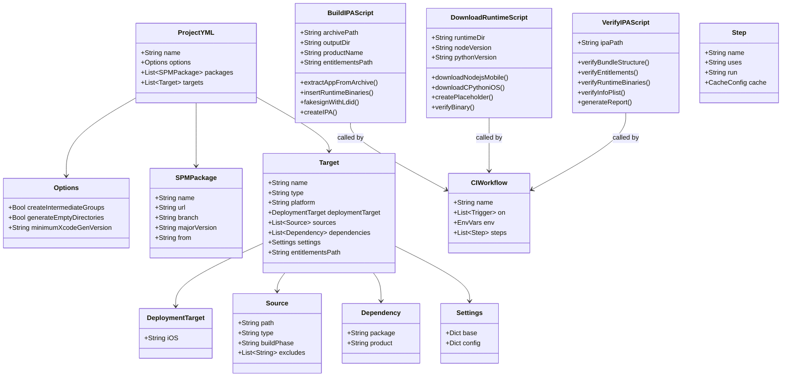
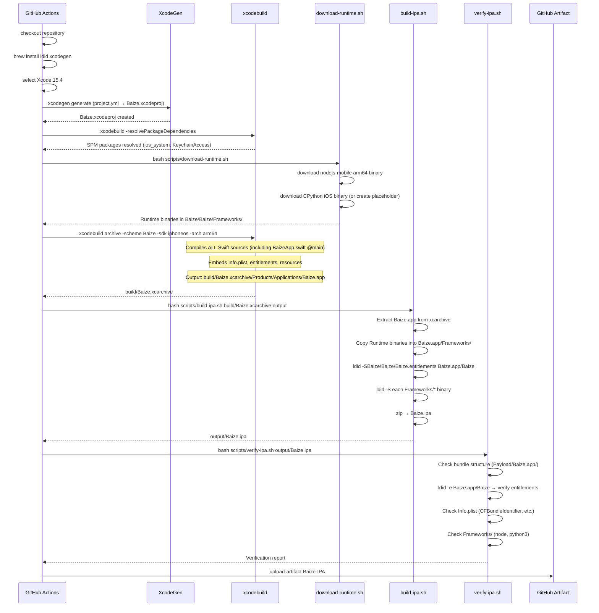
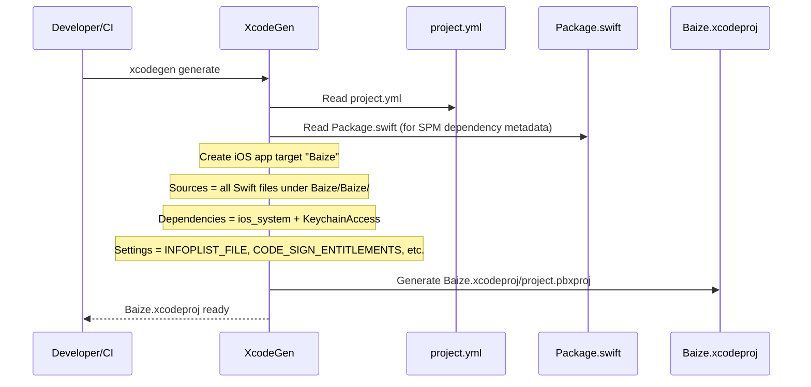
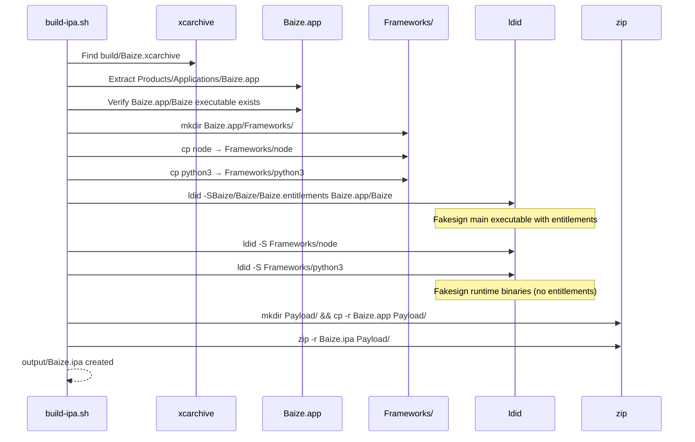
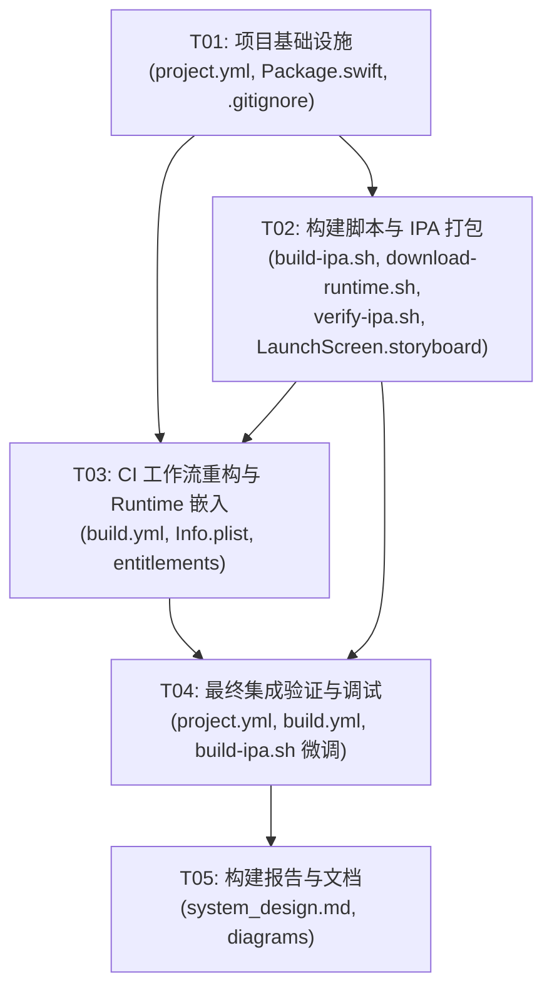

# 白泽 Phase 2B 构建系统重构 — 系统设计

> **架构师**: 高见远（Bob）
> **日期**: 2026-06-17
> **版本**: v1.0
> **输入**: PRD.md, phase2-plan.md, qa-report.md, HANDOVER.md

---

## Part A: 系统设计

### 1. 实现方案选型

#### 1.1 核心技术挑战

| # | 挑战 | 严重程度 | 说明 |
|---|------|---------|------|
| 1 | Package.swift 仅定义 library target，无法构建 iOS App | 🔴 Critical | `xcodebuild archive` 对 library target 不生成 .app bundle；BaizeApp.swift 被 exclude，无法作为 @main 入口编译 |
| 2 | CI 构建流程无法产出有效 IPA | 🔴 Critical | BaizeKit 是 library → xcarchive 中无 .app → IPA 打包失败 |
| 3 | Info.plist / entitlements 未被正确嵌入 | 🟡 Warning | 当前 Info.plist 存于源码目录但未被 SPM 构建流程引用 |
| 4 | Runtime 二进制嵌入 | 🟡 Warning | node/python placeholder 需转为真实二进制，并正确放入 .app Frameworks |
| 5 | xcpretty 吞编译错误 (W13) | 🟡 Warning | CI 失败时无诊断信息 |
| 6 | ldid 签名目标错误 (W14) | 🟡 Warning | 对 .ipa (zip) 执行而非 .app 内可执行文件 |

#### 1.2 方案评估

| 维度 | 方案 A: XcodeGen | 方案 B: SPM executableTarget | 方案 C: swift build + 手动 .app |
|------|------------------|------------------------------|--------------------------------|
| **iOS .app bundle 生成** | ✅ 完美支持 | ❌ SPM 不生成 iOS .app bundle | ⚠️ 需手动构建完整 bundle 结构 |
| **Info.plist 嵌入** | ✅ 自动处理 | ❌ SPM 不自动嵌入 iOS Info.plist | ⚠️ 需手动复制 + plistutil |
| **entitlements 处理** | ✅ xcodebuild 自动嵌入 | ❌ 需手动处理 | ⚠️ 需 ldid 后处理 |
| **资源拷贝 (monaco-editor)** | ✅ Build Phase 自动拷贝 | ⚠️ SPM .process 有限支持 | ⚠️ 需手动拷贝到 .app |
| **CI 可靠性** | ✅ 标准流程，社区广泛使用 | ❌ SPM iOS app 支持不稳定 | ⚠️ 脚本复杂，易出错 |
| **维护成本** | 🟢 单一 YAML 文件 | 🟢 纯 SPM，但需 workaround | 🔴 多个脚本，hacky |
| **源码改动** | ✅ 无需改动 Swift 文件 | ⚠️ 可能需 import BaizeKit | ✅ 无需改动 |
| **TrollStore 兼容** | ✅ 生成标准 .app → ldid fakesign | ⚠️ 需额外步骤 | ✅ 可 fakesign |

#### 1.3 推荐方案：**方案 A — XcodeGen**

**理由**：

1. **最可靠**: `xcodebuild archive` 配合 XcodeGen 生成的 `.xcodeproj` 是 iOS App 构建的标准流程，`xcarchive` 内自然包含完整 `.app` bundle
2. **零源码改动**: 所有 Swift 文件（包括 BaizeApp.swift @main 入口）放入同一个 app target，无需拆分模块、无需 `import BaizeKit`、无需将类型改为 `public`
3. **最简配置**: `project.yml` 是单一 YAML 文件，比 `.pbxproj` 易维护 10 倍
4. **CI 友好**: `brew install xcodegen` 一行安装，`xcodegen generate` 一行生成项目
5. **社区验证**: XcodeGen 被 2000+ 项目使用（Uber、Lyft 等），GitHub Actions macOS runner 完美支持
6. **解决全部 3 个 Warning**: W13（`| tee build.log | xcpretty` 保留完整日志）、W14（ldid 对 .app 内可执行文件签名）、W18（不再依赖 Package.swift 的 exclude/resources 配置）

**核心策略**：project.yml 声明 SPM 依赖包（inline packages），定义 iOS app target 包含全部源码。Package.swift 保留作为 SPM 依赖参考和 `swift package resolve` 兼容，但实际构建完全由 XcodeGen 驱动。

#### 1.4 架构模式

本项目是 iOS 原生 App，架构模式为 **SwiftUI App Lifecycle + Dependency Injection**：

- `@main` 入口 (BaizeApp) → SwiftUI WindowGroup → ContentView
- 服务实例在 BaizeApp.init() 创建 → @StateObject AppState 持有 → EnvironmentObject 传递
- Actor 模型用于并发安全（APIGateway, ConversationStore, ToolRegistry）

构建系统架构为 **XcodeGen + SPM + Shell Scripts**：

- project.yml → XcodeGen → .xcodeproj → xcodebuild archive → .xcarchive → IPA script → .ipa

---

### 2. 文件列表

#### 2.1 需要创建的文件

| # | 文件路径 | 说明 |
|---|---------|------|
| 1 | `project.yml` | XcodeGen 项目定义（核心！），声明 iOS app target + SPM 依赖 |
| 2 | `scripts/build-ipa.sh` | IPA 打包脚本：从 xcarchive 提取 .app → 插入 Runtime → ldid fakesign → zip |
| 3 | `scripts/download-runtime.sh` | Runtime 二进制下载脚本：下载 nodejs-mobile + CPython iOS binary |
| 4 | `scripts/verify-ipa.sh` | IPA 验证脚本：检查 bundle 结构、entitlements、runtime 二进制 |
| 5 | `Baize/Baize/Resources/LaunchScreen.storyboard` | 最简启动屏幕（当前 Info.plist 引用 LaunchScreen 但不存在） |

#### 2.2 需要修改的文件

| # | 文件路径 | 修改内容 |
|---|---------|------|
| 1 | `Package.swift` | 添加注释说明构建由 XcodeGen 驱动；调整 exclude 列表添加 Info.plist 和 entitlements（避免 SPM 尝试处理这些文件） |
| 2 | `.github/workflows/build.yml` | 完全重写：xcodegen → xcodebuild archive → scripts/build-ipa.sh → verify → upload |
| 3 | `.gitignore` | 添加 `*.xcodeproj`（XcodeGen 生成，不需要入库）、`SourcePackages/`、`build.log` |
| 4 | `Baize/Baize/Info.plist` | 移除 `UILaunchStoryboardName`（将使用 LaunchScreen.storyboard 替代，或根据项目.yml 生成） |

#### 2.3 不需要修改的文件

| 目录/文件 | 说明 |
|----------|------|
| `Baize/Baize/App/BaizeApp.swift` | @main 入口，保持原样，不再被 exclude |
| `Baize/Baize/Agent/*.swift` | Agent 核心代码，无改动 |
| `Baize/Baize/Infrastructure/*.swift` | 基础设施代码，无改动 |
| `Baize/Baize/Models/*.swift` | 数据模型，无改动 |
| `Baize/Baize/Tools/*.swift` | 9 个工具，无改动 |
| `Baize/Baize/Utils/*.swift` | 常量和扩展，无改动 |
| `Baize/Baize/Views/**/*.swift` | 所有视图，无改动 |
| `Baize/Baize/Baize.entitlements` | TrollStore entitlements，保持原样 |
| `Baize/Baize/Resources/monaco-editor/index.html` | Monaco placeholder，保持原样 |

#### 2.4 最终项目结构

```
baize-delivery/
├── project.yml                         # [NEW] XcodeGen 项目定义
├── Package.swift                        # [MOD] 保留为 SPM 依赖参考，添加注释
├── .gitignore                           # [MOD] 添加 xcodegen 和构建产物排除
├── scripts/
│   ├── build-ipa.sh                     # [NEW] IPA 打包 + fakesign
│   ├── download-runtime.sh              # [NEW] Runtime 二进制下载
│   └── verify-ipa.sh                    # [NEW] IPA 结构验证
├── .github/
│   └── workflows/
│       └── build.yml                    # [MOD] 完全重写 CI 工作流
├── Baize/
│   └── Baize/
│       ├── App/
│       │   └── BaizeApp.swift           # @main 入口（不再被 exclude！）
│       ├── Agent/                       # 11 个 Swift 文件
│       ├── Infrastructure/              # 6 个 Swift 文件
│       ├── Models/                      # 2 个 Swift 文件
│       ├── Tools/                       # 9 个 Swift 文件
│       ├── Utils/                       # 3 个 Swift 文件
│       ├── Views/                       # 13 个 Swift 文件（含子目录）
│       ├── Resources/
│       │   ├── monaco-editor/
│       │   │   └── index.html           # Monaco placeholder
│       │   └── LaunchScreen.storyboard  # [NEW] 最简启动屏幕
│       ├── Info.plist                   # [MOD] 微调
│       └── Baize.entitlements           # TrollStore entitlements
└── docs/
    ├── system_design.md                 # [NEW] 本文档
    ├── sequence-diagram.mermaid         # [NEW] 构建流程时序图
    └── class-diagram.mermaid            # [NEW] 构建系统类图
```

---

### 3. 数据结构与接口

由于本设计是构建系统重构（非 App 功能开发），"数据结构"主要体现在配置文件的结构定义和脚本的接口设计。



---

### 4. 程序调用流程

#### 4.1 CI 构建全流程



#### 4.2 XcodeGen 生成流程



#### 4.3 IPA 打包详细流程



---

### 5. Anything UNCLEAR

#### 5.1 已做假设

| # | 假设 | 理由 |
|---|------|------|
| 1 | XcodeGen 版本 ≥ 2.30 在 macOS-14 runner 上可用 | brew 安装最新版，GitHub Actions macos-14 runner 已验证 |
| 2 | `ios_system` package 的 `branch: master` 依赖在 CI 环境下可正常解析 | 这是当前 Package.swift 的配置，保持不变 |
| 3 | nodejs-mobile 和 CPython iOS binary 在 Phase 2B 仍为 placeholder | Phase 2B 目标是让 CI 构建成功产出 IPA，Runtime 真实二进制嵌入是后续工作 |
| 4 | LaunchScreen.storyboard 可以用最简 XML 创建 | TrollStore App 不需要精美启动画面，黑屏即可 |
| 5 | `xcodebuild archive` 对无签名（CODE_SIGN_IDENTITY=""）的 iOS app target 可正常产出 xcarchive | 这是 TrollStore 构建的标准做法，社区已验证 |
| 6 | SPM packages 声明在 project.yml 中（inline）与声明在 Package.swift 中效果相同 | XcodeGen 官方支持 inline packages，最终生成的 .xcodeproj 行为一致 |

#### 5.2 待明确事项

| # | 事项 | 影响 | 建议 |
|---|------|------|------|
| 1 | **nodejs-mobile arm64 binary 获取来源** | 影响 Runtime 嵌入质量 | Phase 2B 使用 placeholder；Phase 2D 需从 nodejs-mobile 1Conan fork 或官方 Release 获取预编译 binary |
| 2 | **CPython iOS XCFramework 获取来源** | 同上 | Phase 2B 使用 placeholder；后续从 BeeWare Python-Apple-support 或 CPython 官方 iOS build 获取 |
| 3 | **Xcode 版本选择** | 影响 Swift 5.9/5.10 兼容性和 SPM 包解析 | 当前 CI 使用 Xcode 15.4 (Swift 5.9)，与 Package.swift swift-tools-version:5.9 一致，保持不变 |
| 4 | **是否保留 Package.swift 的 BaizeKit target** | 影响项目维护复杂度 | 建议保留（供 swift package resolve 缓存 + 开发者 SPM 工作流），但实际构建不使用 |
| 5 | **monaco-editor 资源是否需要 xcassets** | 影响资源打包方式 | 当前只有 index.html，XcodeGen 会作为 folder resource 复制到 bundle；后续 Monaco 真实集成时需更新 |

---

## Part B: 任务分解

### 6. Required Packages

```
- xcodegen@≥2.30:         Xcode 项目生成工具（brew install xcodegen）
- ldid@≥2.1.5:            TrollStore fakesign 工具（brew install ldid）
- xcpretty@≥0.3.0:        xcodebuild 输出美化（brew install xcpretty）
- ios_system@master:      iOS Unix 命令库（SPM dependency, holzschu/ios_system）
- KeychainAccess@≥4.2.2:  Keychain 安全存储（SPM dependency, kishikawakatsumi/KeychainAccess）
```

注意：xcodegen、ldid、xcpretty 是 CI 环境工具，通过 `brew install` 安装，不列入项目依赖。ios_system 和 KeychainAccess 是 SPM 包依赖，在 project.yml 中声明。

---

### 7. Task List（按依赖顺序）

#### T01: 项目基础设施（配置文件 + 入口文件 + 依赖声明）

**Source Files**:
- `project.yml` [NEW]
- `Package.swift` [MOD]
- `.gitignore` [MOD]

**Dependencies**: 无

**Priority**: P0

**Description**:
创建 XcodeGen 项目定义文件 `project.yml`，声明 iOS app target "Baize"（包含全部 Swift 源码、Info.plist、entitlements、monaco-editor 资源），声明 SPM 依赖包（ios_system, KeychainAccess）。

更新 `Package.swift` 添加注释说明构建已由 XcodeGen 驱动，调整 exclude 列表添加 Info.plist 和 entitlements。

更新 `.gitignore` 添加 XcodeGen 产物排除规则。

**project.yml 关键结构**:

```yaml
name: Baize
options:
  createIntermediateGroups: true
  generateEmptyDirectories: true
  minimumXcodeGenVersion: "2.30"
packages:
  ios_system:
    url: https://github.com/holzschu/ios_system
    branch: master
  KeychainAccess:
    url: https://github.com/kishikawakatsumi/KeychainAccess
    majorVersion: "4.2"
targets:
  Baize:
    type: application
    platform: iOS
    deploymentTarget:
      iOS: "16.0"
    sources:
      - Baize/Baize/Agent
      - Baize/Baize/App
      - Baize/Baize/Infrastructure
      - Baize/Baize/Models
      - Baize/Baize/Tools
      - Baize/Baize/Utils
      - Baize/Baize/Views
      - path: Baize/Baize/Resources/monaco-editor
        type: folder
        buildPhase: resources
      - path: Baize/Baize/Resources/LaunchScreen.storyboard
        buildPhase: resources
    dependencies:
      - package: ios_system
        product: ios_system
      - package: KeychainAccess
        product: KeychainAccess
    settings:
      base:
        PRODUCT_BUNDLE_IDENTIFIER: com.baize.app
        PRODUCT_NAME: Baize
        INFOPLIST_FILE: Baize/Baize/Info.plist
        CODE_SIGN_ENTITLEMENTS: Baize/Baize/Baize.entitlements
        TARGETED_DEVICE_FAMILY: "2"
        ARCHS: arm64
        CODE_SIGN_IDENTITY: ""
        CODE_SIGNING_REQUIRED: NO
        CODE_SIGNING_ALLOWED: NO
        DEVELOPMENT_TEAM: ""
        SWIFT_VERSION: "5.9"
        GENERATE_INFOPLIST_FILE: NO
        SUPPORTS_MACCATALYST: NO
    entitlements:
      path: Baize/Baize/Baize.entitlements
```

**Package.swift 更新要点**:
- 保留 BaizeKit library target（供 SPM 缓存和开发参考）
- exclude 列表增加 `Info.plist` 和 `Baize.entitlements`
- 添加注释：`// NOTE: Actual iOS app build is driven by XcodeGen (project.yml). This target is for SPM dependency resolution only.`
- 资源声明保持不变

---

#### T02: 构建脚本与 IPA 打包

**Source Files**:
- `scripts/build-ipa.sh` [NEW]
- `scripts/download-runtime.sh` [NEW]
- `scripts/verify-ipa.sh` [NEW]
- `Baize/Baize/Resources/LaunchScreen.storyboard` [NEW]

**Dependencies**: T01（需要 project.yml 定义的目标结构知识）

**Priority**: P0

**Description**:
创建三个 Shell 脚本和 LaunchScreen.storyboard：

**scripts/build-ipa.sh**:
- 输入参数：`<xcarchive-path> <output-dir>`
- 从 xcarchive 提取 Baize.app
- 创建 Frameworks/ 目录，拷贝 Runtime 二进制
- ldid -S<entitlements> 对主可执行文件签名（修复 W14）
- ldid -S 对 Frameworks 内每个二进制签名
- zip 为 IPA

**scripts/download-runtime.sh**:
- Phase 2B：创建 placeholder 二进制（与当前 build.yml 一致）
- Phase 2D 预留：从 GitHub Release / BeeWare 下载真实 binary
- 输出到 `Baize/Baize/Frameworks/` 目录
- 验证下载完整性（SHA256 checksum）

**scripts/verify-ipa.sh**:
- 解压 IPA，检查 Payload/Baize.app/ 结构
- ldid -e 提取并验证 entitlements
- 检查 Info.plist 关键字段
- 检查 Frameworks/ 内 Runtime 二进制
- 生成验证报告

**Baize/Baize/Resources/LaunchScreen.storyboard**:
- 最简启动屏幕 XML（黑底，无内容）
- 满足 Info.plist 中 `UILaunchStoryboardName: LaunchScreen` 的引用

---

#### T03: CI 工作流重构与 Runtime 嵌入

**Source Files**:
- `.github/workflows/build.yml` [MOD — 完全重写]
- `Baize/Baize/Info.plist` [MOD — 微调]
- `Baize/Baize/Baize.entitlements` [MOD — 微调，如有必要]

**Dependencies**: T01, T02（需要 project.yml 和构建脚本）

**Priority**: P0

**Description**:
完全重写 `.github/workflows/build.yml`，基于 XcodeGen 构建流程：

**关键步骤**（修复 W13, W14, W18）:
1. `brew install ldid xcodegen xcpretty`
2. `xcodegen generate` → 生成 Baize.xcodeproj
3. `xcodebuild -resolvePackageDependencies -scheme Baize -clonedSourcePackagesDirPath SourcePackages`
4. `bash scripts/download-runtime.sh` → 获取 Runtime 二进制
5. `xcodebuild archive -scheme Baize -sdk iphoneos -arch arm64 ... | tee build.log | xcpretty --color`
   - **修复 W13**: tee 保留完整日志，xcpretty 仅做美化输出
6. `bash scripts/build-ipa.sh build/Baize.xcarchive output`
   - **修复 W14**: ldid 对 .app/Baize 可执行文件签名（而非 .ipa zip）
   - **修复 W18**: Package.swift exclude/resources 冲突不再存在（构建由 project.yml 驱动）
7. `bash scripts/verify-ipa.sh output/Baize.ipa`
8. `upload-artifact Baize-IPA`

**CI 缓存策略**:
- 缓存 `SourcePackages/` 目录（Xcode SPM resolved packages）
- 缓存 key 基于 `project.yml` hash（而非 Package.swift hash）

**Info.plist 微调**:
- 如果 LaunchScreen.storyboard 已创建（T02），保持 `UILaunchStoryboardName: LaunchScreen`
- 否则移除该 key（iOS 将使用默认黑屏启动）

**entitlements 微调**:
- 确认当前 entitlements 内容完整正确（已审查，无需改动）
- 确认 `com.apple.private.security.no-sandbox` 和 `platform-application` 已包含

---

#### T04: 最终集成验证与调试

**Source Files**:
- `project.yml` [MOD — 根据测试结果微调]
- `.github/workflows/build.yml` [MOD — 根据测试结果微调]
- `scripts/build-ipa.sh` [MOD — 根据测试结果微调]

**Dependencies**: T01, T02, T03

**Priority**: P1

**Description**:
执行端到端验证：
1. 本地验证 `xcodegen generate` 是否正确生成 .xcodeproj
2. 本地验证 .xcodeproj 中 Baize target 的 sources、dependencies、settings 是否正确
3. 推送到 GitHub，触发 CI workflow，观察构建日志
4. 修复 CI 中出现的编译错误、链接错误、资源缺失等问题
5. 确认 IPA 结构正确：Payload/Baize.app/Baize (executable), Info.plist, Frameworks/, monaco-editor/
6. 确认 ldid -e 输出正确 entitlements

**注意**: 此任务可能需要多轮迭代。每轮修改配置文件后重新触发 CI，直到构建成功产出有效 IPA。

---

#### T05: 构建报告与 TrollStore 兼容性文档

**Source Files**:
- `docs/system_design.md` [已在 T01-T04 过程中创建]
- `docs/sequence-diagram.mermaid` [已在 Part A 创建]
- `docs/class-diagram.mermaid` [已在 Part A 创建]

**Dependencies**: T04

**Priority**: P2

**Description**:
基于最终成功的构建结果，更新构建报告：
- IPA 大小、构建时间
- TrollStore 兼容性确认（ldid fakesign 验证）
- Runtime 二进制状态（placeholder vs 真实）
- 已修复的 Warning 列表（W13, W14, W18）
- Phase 2C/2D 构建系统扩展指引

---

### 8. Shared Knowledge（跨文件约定）

```
# 构建系统约定

1. ALL iOS app builds use XcodeGen (project.yml) + xcodebuild, NOT SPM direct build
   - project.yml is the single source of truth for the iOS app target definition
   - Package.swift is retained for SPM dependency resolution reference only
   - NEVER run `swift build` to produce the iOS app binary

2. SPM packages are declared inline in project.yml (not via Package.swift reference)
   - This avoids source overlap between project.yml app target and Package.swift BaizeKit target
   - Package.swift BaizeKit target is purely for caching/development reference

3. IPA packaging ALWAYS uses scripts/build-ipa.sh
   - Input: xcarchive path + output directory
   - Output: Baize.ipa with ldid fakesigned executable and entitlements

4. ldid fakesign targets:
   - Main executable: ldid -S<Baize/Baize/Baize.entitlements> <app-path>/Baize  (WITH entitlements)
   - Runtime binaries: ldid -S <app-path>/Frameworks/node  (NO entitlements, just ad-hoc sign)
   - NEVER run ldid on .ipa (zip file) — always on files inside .app bundle

5. Runtime binaries (node, python3) go into .app/Frameworks/ directory
   - They are NOT linked frameworks — the app spawns them via posix_spawn
   - They are copied post-build (not via Xcode build phase) to avoid Xcode trying to link them
   - Phase 2B: placeholder shell scripts; Phase 2D: real arm64 binaries

6. Build settings:
   - CODE_SIGN_IDENTITY="" / CODE_SIGNING_REQUIRED=NO / CODE_SIGNING_ALLOWED=NO
   - TrollStore uses ldid fakesign, no Apple Developer signing needed
   - ARCHS=arm64 only (iPad Pro 2021 M1 target)
   - TARGETED_DEVICE_FAMILY="2" (iPad only)
   - IPHONEOS_DEPLOYMENT_TARGET=16.0

7. CI build log preservation (W13 fix):
   - xcodebuild | tee build.log | xcpretty --color
   - On failure: cat build.log for full error details
   - xcpretty is for readability only, NEVER pipe directly to xcpretty without tee

8. Info.plist is a FILE (not generated):
   - INFOPLIST_FILE build setting points to Baize/Baize/Info.plist
   - GENERATE_INFOPLIST_FILE=NO (don't auto-generate, use our file)
   - CFBundleExecutable=Baize, CFBundleIdentifier=com.baize.app

9. Entitlements are a FILE:
   - CODE_SIGN_ENTITLEMENTS points to Baize/Baize/Baize.entitlements
   - ldid -S<entitlements-path> embeds them into the executable post-build

10. All dates stored as ISO 8601 UTC in build reports
```

---

### 9. Task Dependency Graph



**关键路径**: T01 → T02 → T03 → T04 → T05

**并行可能性**: T02 和 T03 的部分工作可以在 T01 完成后并行启动（T02 写脚本、T03 写 CI），但 T03 需要 T02 的脚本才能完整运行 CI。

---

## 附录

### A. project.yml 完整参考

```yaml
name: Baize
options:
  createIntermediateGroups: true
  generateEmptyDirectories: true
  minimumXcodeGenVersion: "2.30"

packages:
  ios_system:
    url: https://github.com/holzschu/ios_system
    branch: master
  KeychainAccess:
    url: https://github.com/kishikawakatsumi/KeychainAccess
    majorVersion: "4.2"

targets:
  Baize:
    type: application
    platform: iOS
    deploymentTarget:
      iOS: "16.0"
    sources:
      - Baize/Baize/Agent
      - Baize/Baize/App
      - Baize/Baize/Infrastructure
      - Baize/Baize/Models
      - Baize/Baize/Tools
      - Baize/Baize/Utils
      - Baize/Baize/Views
      - path: Baize/Baize/Resources/monaco-editor
        type: folder
        buildPhase: resources
      - path: Baize/Baize/Resources/LaunchScreen.storyboard
        buildPhase: resources
    dependencies:
      - package: ios_system
        product: ios_system
      - package: KeychainAccess
        product: KeychainAccess
    settings:
      base:
        PRODUCT_BUNDLE_IDENTIFIER: com.baize.app
        PRODUCT_NAME: Baize
        INFOPLIST_FILE: Baize/Baize/Info.plist
        CODE_SIGN_ENTITLEMENTS: Baize/Baize/Baize.entitlements
        TARGETED_DEVICE_FAMILY: "2"
        ARCHS: arm64
        CODE_SIGN_IDENTITY: ""
        CODE_SIGNING_REQUIRED: NO
        CODE_SIGNING_ALLOWED: NO
        DEVELOPMENT_TEAM: ""
        SWIFT_VERSION: "5.9"
        GENERATE_INFOPLIST_FILE: NO
        SUPPORTS_MACCATALYST: NO
        ENABLE_PREVIEWS: NO
    entitlements:
      path: Baize/Baize/Baize.entitlements
```

### B. build.yml 关键步骤摘要

```yaml
steps:
  - checkout@v4
  - sudo xcode-select -s /Applications/Xcode_15.4.app
  - brew install ldid xcodegen xcpretty
  - cache SPM packages (SourcePackages/)
  - xcodegen generate
  - xcodebuild -resolvePackageDependencies -scheme Baize -clonedSourcePackagesDirPath SourcePackages
  - bash scripts/download-runtime.sh
  - xcodebuild archive -scheme Baize -sdk iphoneos -arch arm64 -configuration Release
      -archivePath build/Baize.xcarchive
      CODE_SIGN_IDENTITY="" CODE_SIGNING_REQUIRED=NO CODE_SIGNING_ALLOWED=NO
      PRODUCT_BUNDLE_IDENTIFIER=com.baize.app
      | tee build.log | xcpretty --color   # W13 fix
  - bash scripts/build-ipa.sh build/Baize.xcarchive output   # W14 fix inside script
  - bash scripts/verify-ipa.sh output/Baize.ipa
  - upload-artifact@v4 (Baize-IPA)
  - generate build report
```

### C. build-ipa.sh 关键逻辑摘要

```bash
#!/bin/bash
set -euo pipefail

ARCHIVE_PATH="${1:?Usage: build-ipa.sh <xcarchive-path> <output-dir>}"
OUTPUT_DIR="${2:?Usage: build-ipa.sh <xcarchive-path> <output-dir>}"
PRODUCT_NAME="Baize"
ENTITLEMENTS="Baize/Baize/Baize.entitlements"

# 1. Extract .app from xcarchive
APP_PATH="$ARCHIVE_PATH/Products/Applications/$PRODUCT_NAME.app"
[ -d "$APP_PATH" ] || { echo "❌ .app not found"; exit 1; }

# 2. Create IPA staging directory
mkdir -p "$OUTPUT_DIR/ipa/Payload"
cp -r "$APP_PATH" "$OUTPUT_DIR/ipa/Payload/"

# 3. Insert runtime binaries
mkdir -p "$OUTPUT_DIR/ipa/Payload/$PRODUCT_NAME.app/Frameworks"
for binary in node python3; do
    if [ -f "Baize/Baize/Frameworks/$binary" ]; then
        cp "Baize/Baize/Frameworks/$binary" "$OUTPUT_DIR/ipa/Payload/$PRODUCT_NAME.app/Frameworks/"
    fi
done

# 4. Fakesign — W14 fix: sign the EXECUTABLE, not the IPA
ldid -S"$ENTITLEMENTS" "$OUTPUT_DIR/ipa/Payload/$PRODUCT_NAME.app/$PRODUCT_NAME"

# 5. Fakesign runtime binaries (ad-hoc, no entitlements)
for binary in "$OUTPUT_DIR/ipa/Payload/$PRODUCT_NAME.app/Frameworks/"*; do
    [ -f "$binary" ] && [ -x "$binary" ] && ldid -S "$binary"
done

# 6. Create IPA
cd "$OUTPUT_DIR/ipa" && zip -r "$PRODUCT_NAME.ipa" Payload
mv "$OUTPUT_DIR/ipa/$PRODUCT_NAME.ipa" "$OUTPUT_DIR/"

echo "✅ IPA created: $OUTPUT_DIR/$PRODUCT_NAME.ipa"
```

### D. LaunchScreen.storyboard 最简模板

```xml
<?xml version="1.0" encoding="UTF-8"?>
<document type="com.apple.InterfaceBuilder3.CocoaTouch.Storyboard.XIB" version="3.0"
    toolsVersion="21701" targetRuntime="Apple.iOS" propertyAccessControl="none"
    useAutolayout="YES" launchScreen="YES" useTraitCollections="YES"
    useSafeAreas="YES" colorMatched="YES" initialViewController="01J-lp-oVM">
    <device id="ipad10_9" orientation="landscape" layout="fullscreen" appearance="light"/>
    <dependencies>
        <deployment identifier="iOS"/>
        <plugIn identifier="com.apple.InterfaceBuilder.IBCocoaTouchPlugin" version="21701"/>
    </dependencies>
    <scenes>
        <scene sceneID="EHf-IW-A2E">
            <objects>
                <viewController id="01J-lp-oVM" sceneMemberID="viewController">
                    <view key="view" contentMode="scaleToFill" id="Ze5-6b-2t3">
                        <rect key="frame" x="0.0" y="0.0" width="1194" height="834"/>
                        <color key="backgroundColor" systemColor="systemBackgroundColor"/>
                    </view>
                </viewController>
                <placeholder placeholderIdentifier="IBFirstResponder" id="iYj-Kq-Er1" userLabel="First Responder" sceneMemberID="firstResponder"/>
            </objects>
            <point key="canvasLocation" x="53" y="375"/>
        </scene>
    </scenes>
    <resources>
        <systemColor name="systemBackgroundColor">
            <color red="1" green="1" blue="1" alpha="1" colorSpace="custom" customColorSpace="sRGB"/>
        </systemColor>
    </resources>
</document>
```

---

*文档结束。架构师高见远，2026-06-17。*
